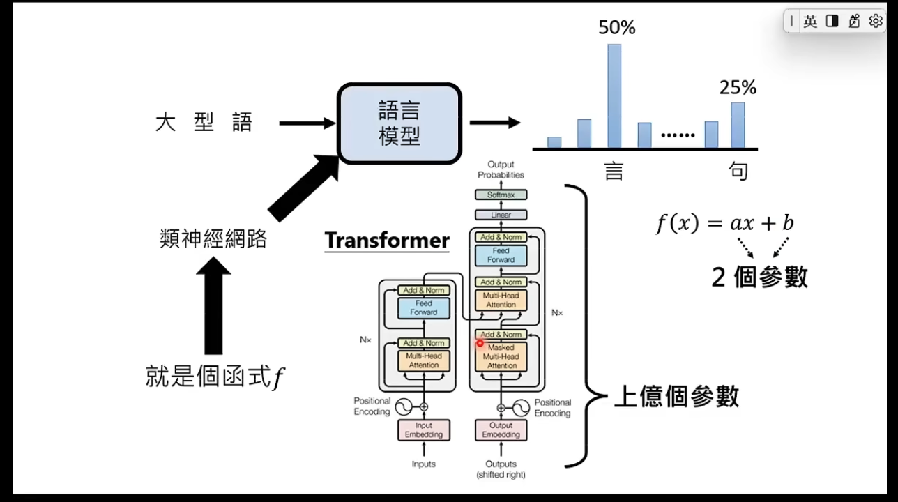

# Transformer - 含量参数的函数

## Transformer 架构（2017 年谷歌推出的）

- 自注意力机制

  1. Transformer 在处理每个词时，会注意输入序列中的所有词，而不仅仅是词本身和相邻的词。给予每个词不一样的注意力权重；
  2. 权重是模型在训练过程中通过大量文本逐渐习得的，因此 Transformer 有能力知道当前词和其他词的相关性有多强，然后专注输入里真正重要的部分。
  3. 即使 2 个词位置隔得很远 Transformer 也能捕捉到它们之间的依赖关系。从而更好地理解文本的含义。

  

- 位置编码

  在把词输入给神经网络前，Transformer 会对词进行嵌入，转化为向量（也就是把词用成一串数字表示）；
  还会给每个词用一串数字表示，添加到输入序列的表示中；然后把这个结果给神经网络；
  大模型即可以理解每个词的意义，又可以捕获词在句子中的位置，从而理解不同词之间的顺序关系；
  借助位置编码，词可以不按顺序输入给 Transformer，模型可以同时处理输入序列里的所有位置，不需要像 RNN 那样一次处理；
  在计算时，每个输出都可以独立计算，不需要依赖其他位置的计算结果，从而大大提高了计算效率（训练速度）；

  

  

## Transformer 处理流程

chatGpt：通过预测出现概率最高的下一个词来实现文本生成的；

Transformer：主要分为 编码器（Encoder）和 解码器（Decoder）；

- 编码器：用来理解和表示输入序列； 将输入序列（如文本）转化为一系列向量（称为“上下文向量”），这些向量捕捉了输入序列中的信息；
- 解码器：用来生成输出学列； 将上下文向量转化为输出序列（如文本），通过预测下一个词来实现文本生成。

- 编码器

  1. token 化： 输入的文本先被 token 化（把输入拆分为各个 token）；

     - 短单词：可能每个词一个 token；
     - 长单词：可能拆分为多个 token；
       - 为什么拆分？英文单词无法穷举，出现新事物要造一个新字（不像中文可以组合成词来表达）；
       - 使用类似字首的方式拆分 为 token；
     - 每个 token 会用一个整数表示，叫 token ID；

     * 原因：计算机内部无法储存文字，任何字符最终都得用数字表示，最终都会被转化为二进制

     

  2. 向量嵌入：嵌入层的作用是：让每个 token 都用向量表示；

     - 向量：可以简单的看做一串（组）数字；一串（组）数字能 表示的含义大于一个数字；
     - 将每个词（或子词）映射为一个高维向量（如 512 维），转化为模型可处理的数字形式。
     - 例如："cat" → [0.2, -0.5, 0.7, ...]（通过查找`预训练的嵌入表` 或 `随机初始化后学习`）。

     

  3. 位置编码：把各个词在文本里的顺序向量化；

     - 例如：第 1 个位置的编码 → [sin(θ₁), cos(θ₁), sin(θ₂), cos(θ₂), ...]。

     - 位置编码的目的是：让模型知道词的顺序，因为词的顺序在自然语言中非常重要；
     - 位置编码是固定的（基于数学公式计算，不参与训练），不会随着训练过程改变；
     - 与词向量 相加后，输入既包含语义，又包含位置信息；模型即可以理解每个词的意义，又可以捕获词在句子中的位置，从而理解不同词之间的顺序关系。

     

     

  4. 编码器--核心部分：包括 2 部分：自注意力机制、前馈神经网络；

     - 把输入转换成一种更抽象的表示形式，也是向量，即一串（组）数字；
     - 里面即保留了输入文本的词汇信息和顺序关系，也捕捉了语法语义的关键特征；

     - 捕捉关键特征的核心是编码器的“自注意力机制”：

       1. 自注意力机制：模型在处理每个词时，不仅会关注这个词本身和相邻的词，还会关注输入序列中所有的其他词；
       2. 自注意力机制 通过计算每个词之间的相关性来决定“注意力权重”；如果 2 个词之间的相关性更强，它们之间的注意力权重就更高；
       3. 自注意力机制 对上下文的全面关注，在输入的结果里 不仅包含词本身的信息还融合了上下文中的相关信息；
       4. 有 N 个自注意力机制，每个头都有自己的自注意力机制，用来关注文本里不同特征或方面（例有的关注动词、有的关注修饰词等）；
       5. 每个自注意力头可以并行计算，互不影响；
       6. 每个自注意力头的权重：都是模型在之前的训练中 从大量文本里逐渐学习和调整的；

     - 前馈神经网络：对多头自注意力机制的输出进行进一步处理，增强模型的表达能力

     

     

     

  5. 编码器在 Transformer 有 N 个；每个编码器内部结构一样，但不共享权重；这样模型能更深入理解数据，处理更复杂的文本语言内容；

通过 编码器 有了输入序列里 各个 token 的抽象表示，可以把它传给解码器；

- 解码器

  1. 先接收一个特殊值：表示输出序列的开头；

     - 解码器不仅会把来自编码器的输入序列的抽象表示作为输入，还会把之前已经生成的文本也作为输入，来保持输出的连贯性和上下文相关性；

  2. 文本经过嵌入层和位置编码，然后被输入进“带掩码的多头自注意力层”
  3. 解码器--核心部分：包括 3 部分：带掩码的多头自注意力层、多头注意力层、前馈神经网络；

     - 带掩码的多头自注意力：是针对已生成的输出序列的；只会关注这个词和它前面的词，后面的词要被遮住，不去关注；
     - 被遮住目的：确保解码器生成文本时遵守正确的时间顺序；在预测下一个词时：只使用前面的词作为上下文；

     - 后面的多头注意力层：处理“编码器”输出的输入序列的抽象表示；注意力会捕捉编码器的输出和解码器即将生成的输出之间的对应关系，从而将原始输入序列的信息融合到输出序列的生成过程中

     - 前馈神经网络：和编码器的类似，也是通过额外的计算，来增强模型的表达能力；

  4. 解码器也是多个(N 个)堆叠到一起的；增加模型的性能，有助于处理复杂的输入输出关系；
  5. 解码器的最后阶段：包含 1 个线性层和 1 个 Softmax 层；2 个合起来的作用：将解码层输出的表示 转换为词汇表的概率分布；
     - 词汇表的概率分布：代表下一个被生成的 token 的概率；
     - 有些 token 的概率比其他的高，大多少情况下，模型会选择概率高的 token 作为下一个输出；
     - 解码器本质是在猜下一个输出；
  6. 解码器的整个流程会重复多次，新的 token 会持续生成，直到生成的是一个用来表示输出序列结束的特殊 token;

