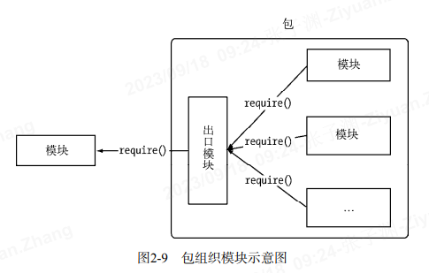

# 包与 NPM

包和 NPM 管理第三方模块的；



## 包结构

- package.json:包描述文件。
- bin:用于存放可执行二进制文件的目录。
- lib:用于存放 JavaScript 代码的目录。
- doc:用于存放文档的目录。
- test:用于存放单元测试用例的代码。

## 安装依赖包

1. 全局模式安装

   如果 Node 可执行文件的位置是 usr/local/bin/node,那么模块目录就是 usr/local/lib/node_modules。

2. 从本地安装包

   - npm install <tarball file>
   - npm install <tarball url>
   - npm install <folder>

3. 从非官方安装

   - 如果不能通过官方源安装，可以通过镜像源安装。在执行命令时，添加-registry=http://registry.url 即可，示例如下：npm install underscore --registry=http://registry.url
   - 如果使用过程中几乎都采用镜像源安装，可以执行以下命令指定默认源：npm config set registry http://registry.url

## 分析包

npm ls ：这个命令可以为你分析出当前路径下能够通过模块路径找到的所有包，并生成依赖树

## 发布包

1. 编写模块： `exports.sayHello=function(){return 'hell'}`
2. 初始化包的描述文件：`npm init`
3. 注册包含仓库账号
   ```
     npm adduser
     Username:(liSi)
     Email:(aa@qq.com)
   ```
4. 上传包：`npm publish .`
   上传包的命令是`npm publish <folder>`,在刚刚创建的 package.json 文件所在的目录下，执行 `npm publish .`开始上传包。 在这个过程中，NPM 会将目录打包为一个存档文件，然后上传到官方源仓库中。
5. 安装包 `npm install <package name>`
6. 管理包权限：npm owner
   ```
      npm owner ls <package name>
      npm owner add <user> <package name>
      npm owner rm <user> <package name>
   ```
