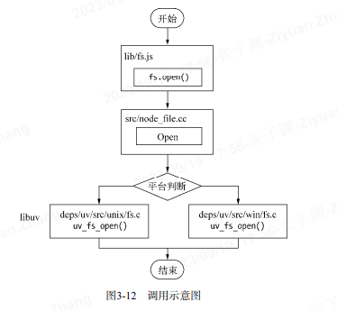

# 异步 I/O 与 编成 (原文:深入浅出 Node.js)

我们时常提到 Node 是单线程的，这里的单线程仅仅只是 JavaScript 执行在单线程中罢了。
在 Node 中，无论是`*nix` 还是 Windows 平台，内部完成 I/O 任务的另有线程池。

## node 的异步 I/O

完成 “整个异步 I/O 环节” 的有`事件循环、观察者、请求对象`等。

1. 事件循环-----Node 自身的执行模型

   在进程启动时，Node 便会创建一个类似于 while(true)的循环，每执行一次循环体的过程我们称为 Tick。

   每个 Tick 的过程就是查看是否有事件待处理，

   - 如果有，就取出事件及其相关的回周函数。如果存在关联的回调函数，就执行它们。然后进入下个循环;
   - 如果不再有事件处理，就退出进程;

   

2. 观察者-----每次循环都向观察者询问是否有要处理的事件

   每个事件循环中有一个或者多个观察者，而判断是否有事件要处理的过程就是向这些观察者询问是否有要处理的事件。

   浏览器采用了类似的机制。事件可能来自用户的点击或者加载某些文件时产生，而这些产生的事件都有对应的观察者。  
   在 Node 中，事件主要来源于网络请求、文件 I/O 等，这些事件对应的观察者有文件 1/O 观察者、网络/O 观察者等。  
   观察者将事件进行了分类。

   事件循环是一个典型的生产者/消货者模型。异步/O、网络请求等则是事件的生产者，源源不断为 Node 提供不同类型的事件，这些事件被传递到对应的观察者那里，事件循环则从观察者那里取出事件并处理。

3. 请求对象

   请求对象: node 的异步 I/O 调用：从 JavaScript 发起调用到内核执行完 I/O 操作的过渡过程中，存在一种中间产物，它叫做请求对象。

   请求对象是异步 I/O 过程中的重要中间产物，所有的状态都保存在这个对象中，包括“送入线程池等待执行”以及“ I/O 操作完毕后的回调处理”。

   
