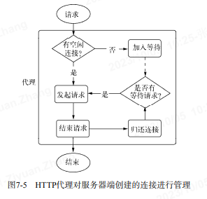
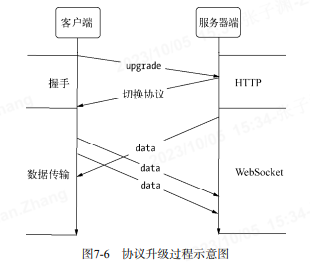

# 网络编程 (原文:深入浅出 Node.js)

- ASP、ASP.NET 需要 IIS 作为服务器，
- PHP 需要搭载 Apache 或 Nginx 环境等，
- JSP 需要 Tomcat 服务器等。

Node 提供了 net、dgram、http、https 这 4 个模块，分别用于处理 TCP、UDP、HTTP、HTTPS,适用于服务器端和客户端。

- telnet 127.0.0.1 8124
- nc -U /tmp/echo.sock
- curl -v http://127.0.0.1:1337

## TCP

1. 创建 TCP 服务端

   ```
   var net = require('net');
   var server = net.createServer(function (socket) {
       // 新的连接
       socket.on('data', function (data) {
         socket.write("你好")
       });
       socket.on('end', function () {
          console.log('断开接܏开');
       });
       socket.write("欢迎光临《深入浅出Node.js》示例：\n");
   });
   server.listen(8124, function () {
       console.log('server bound');
   });
   ```

   通过 net.createServer(listener)创建一个 TCP 服务器，listener 是连接事件 connection 的侦听器，也可以采用如下的方式进行侦听：

   ```
   var server = net.createServer();
   server.on('connection', function (socket) {   // 新的连接 });
   server.listen(8124);
   ```

   - listening:在调用 server.listen()绑定端口或者 Domain Socket.后触发，简洁写法为 server.listen(port,listeningListener),通过 listen()方法的第二个参数传入。
   - connection:每个客户端`套接字`连接到服务器端时触发，简洁写法为通过 net.createServer(),最后一个参数传递。
   - close:当服务器关闭时触发，在调用 server.close()后，服务器将停止接受新的`套接字`连接，但保持当前存在的连接，等待所有连接都断开后，会触发该事件。
   - error:当服务器发生异常时，将会触发该事件。比如侦听一个使用中的端口，将会触发一个异常，如果不侦听 error 事件，服务器将会抛出异常。

2. 创建 TCP 客户端

   ```
   var net = require("net");
   var client = net.connect({ port: 8124 }, function () {
     //'connect' listener
     console.log("client connected");
     client.write("world!\r\n");
   });
   client.on("data", function (data) {
     console.log(data.toString());
     client.end();
   });
   client.on("end", function () {
     console.log("client disconnected");
   });
   ```

   - connect:该事件用于客户端，当`套接字`与服务器端连接成功时会被触发。

3. 连接事件

   服务器可以同时与多个客户端保持连接，对于每个连接而言是典型的可写可读 Stream 对象。

   - data:当一端周用 write()发送数据时，另一端会触发 data 事件，事件传递的数据即是 write()发送的数据。
   - end:当连接中的任意一端发送了 FIN 数据时，将会触发该事件。
   - drain:当任意一端调用 write()发送数据时，当前这端会触发该事件。
   - error:当异常发生时，触发该事件。
   - close:当`套接字`完全关闭时，触发该事件。
   - timeout:当一定时间后连接不再活跃时，该事件将会被触发，通知用户当前该连接已经被闲置了。

4. TCP 的优化策略---Nagle 算法

   - 每次只发送一个字节的内容，浪费网络资源；
   - TCP 针对网络中的小数据包有一定的优化策略：Nagle 算法：将缓冲数据达到一定数量或一定时间后才将其发送；
   - 在 Node 中，由于 TCP 默认启用了 Nagle 算法，可以调用 socket.setNoDelay(true)去掉 Nagle 算法，使得 write()可以立即发送数据到网络中。
   - 尽管在网络的一端调用 rite()会触发另一端的 data 事件，但是并不意味着每次 write()都会触发一次 data 事件，在关闭掉 Nagle 算法后，另一端可能会将接收到的多个小数据包合并，然后只触发一次 data 事件。

## UDP

创建 UDP 套接字十分简单，UDP 套接字一旦创建，既可以作为客户端发送数据，也可以作为服务器端接收数据。

1. 创建 UDP 服务器端  
   若想让 UDP 套接字接收网络消息，只要调用 dgram.bind(port,[address])方法对网卡和湍口
   进行绑定即可。

   ```
   var dgram = require("dgram");
   var server = dgram.createSocket("udp4");
   server.on("message", function (msg, rinfo) {
        console.log("server got: " + msg + " from " + rinfo.address + ":" + rinfo.port);
   });
   server.on("listening", function () {
        var address = server.address();
        console.log("server listening " + address.address + ":" + address.port);
   });
   server.bind(41234);

   ```

   该套接字将接收所有网卡上 41234 端口上的消息。在绑定完成后，将触发 listening 事件。

2. 创建 UDP 客户端

   ```
   var dgram = require('dgram');
   var message = new Buffer("深入浅出Node.js");
   var client = dgram.createSocket("udp4");
   client.send(message, 0, message.length, 41234, "localhost", function(err, bytes) {
       client.close();
   });
   ```

   socket.send(buf, offset, length, port, address, [callback])：要发送的 Buffer、Buffer 的偏移、Buffer 的长度、目标端口、目标地址、发送完成后的回调。

3. UDP 套接字事件
   UDP 套接字它只是一个 EventEmitter 的实例，而非 Stream 的实例。
   - message:当 UDP 套接字侦听网卡端口后，接收到消息时触发该事件，触发携带的数据为消息 Buffer 对象和一个远程地址信息。
   - listening:当 UDP 套接字开始你听时触发该事件。
   - close:调用 close()方法时触发该事件，并不再触发 message 事件。如需再次触发 message 事件，重新绑定即可。
   - error:当异常发生时触发该事件，如果不侦听，异常将直接抛出，使进程退出。

## HTTP

- 从协议的角度来说，现在的应用，如浏览器，其实是一个 HTTP 的代理，用户的行为将会通过它转化为 HTTP 请求报文发送给服务器端，服务器端在处理请求后，发送响应报文给代理，代理在解析报文后，将用户需要的内容呈现在界面上。
- 以浏览器打开一张图片地址为例：首光，浏览器构造 HTTP 报文发向图片服务器端：然后，服务器端判断报文中的要请求的地址，将磁盘中的图片文件以报文的形式发送给浏览器；浏览器接收完图片后，调用谊染引擎将其显示给用户。简而言之，HTTP 服务只做两件事情：处理 HTTP 请求和发送 HTTP 响应。
- 无论是 HTTP 请求报文还是 HTTP 响应报文，报文内容都包含两个部分：报文头和报文体。
- 下文的报文代码中>和<部分属于报文的头部，由于是 GET 请求，请求报文中没有包含报文体，响应报文中的 Hello World 即是报文体。

```
var http = require('http');
http.createServer(function (req, res) {
    res.writeHead(200, {'Content-Type': 'text/plain'});
    res.end('Hello World\n');
}).listen(1337, '127.0.0.1');
console.log('Server running at http://127.0.0.1:1337/');
//====================================================================
$ curl -v http://127.0.0.1:1337
* About to connect() to 127.0.0.1 port 1337 (#0)
* Trying 127.0.0.1...
* connected
* Connected to 127.0.0.1 (127.0.0.1) port 1337 (#0)
> GET / HTTP/1.1
> User-Agent: curl/7.24.0 (x86_64-apple-darwin12.0) libcurl/7.24.0 OpenSSL/0.9.8r zlib/1.2.5
> Host: 127.0.0.1:1337
> Accept: */*
>
< HTTP/1.1 200 OK
< Content-Type: text/plain
< Date: Sat, 06 Apr 2013 08:01:44 GMT
< Connection: keep-alive
< Transfer-Encoding: chunked
<
Hello World
* Connection #0 to host 127.0.0.1 left intact
* Closing connection #0
//==================================================
第一部分内容为经典的TCP的3次握手过程，
第二部分是在完成握手之后，客户端向服务器端发送请求报文，
第三部分是服务器端完成处理后，向客户端发送响应内容，包括响应头和响应休，
最后部分是结束会话的信总，
```

### http 模块

在 Node 中，HTTP 服务继承自 TCP 服务器(net 模块)，它能够与多个客户端保持连接，由于其采用事件驱动的形式，并不为每一个连接创建额外的线程或进程，保持很低的内存占用，所以能实现高并发。

HTTP 服务与 TCP 服务模型有区别的地方在于，在开启 keepalive 后，一个 TCP 会话可以用于多次请求和响应。TCP 服务以 connection 为单位进行服务，HTTP 服务以 request 为单位进行服务。http 模块即是将 connection 到 request 的过程进行了封装，

除此之外，http 模块将连接所用套接字的读写抽象为 ServerRequest 和 ServerResponse 对象，它们分别对应请求和响应操作。在请求产生的过程中，htt 模块拿到连接中传来的数据，调用二进制模块 http_parser 进行解析，在解析完请求报文的报头后，触发 request 事件，周用用户的业务逻辑。

1. HTTP 请求
   - req.method 属性：常见的请求方法有 GET、PoST、DELETE、PUT、CONNECT 等几种；
   - req.url 属性：值为/；
   - req.httpVersion 属性：值为 1.1；
   - 其余报头是很规律的 Key:Value 格式，被解析后放置在 req.headers 属性上；
   - 报文体部分则抽象为一个只读流对象，如果业务逻辑需要读取报文体中的数据，则要在这个数据流结束后才能进行操作；
   ```
   function (req, res) {
     // console.log(req.headers);
     var buffers = [];
     req.on('data', function (trunk) {
     buffers.push(trunk);
     }).on('end', function () {
     var buffer = Buffer.concat(buffers);
     // TODO
     res.end('Hello world');
     });
    }
   ```
2. HTTP 响应

   - 响应报文头部信息 API: res.setHeader() / res.writeHead() `res.writeHead(200, {'Content-Type': 'text/plain'}); `  
     调用 setHeader 进行多次设置，但只有调用 writeHead 后，报头才会写入到连接中。除此之外，http 模块会自动帮你设置一些头信息
   - 报文体部分则是调用 res.write()和 res.end()方法实现,
     res.end()会先调用 res.write()发送数据，然后发送信号告知服务器这次响应结束，响应结束后，HTTP 服务器可能会将当前的连接用于下一个请求，或者关闭连接。
   - 报头是在报文体发送前发送的，一旦开始了数据的发送，writeHead()和 setHeader()将不再生效。这由协议的特性决定。
   - 无论服务器端在处理业务逻辑时是否发生异常，务必在结束时调用 res.end()结束请求，否则客户端将一直处于等待的状态。当然，也可以通过延迟 res.end()的方式实现客户端与服务器端之间的长连接，但结束时`务必关闭连接`。

### HTTP 服务的事件

- connection 事件：TCP 连接建立时，服务器触发一次 connection 事件。
- request 事件：在解析出 HTTP 请求头后，将会触发该事件。
- close 事件：与 TCP 服务器的行为一致，调用 server.close()方法停止接受新的连接，当已有的连接都断开时，触发该事件
- checkContinue 事件：某些客户端在发送较大的数据时，并不会将数据直接发送，而是先发送一个头部带 Expect:1o0-continue 的请求到服务器，服务器将会触发 checkContinue 事件：
  1.  如果没有为服务器监听这个事件，服务器将会自动响应客户湍 100 Continue 的状态码，表示接受数据上传；
  2.  如果不接受数据的较多时，响应客户端 400 Bad Request 拒绝客户端继续发送数据即可。
  3.  **注**当该事件发生时不会触发 request 事件，两个事件之间互斥。当客户端收到 1o0 Continue/后重新发起请求时，才会触发 request 事件 。
- connect 事件：当客户带发起 CONNECT 请求时发，而发起 CONNECT 请求通常在 HTTP 代理时出现；如果不监听该事件，发起该请求的连接将会关闭。
- upgrade 事件：当客户端要求升级连接的协议时，需要和服务器端协商，客户端会在请求头中带上 Upgrade 字段，服务器端会在接收到这样的请求时触发该事件。
- clientError 事件：连接的客户端触发 error 事件时，这个错误会传递到服务器端，此时触发该事件。

### HTTP 客户端

http 模块提供了一个底层 API:http.request(options,connect),用于构造 HTTP 客户端。

```
var options = {
  hostname: "127.0.0.1",
  port: 1334,
  path: "/",
  method: "GET"
};
var req = http.request(options, function (res) {
  console.log("STATUS: " + res.statusCode);
  console.log("HEADERS: " + JSON.stringify(res.headers));
  res.setEncoding("utf8");
  res.on("data", function (chunk) {
    console.log(chunk);
  });
});
req.end();
```

options 参数：

- host: 服务器的域名或 IP 地址，默认为 localhost;
- hostname: 服务器名称;
- port: 服务器端口，默认为 80;
- localAddress: 建立网络连接的本地网卡;
- socketPath: Domain 套接字路径;(Domain 标识指定了哪些主机可以接受 Cookie,例如 Domain=http://mozilla.org)
- method: HTTP 请求方法，默认为 GET;
- path: 请求路径，默认为/;
- headers: 请求头对象;
- auth: Basic 认证，这个值将被计算成请求头中的 Authorization 部分;

报文体的内容由请求对象的 write()和 end()方法实现：

- 通过 write()方法向连接中写入数据;
- 通过 end()方法告知报文结束;

1. HTTP 响应
2. HTTP 代理
   为了重用 TCP 连接，http 模块包含一个默认的客户端代理对象 http.globalAgent。它对每个服务器端(host+port)创建的连接进行了管理，默认情况下，通过 ClientRequest 对象对同一个服务器端发起的 HTTP 请求最多可以创建 5 个连接。
   它的实质是一个连接池：  
   

3. HTTP 客户端事件

   - response:与服务器端的 request 事件对应的客户端在请求发出后得到服务器端响应时，会触发该事件。
   - socket:当底层连接池中建立的连接分配给当前请求对象时，触发该事件。
   - connect:当客户端向服务器端发起 CONNECT 请求时，如果服务器端响应了 200 状态码，客户端将会触发该事件。
   - upgrade:客户端向服务器端发起 Upgrade 请求时，如果服务器端响应了 101 SwitchingProtocols 状态，客户端将会触发该事件。
   - continue:客户端向服务器端发起 Expect:100-continue 头信息，以试图发送较大数据量，如果服务器端响应 100 Continue 状态，客户端将触发该事件。

## WebSocket

WebSocket 更接近于传输层协议，它并没有在 HTTP 的基础上模拟服务器端的推送，而是在 TCP 上定义独立的协议。
WebSocket 协议主要分为两个部分：握手和数据传输。
WebSocket 的握手部分是由 HTTP 完成的。

1. 客户端建立连接时，通过 HTTP 发起请求报文:

   - GET /chat HTTP/1.1
   - Host: server.example.com
   - Upgrade: websocket //==请求服务器端升级协议为 WebSocket
   - Connection: Upgrade //==请求服务器端升级协议为 WebSocket
   - Sec-WebSocket-Key: dGhlIHNhbXBsZSBub25jZQ== //==用于安全校验：
   - Sec-WebSocket-Protocol: chat, superchat //==指定子协议
   - Sec-WebSocket-Version: 13 //==子协议版本号

Sec-WebSocket-Key 的值是随机生成的 Base64 编码的字符串。服务器端接收到之后将其与字符串 258EAFA5-E914-47DA-95CA-C5AB0DC85B11 相连，形成字符串 dGh1 IHNhbXBsZSBub.25jZ0=258EAFA5-E914-47DA-95CA-C5AB0DC85B11,然后通过 sha1 安全散列算法计算出结果后，再进行 Bse64 编码，最后返回给客户端。

2. 服务器端在处理完请求后，响应如下报文：

   - HTTP/1.1 101 Switching Protocols //==告之客户端正在更换协议
   - Upgrade: websocket //==更新应用层协议为 websocket 协议,并在当前的套接字连接上应用新协议。
   - Connection: Upgrade //==
   - Sec-WebSocket-Accept: s3pPLMBiTxaQ9kYGzzhZRbK+xOo= //==服务器端基于 Sec-WebSocket-Key 生成的字符串
   - Sec-WebSocket-Protocol: chat //==选中的子协议

   

### websocket 数据传输

```
var socket = new WebSocket("ws://127.0.0.1:12010/updates");
socket.onopen = function () {
  setInterval(function () {
     if (socket.bufferedAmount == 0) socket.send(getUpdateData());
  }, 50);
};
socket.onmessage = function (event) {
  // TODO：event.data
};
```

在握手顺利完成后，当前连接将不再进行 HTTP 的交互，而是开始 WebSocket 的数据帧协议，实现客户端与服务器端的数据交换。  
握手完成后，客户端的 onopen()将会被触发执行。

当客户端调用 send()发送数据时，服务器端触发 onmessage()；  
当服务器端调用 send()发送数据时，客户端的 onmessage()触发。  
当我们调用 send()发送一条数据时，协议可能将这个数据封装为一帧或多帧数据，然后逐帧发送。

## 网络服务与安全

最初网景公司的浏览器提出了 SSL（Secure Sockets Layer，安全套接层），最初的 SSL 应用在 Web 上，被服务器端和浏览器端同时支持，随后 ETF 将其标准化，称为 TLS(Transport Layer Security,安全传输层协议)。

Node 在网络安全上提供了 3 个模块，分别为 crypto、tls、https。

- crypto:主要用于加密解密，SHA1、MD5 等加密算法都在其中有体现。
- tls 模块提供了与 net 模块类似的功能，区别在于它建立在 TLS/SSL 加密的 TCP 连接上。
- https 模块，它完全与 http 模块接口一致，区别也仅在于它建立于安全的连接之上。

1. TLS/SSL

   TLS/SSL 是一个公钥/私钥的结构，它是一个非对称的结构；  
   为了解决“公私钥的非对称加密”被窃听的情况（例：中间人攻击）TLS/SSL 引入了“数字证书”来进行认证。  
   数字证书中包含了：服务器的名称和主机名、服务器的公钥、签名颁发机构的名称、来自签名颁发机构的签名。

2. 数字证书

   为了确保我们的数据安全，现在我们引入了一个第三方：CA(Certificate Authority,数字证书认证中心)。CA 的作用是为站点颁发证书，且这个证书中具有 CA 通过自己的公钥和私钥实现的签名。

   如果是知名的 CA 机构，它们的证书一般预装在浏览器中。  
   如果是自己扮演 CA 机构，预发自有签名证书则不能享受这个福利，客户端需要获取到 CA 的证书才能进行验证。  
   CA 那里的证书是不需要上级证书参与签名的，这个证书我们通常称为根证书。

## TLS 服务（TCP 的加密服务）

1. 创建 TLS 服务端

   ```
   var tls = require("tls");
   var fs = require("fs");
   var options = {
        key: fs.readFileSync("./keys/server.key"),
        cert: fs.readFileSync("./keys/server.crt"),
        requestCert: true,
        ca: [fs.readFileSync("./keys/ca.crt")]
   };
   var server = tls.createServer(options, function (stream) {
        console.log("server connected", stream.authorized ? "authorized" : "unauthorized");
        stream.write("welcome!\n");
        stream.setEncoding("utf8");
        stream.pipe(stream);
   });
   server.listen(8000, function () {
        console.log("server bound");
   });
   ```

   启动上述服务后，通过下面的命令可以测试证书是否正常：
   openssl s_client -connect 127.0.0.1:8000

2. TLS 客户端  
   // 创建私钥  
   $ openssl genrsa -out client.key 1024  
   // 生成 CSR  
   $ openssl req -new -key client.key -out client.csr  
   // 生成签名证书  
   $ openssl x509 -req -CA ca.crt -CAkey ca.key -CAcreateserial -in client.csr -out client.crt

   ```
   var tls = require("tls");
   var fs = require("fs");
   var options = {
      key: fs.readFileSync("./keys/client.key"),
      cert: fs.readFileSync("./keys/client.crt"),
      ca: [fs.readFileSync("./keys/ca.crt")]
   };
   var stream = tls.connect(8000, options, function () {
      console.log("client connected", stream.authorized ? "authorized" : "unauthorized");
      process.stdin.pipe(stream);
   });
   stream.setEncoding("utf8");
   stream.on("data", function (data) {
      console.log(data);
   });
   stream.on("end", function () {
      server.close();
   });
   ```

   启动客户端的过程中，用到了为客户端生成的私钥、证书、CA 证书。客户端启动之后可以 在输入流中输入数据，服务器端将会回应相同的数据。
