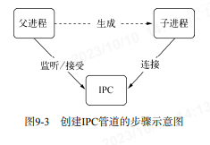
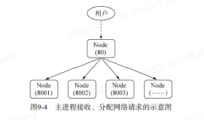
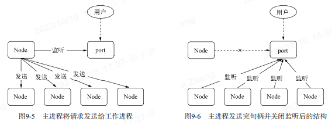

# 玩转进程 (原文:深入浅出 Node.js)

node 好处是：程序状态是单一的，在没有多线程的情况下没有锁、线程同步问题，操作系统在调度时也因为较少上下文的切换，可以很好地提高 CPU 的使用率。

node 问题：1、如何充分利用多核 CPU 服务器？2、如何保证进程的健壮性和稳定性？

## 服务器模型的变迁：

同步--》复制进程--》多线程--》事件驱动

## 多线程架构

Master-Worker 模式，又称主从模式。分为两种：主进程和工作进程。这是典型的分布式架构中用于并行处理业务的模式，具备较好的可伸缩性和稳定性。
主进程：不负责具体的业务处理，而是负责调度或管理工作进程，它是趋向于稳定的。  
工作进程：负责具休的业务处理，因为业务的多种多样，甚至一项业务由多人开发完成，所以作进程的稳定性值得开发者关注。


```worker.js
var http = require('http');
http.createServer(function (req, res) {
 res.writeHead(200, {'Content-Type': 'text/plain'});
 res.end('Hello World\n');
}).listen(Math.round((1 + Math.random()) * 1000), '127.0.0.1');
```

```master.js，
var fork = require('child_process').fork;
var cpus = require('os').cpus();
for (var i = 0; i < cpus.length; i++) {
 fork('./worker.js');
}
//-----------------
启动node master.js
```

通过过 fork()复制的进程都是一个独立的进程，这个进程中有着独立而全新的 V8 实例。它需要至少 30 毫秒的启动时间和至少 10MB 的内存。  
**注：**尽管 Node 提供了 fork()供我们复制进程使每个 CPU 内核都使用上，但是依然要切记 fok()进程是昂贵的。好在 Node 通过事件驱动的方式在单线程上解决了大并发的问题，这里启动多个进程只是为了充分将 CU 资源利用起来，而不是为了解决并发问题。

## 创建子进程

4 中方法创建子进程：

- spawn():启动一个子进程来执行命令。
- exec():启动一个子进程来执行命令，它有一个回调函数获知子进程的状况。（超时将会被杀死，执行已有的命令）
- execFi1le():启动一个子进程来执行可执行文件。（超时将会被杀死，执行文件）
- fork():与 spawn()类似，不同点在于它创建 Node 的子进程只带指定要执行的 JavaScript 文件模块即可。

exec()、execFile()、fork() 方法都是 spawn()的延伸应用

```
var cp = require("child_process");
cp.spawn("node", ["worker.js"]);
cp.exec("node worker.js", function (err, stdout, stderr) {
  // some code
});
cp.execFile("worker.js", function (err, stdout, stderr) {
  // some code
});
cp.fork("./worker.js");
```


这里的“可执行文件”是指“可以直接执行的文件”，如果是 JavaScript 文件通过 execFile()运行，它的首行内容必须添加如下代码：`#!/usr/bin/env node`

## 进程间通信

通过 fok()或者其他 API,创建子进程之后，为了实现父子进程之间的通信，父进程与子进程之间将会创建 PC 通道。通过 PC 通道，父子进程之间才能通过 message 和 send()传递消息。

```
//---- parent.js ------------------------
var cp = require('child_process');
var n = cp.fork(__dirname + '/sub.js');
n.on('message', function (m) {
  console.log('PARENT got message:', m);
});
n.send({hello: 'world'});
//---- sub.js ---------------------------
process.on('message', function (m) {
  console.log('CHILD got message:', m);
});
process.send({foo: 'bar'});
```

- 进程间通信原理
  在 Node 中，IPC 通道被抽象为 Stream 对象，在调用 send()时发送数据（类似于 rite()),接收到的消息会通过 message 事件（类似于 data)触发给应用层。

  

  父进程在实际创建子进程之前，会创建 PC 通道并监听它，然后才真正创建出子进程，并通过环境变量(NODE CHANNEL FD)告诉子进程这个 IPC 通道的文件描述符。  
  子进程在启动的过程中，根据文件描述符去连接这个已存在的 PC 通道，从而完成父子进程之间的连接。

  

  **注：**只有启动的子进程是 Node 进程时，子进程才会根据环境变量去连接 PC 通道，对于其他类型的子进程则无法实现进程间通信，除非其他进程地按约定去连接这个已经创建好的 PC 通道。

## 句柄传递

传统代理：



传统问题：通过代理，可以避免端口不能重复监听的问题，甚至可以在代理进程上做适当的负载均衡，使得每个子进程可以较为均衡地执行任务。  
由于进程每接收到一个连接，将会用掉一个文件描述符，因此代理方案中客户端连接到代理进程，代理进程连接到工作进程的过程需要用掉两个文件描述符。操作系统的文件描述符是有限的，代理方案浪费掉一倍数量的文件描述符的做法影响了系统的扩展能力。

send()方法除了能通过 IPC 发送数据外，还能发送句柄，第二个可选参数就是句柄:`child.send(message, [sendHandle])`

句柄是一种可以用来标识资源的引用，它的内部包含了指向对象的文件描述符。比如句柄可以用来标识一个服务器端 socket 对象、一个客户端 socket 对象、一个 UDP 套接字、一个管道等。

发送句柄意味着什么？在前一个问题中，我们可以去掉代理这种方案，使主进程接收到 socket 请求后，将这个 socket]直接发送给工作进程，而不是重新与工作进程之间建立新的 socket 连接来转发数据。文件描述符浪费的问题可以通过这样的方式轻松解决。

```
//----主进程----------------
var child = require("child_process").fork("child.js");
// Open up the server object and send the handle
var server = require("net").createServer();
server.on("connection", function (socket) {
  socket.end("handled by parent\n");
});
server.listen(1337, function () {
  child.send("server", server);
});
//-----子进程---------------
process.on("message", function (m, server) {
  if (m === "server") {
    server.on("connection", function (socket) {
      socket.end("handled by child\n");
    });
  }
});
// 示例中直接将一个TCP服务器发送给了子进程。====== 子进程和主进程都会响应
```



主进程发送完句柄并关闭监听，会发现，多个子进程可以同时监听相同端口，再没有 `EADDRINUSE`异常发生了。

1. 句柄发送与还原
