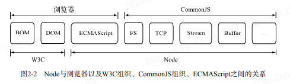
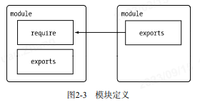
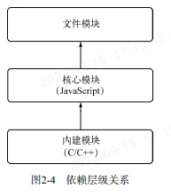
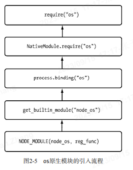
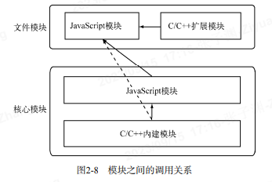

# node--基础篇 2--模块 (原文:深入浅出 Node.js)



## 模块



- 在 node 中，一个文件就是一个模块，将方法挂载在 exports 对象上 作为属性即可定义导出的方式

  ```code
   exports.add=function(){}
  ```

- 在模块中存在一个 module 对象，它代表模块自身，而 exports 是 module 的属性。

- 在模块中，上下文提供了：

  1. require()方法来引入外部模块；
  2. exports 对象用于导出当前模块的方法或者变量，并且它是唯一导出的出口；

## 模块加载

- 在 Node 中引入模块，需要经过 3 个步骤：

  1. 路径分析：文件模块（用户编写的模块）、核心模块
  2. 文件定位：文件模块（用户编写的模块）
  3. 编译执行：文件模块（用户编写的模块）

- node 模块分为两类：1、核心模块，2、文件模块（用户编写的模块）

  1. 核心模块：在 node 源代码的编译过程中，编译进了二进制执行文件，node 进程启动时直接加载到内存中运行，跳过“文件定位”和“编译执行”，并且在路径分析中优先判断，加载速度最快；
  2. 文件模块（用户编写的模块）：在运行时动态加载，需要完整的“路径分析”、“文件定位”、“编译执行”过程，速度比核心模块慢；

- 优先从缓存加载
  1. 相同：浏览器仅仅缓存文件；node 缓存的时编译和执行之后的对象；
  2. 不同：核心模块的缓存检查先于文件模块的检查；

### 路径分析

模块标识符：require()方法接受一个标识符作为参数，基于标识符进行模块查找；

- 在 node 中 模块标识分为：

  1. 核心模块，（如 http、fs、path 等）；

     核心模块的优先级仅次于缓存加载，node 源码时已经编译为二进制代码，加载最快。

  2. 路径形式的文件模块，（.或..开始的相对路径文件、 以/开始的绝对路径文件）；

     路径分析时，require()方法会将路径转化为真是路径，并以真实路径为索引，将编译后的结果存到缓存中，下次加载更快；

  3. 非路径形式的文件模块，（如自定义的 connect 模块、一个文件或包的形式）；

     在加载的过程中，Node 会逐个尝试模块路径中的路径，直到找到目标文件位置。
     可以看出，当前文件的路径越深，模块查找耗时会越多，这是自定义模块的加载速度最慢的原因。

     - “模块路径”:具体表现为一个路径组成的数组，

     ```code
     创建module_path.js文件，内容为console.log(module.paths);
     将其放在任意一个目录中，执行node module_path.js。
       linux下：
       [ '/home/jackson/research/node_modules',
         '/home/jackson/node_modules',
         '/home/node_modules',
         '/node_modules' ]

       Windows 下：[ 'c:\\nodejs\\node_modules', 'c:\\node_modules' ]

     ```

     - “模块路径”的生成规则如下：

       1. 当前文件目录下的 node_modules 目录。
       2. 父目录下的 node_modules 目录。
       3. 父目录的父目录下的 node_modules 目录。
       4. 沿路径向上逐级递归，直到根目录下的 node_modules 目录。

### 文件定位

- 文件扩展名分析：require()中不包含文件扩展名时，Node 会按.js、.json、.node 的次序补足扩展名，主次尝试。
  在尝试的过程中，需要调用 fs 模块同步阻塞式的判断文件是否存在，因为 Node 是单线程的，所以这里是一个会引起性能问题的地方

- 目录分析和包

  1. 在分析标识符的过程中，require()通过分析文件扩展名之后，可能没有查找到对应文件，但却得到个目录，这在引入“自定义模块”和“逐个模块路径”进行查找时经常会出现，此时 Node 会将目录当做个包来处理。

  2. 在这个过程中，Node 对 CommonJS 包规范进行了一定程度的支特。首先，Node 在当前目录下查找 package.json(CommonJS 包规范定义的包描述文件)，通过 JSON.parse()解析出包描述对象，从中取出 main 属性指定的文件名进行定位。如果文件名缺少扩展名，将会进入扩展名分析的步骤。

  3. 而如果 main 属性指定的文件名错误，或者压根没有 package.json 文件，Node 会将 index 当做默认文件名，然后依次查找 index.js、index.json、index.node。

  4. 如果在目录分析的过程中没有定位成功任何文件，则自定义模块进入下一个模块路径进行查找。如果模块路径数组都被遍历完毕，依然没有查找到目标文件，则会抛出查找失败的异常。

### 编译和执行--- 这里我们提到的模块编译都是指文件模块，即用户自己编写的模块。（不是核心模块中的 JavaScript 模块和 C/C++模块）

编译和执行是引人文件模块的最后一个阶段。定位到具体的文件后，Node 会新建一个模块对象，然后根据路径载入并编译。

- 对于不同的文件扩展名，其载人方法也有所不同，具体如下所示。

1. .js 文件。通过 fs 模块同步读取文件后编译执行。
2. .node 文件。这是用 C/C+编写的扩展文件，通过 dlopen()方法加载最后编译生成的文件。
3. .json 文件。通过 fs 模块同步读取文件后，用 JSON.parse()解析返回结果。
4. 其余扩展名文件。它们都被当做 js 文件载入。

每一个编译成功的模块都会将其文件路径作为索引缓存在 Module.cache 对象上，以提高二次引入的性能。

1. JavaScript 模块的编译
   `exports, require, module, __filename,__dirname`这些变量从哪来？

   在编译的过程中，Node 对获取的 JavaScript 文件内容进行了头尾包装。
   在头部添加了`(function (exports, require, module, __filename,__dirname) {\n，在尾部添加了\n});`

   ```code
      (function (exports, require, module, __filename, __dirname) {
          var math = require('math');
          exports.area = function (radius) {
            return Math.PI * radius * radius;
          };
      });
   ```

   这样每个模块文件之间都进行了作用域隔离。
   包装之后的代码会通过原生模块的 runInThisContext()方法执行（类似 eval,只是具有明确上下文，不污染全局），返回一个具体的 function 对象。
   最后，将当前模块对象的 exports 属性、require()方法、module(模块对象自身)，以及在文件定位中得到的“完整文件路径”和“文件目录”作为参数传递给这个 function()执行：这就是这些变量并没有定义在每个模块文件中却存在的原因
   在执行之后，模块的 exports 属性被返回给了调用方。exports 属性上的任何方法和属性都可以被外部调用到，但是模块中的其余变量或属性则不可直接被调用。至此，require、exports、module 的流程已经完整，这就是 Node 对 CommonJS 模块规范的实现。

2. C/C++模块的编译
   Node 调用 process.d1open()方法进行加载和执行。
   在 Node 的架构下，d1open()方法在 Windows 和 `*nix` 平台下分别有不同的实现，通过 libuv 兼容层进行了封装。
   实际上，.node 的模块文件并不需要编译，因为它是编写 CC++模块之后编译生成的，所以这里只有加载和执行的过程。

   优势：C/C++模块给 Node 使用者带来的优势主要是“执行效率”方面的，
   劣势：则是 C/C++模块的编写门槛比 JavaScript 高。

3. JSON 文件的编译---JSON 文件在用作项目的配置文件时比较有用。
   Node 利用 fs 模块同步读取 JSON 文件的内容之后，调用 JSON.parse()方法得到对象，然后将它赋给模块对象的 exports,以供外部调用。
   如果你定义了一个 JSON 文件作为配置，那就不必调用 fs 模块去异步读取和解析，直接调用 require()引入即可。

## 核心模块---

Node 的核心模块在编译成可执行文件的过程中被编译进了二进制文件。
核心模块分为两部分: C/C++编写的和 JavaScript 编写的两部分;
其中 C/C++文件存放在 Node 项目的 src 目录下，JavaScript 文件存放在 lib 目录下。

**注：** 先编译 JavaScript 核心模块文件，后编译 C/C++文件模块

### JavaScript 核心模块的编译过程

编译程序将所有的 JavaScript 核心模块文件编译为 C/C++代码（不可直接执行）；

1. 转存为 C/C++代码

   - Node 采用了 V8 附带的 js2c.py 工具，将所有内置的 JavaScript 代码(`src/node.js 和 lib/*.js`)转换成 C+里的数组，生成 node natives.h 头文件;
   - 在这个过程中，JavaScript 代码以字符串的形式存储在 node 命名空间中，是不可直接执行的。
   - 在启动 Node 进程时，JavaScript 代码直接加载进内存中。在加载的过程中，JavaScript 核心模块经历标识符分析后直接定位到内存中，比普通的文件模块从磁盘中一处一处查找要快很多。

2. 编译 javaScript 核心模块

   - 1ib 目录下的所有模块文件也没有定义 require、module、exports.这些变量。在引入 JavaScript 核心模块的过程中，也经历了头尾包装的过程，然后才执行和导出了 exports 对象。
   - 与文件模块有区别的地方在于：获取源代码的方式（核心模块是从内存中加载的）以及缓存执行结果的位置。
   - 源文件通过 process.binding('natives')取出，编译成功的模块缓存到 NativeModule.cache 对象上，文件模块则缓存到 Module.cache 对象上

### C/C++核心模块的编译过程

在核心模块中，有些模块全部由 C/C++编写，有些模块则由 C/C++完成核心部分，其他部分则由 JavaScript 实现包装或向外导出，以满足性能需求。
后面这种 C++模块主内完成核心，JavaScript 主外实现封装的模式，是 Node 能够提高性能的常见方式。
通常，脚本语言的开发速度优于静态语言，但是其性能则弱于静态语言。而 Node 的这种复合模式可以在开发速度和性能之间找到平衡点。
这里我们将那些由纯 C/C++编写的部分统一称为内建模块，因为它们通常不被用户直接调用。

1. 内建模块的组织形式

   内建模块有：1、node_buffer；2、node_crypto；3、node_evals；4、node_fs；5、node_http_parser；6、node_os；7、node_zlib；8、node_timer_wrap；9、node_tcp_wrap；10、node_udp_wrap；11、node_pipe_wrap；12、node_cares_wrap；13、node_tty_wrap；14、node_process_wrap；15、node_fs_event_wrap；16、node_signal_watcher；
   内建模块放在 node_module_list 中，node 提供了 get_builtin_module()方法获取；

   - 内建模块的优势在于：
     首先，它们本身由 CC+编写，性能上优于脚本语言；
     其次，在进行文件编译时，它们被编译进二进制文件。一旦 Node 开始执行，它们被直接加载进内存中，无须再次做标识符定位、文件定位、编译等过程，直接就可执行。

2. 内建模块的导出
   内建模块（C/C++）-->核心模块（javaScript）-->文件模块

   

在加载内建模块时，我们先创建一个 exports:空对象，然后调用 get_builtin_module()方法取出内建模块对象，通过执行 register_func()填充 exports 对象，最后将 exports 对象按模块名缀存，并返回给调用方完成导出。

这个方法不仅可以导出内建方法，还能导出一些别的内容。前面提到的 JavaScript 核心文件被转换为 C/C+数组存储后，便是通过 process.binding('natives')取出放置在 NativeModule.source 中的：`NativeModule.source process.binding('natives');`
该方法将“通过 js2c.py 工具转换出的字符串数组”取出，然后重新转换为普通字符串，以对 JavaScript 核心模块进行编译和执行。

### 核心模块的引入流程

NODE_MODULE(node_os,reg_func) --> get_builtin_module("node os") --> process.binding("os") --> NativeModule.require("os") --> require("os")


## C/C++扩展模块 -- 需要 C/C++ 功底

## 模块调用

文件模块、核心模块、内建模块、C/C++扩展模块 调用关系



- JavaScript 核心模块的职责有两类：
  1. 是作为 C/C++内建模块的封装层和桥接层供文件模块调用；
  2. 是纯粹的功能模块，它不需要跟底层打交道，但是又十分重要。

文件模块通常由第三方编写，包括普通 JavaScript 模块和 C/C++扩展模块，主要调用方向为普通 JavaScript 模块调用扩展模块。
