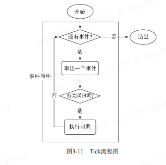
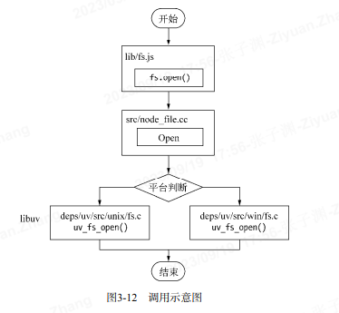
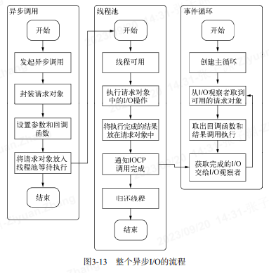
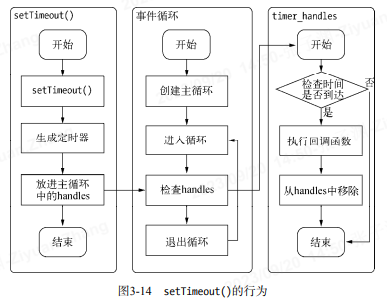
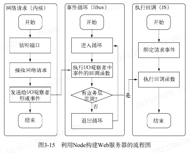

# 异步 I/O 与 编成 (原文:深入浅出 Node.js)

我们时常提到 Node 是单线程的，这里的单线程仅仅只是 JavaScript 执行在单线程中罢了。
在 Node 中，无论是`*nix` 还是 Windows 平台，内部完成 I/O 任务的另有线程池。

## node 的异步 I/O

完成 “整个异步 I/O 环节” 的有`事件循环、观察者、请求对象、I/O线程池`等。

1. 事件循环-----Node 自身的执行模型

   在进程启动时，Node 便会创建一个类似于 while(true)的循环，每执行一次循环体的过程我们称为 Tick。

   每个 Tick 的过程就是查看是否有事件待处理，

   - 如果有，就取出事件及其相关的回周函数。如果存在关联的回调函数，就执行它们。然后进入下个循环;
   - 如果不再有事件处理，就退出进程;

   

2. 观察者-----每次循环都向观察者询问是否有要处理的事件

   每个事件循环中有一个或者多个观察者，而判断是否有事件要处理的过程就是向这些观察者询问是否有要处理的事件。

   浏览器采用了类似的机制。事件可能来自用户的点击或者加载某些文件时产生，而这些产生的事件都有对应的观察者。  
   在 Node 中，事件主要来源于网络请求、文件 I/O 等，这些事件对应的观察者有文件 1/O 观察者、网络/O 观察者等。  
   观察者将事件进行了分类。

   事件循环是一个典型的生产者/消货者模型。异步/O、网络请求等则是事件的生产者，源源不断为 Node 提供不同类型的事件，这些事件被传递到对应的观察者那里，事件循环则从观察者那里取出事件并处理。

3. 请求对象

   node 的异步 I/O 调用：从 JavaScript 发起调用到内核执行完 I/O 操作的过渡过程中，存在一种中间产物，它叫做请求对象。

   请求对象是异步 I/O 过程中的重要中间产物，所有的状态都保存在这个对象中，包括“送入线程池等待执行”以及“ I/O 操作完毕后的回调处理”。

   

   - 从 JavaScript 调用 Node 的核心模块，核心模块调用 C++内建模块，内建模块通过 libuv 进行系统调用，这是 Node 里经典的调用方式。
   - 这里 libuv 作为封装层，有两个平台的实现，实质上是调用了 uv_fs_open()方法。在 uv_fs_open()的调用过程中，我们创建了一个`FSReqWrap请求对象`。
   - 从 JavaScript 层传入的参数和当前方法都被封装在这个请求对象中，其中我们最为关注的回调函数则被设置在这个对象的 oncomplete_sym/属性上：`req_wrap->object*->Set(oncomplete_sym,callback)`；
   - 对象包装完毕后，在 Windows 下，则调用 QueueUserWorkItem()方法将这个 FSReqWrap 对象推入线程池中等待执行，该方法的代码如下所示：`QueueUserWorkItem(&uv_fs_thread_proc,req,WT_EXECUTEDEFAULT)`;
   - QueueUserWorkItem()方法接受 3 个参数：第一个参数是将要执行的方法的引用，这里引用的是 uv_fs_thread_proc；第二个参数是 uv_fs_thread_proc 方法运行时所需要的参数；第三个参数是执行的标志。
   - 当线程池中有可用线程时，我们会调用 uv_fs_thread_proc()方法。uv_fs_thread_proc()方法会根据传入参数的类型调用相应的底层函数。以 uv_fs_open()为例，实际上调用 fs_open()方法。
   - 至此，JavaScript 调用立即返回，由 JavaScript 层面发起的异步周用的第一阶段就此结束。JavaScript 线程可以继续执行当前任务的后续操作。当前的 1/O 操作在线程池中等待执行，不管它是否阻塞 I/O,都不会影响到 JavaScrip 线程的后续执行，如此就达到了异步的目的。

4. 执行回调
   组装好清求对象、送入 I/O 线程池等待执行，实际上完成了异步 I/O 的第一部分，回调通知是第二部分。

   线程池中的 I/O 操作调用完毕之后，会将获取的结果储存在 req->result 属性上，然后周用 PostQueuedCompletionStatus()通知 IOCP,告知当前对象操作已经完成；

   PostQueuedCompletionStatus()方法的作用是向 IOCP 提交执行状态，并将线程归还线程池。
   通过 PostQueuedCompletionStatus()方法提交的状态，可以通过 GetQueuedCompletionStatus()提取。

   在这个过程中，我们其实还动用了事件循环的 I/O 观察者。在每次 Tck 的执行中，它会调用 IOCP 相关的 GetQueuedCompletionStatus()方法检查线程池中是否有执行完的请求，如果存在，会将请求对象加入到/O 观察者的队列中，然后将其当做事件处理。

   I/O 观察者回调函数的行为就是取出请求对象的 result 属性作为参数，取出 oncomplete sym 属性作为方法，然后调用执行，以此达到调用 JavaScript 中传人的回调函数的目的。至此，整个异步 1/O 的流程完全结束。

   

事件循环、观察者、请求对象、I/O 线程池这四者共同构成了 Node 异步 I/O 模型的基本要素。

在 Node 中，除了 JavaScript 是单线程外，Node 自身其实是多线程的，只是 I/O 线程使用的 CPU 较少。

另一个需要重视的观点则是，除了用户代码无法并行执行外，所有的 I/O(磁盘/O 和网络 I/O 等)则是可以并行起来的。

## 非 I/O 的异步 API

setTimeout()、setInterval()、setImmediate()、Process.nextTick()。

1. setTimeout()、setInterval() -- 不精确（在容忍范围内）

   比如通过 setTimeout()设定一个任务在 10 毫秒后执行，但是在 9 毫秒后，有一个任务占用了 5 毫秒的 CPU 时间片，再次轮到定时器执行时，时间就已经过期 4 毫秒。

   

2. Process.nextTick()

   每次调用 process.nextTick()方法，只会将回调函数放入队列中，在下一轮 Tick 时取出执行。

3. setImmediate()
   不同点

- process.nextTick()中的回调函数执行的优先级要高于 setImmediate()。

  process.nextTick()属于 ide 观察者，setImmediate()属于 check 观察者。
  事件循环对观察者的检查是有先后顺序的；在每一个轮循环检查中，ide 观察者 > I/O 观察者 > check 观察者。

- process.nextTick()的回调函数保存在一个数组中，setImmediate()的结果则是保存在链表中。

  在行为上，process.nextTick()在每轮循环中会将数组中的回调函数全部执行完，而 setImmediate()在每轮循环中执行链表中的一个回调函数。

  这样设计的目的，是为了保证每轮循环能够较快地执行结束，防止 CPU 占用过多而阻塞后续 I/O 调用的情况。

## 事件驱动与高性能服务器

- 几种经典的服务器模型

  1. 同步式。对于同步式的服务，一次只能处理一个请求，并且其余请求都处于等待状态。
  2. 每进程/每请求。为每个请求启动一个进程，这样可以处理多个请求，但是它不具备扩展性，因为系统资源只有那么多。
  3. 每线程/每请求。(Apache 服务器)为每个请求启动一个线程来处理。尽管线程比进程要轻量，但是由于每个线程都占用一定内存，当大并发请求到来时，内存将会很快用光，导致服务器缓慢。

- node 与 Nginx
  形同点：1、都采用事件驱动；(Nginx 摒弃了多线程的方式)
  不同点：
  Nginx 采用纯 C 写成，性能较高，仅适合于做 web 服务器；用于反向代理或负载均衡等服务；  
  node 则是一套高性能的平台，可以利用它构建与 Nginx 相同的功能，也可以处理各种具休业务，而且与背后的网络保持异步畅通。

**注：** Nginx 在 Web 服务器方面更专业；node 事件驱动 + 异步 I/O；
