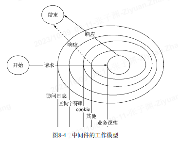

# 构建 web 应用---中间件 (原文:深入浅出 Node.js)



```
var middleware = function (req, res, next) {
    // TODO
    next();
}
//===== querystring解析中间件 ==============
//
var querystring = function (req, res, next) {
  req.query = url.parse(req.url, true).query;
  next();
};
//===== cookie解析中间件 ======================
var cookie = function (req, res, next) {
  var cookie = req.headers.cookie;
  var cookies = {};
  if (cookie) {
    var list = cookie.split(";");
    for (var i = 0; i < list.length; i++) {
      var pair = list[i].split("=");
      cookies[pair[0].trim()] = pair[1];
    }
  }
  req.cookies = cookies;
  next();
};
//=================================
app.use = function (path) {
  var handle;
  if (typeof path === "string") {
    handle = {
      // 第一个参数作为路径
      path: pathRegexp(path),
      // 其他的都是处理单元
      stack: Array.prototype.slice.call(arguments, 1)
    };
  } else {
    handle = {
      // 第一个参数作为路径
      path: pathRegexp("/"),
      // 其他的都是处理单元
      stack: Array.prototype.slice.call(arguments, 0)
    };
  }
  routes.all.push(handle);
};
//====================================

var match = function (pathname, routes) {
  var stacks = [];
  for (var i = 0; i < routes.length; i++) {
    var route = routes[i];
      // 正则匹配
    var reg = route.path.regexp;
    var matched = reg.exec(pathname);
    if (matched) {
      // 抽取具体值
      // 代码省略
      // 将中间件数组交给handle()方法处理
      stacks = stacks.concat(route.stack);
    }
  }
  return stacks;
};
//===================================
var handle = function (req, res, stack) {
  var next = function () {
    // 从stack数组中取出中间件并执行
    var middleware = stack.shift();
    if (middleware) {
      // 传入next()函数自身，使中间件能ࠕ够行结束后递归
      middleware(req, res, next);
    }
  };
  // 启动执行
  next();
};
//=======================================
function (req, res) {
  var pathname = url.parse(req.url).pathname;
  // 将请求方法变为小写
  var method = req.method.toLowerCase();
  // 获取all()方法里的中间件
  var stacks = match(pathname, routes.all);
  if (routes.hasOwnPerperty(method)) {
    //据请求方法分发，获取相关的中间件
    stacks.concat(match(pathname, routes[method]));
  }
  if (stacks.length) {
    handle(req, res, stacks);
  } else {
    // 处理404请求
    handle404(req, res);
  }
}
//=====================
app.use(querystring);
app.use(cookie);
app.use(session);
app.get('/user/:username', getUser);
app.put('/user/:username', authorize, updateUser);
```

## 异常处理

我们需要为白己构建的 Web 应用的稳定性和健壮性负责。于是我们为 next()方法添加 err 参数，并捕获中间件直接抛出的同步异常

```
var handle = function (req, res, stack) {
  var next = function (err) {
    if (err) {
      return handle500(err, req, res, stack);
    }
    // 从stack数组中取出中间件并执行
    var middleware = stack.shift();
    if (middleware) {
      // 传入next()函数自身，使中间件能够行结束后递归
      try {
        middleware(req, res, next);
      } catch (ex) {
        next(err);
      }
    }
  };
  // 启动执行
  next();
};
```

由于异步方法的异常不能直接捕获，中间件异步产生的异常需要自己传递出来

```
var session = function (req, res, next) {
  var id = req.cookies.sessionid;
  store.get(id, function (err, session) {
    if (err) {
      // 将异常通过next()传递
      return next(err);
    }
    req.session = session;
    next();
  });
};
//=============================
var middleware = function (err, req, res, next) {
 // TODO
 next();
};
//==========================
app.use(function (err, req, res, next) {
 // TODO
});
//=======================
var handle500 = function (err, req, res, stack) {
  // 获取异常处理中间件
  stack = stack.filter(function (middleware) {
    return middleware.length === 4;
  });
  var next = function () {
    // 从stack数组中取出中间件并执行
    var middleware = stack.shift();
    if (middleware) {
      // 传递异常对象
      middleware(err, req, res, next);
    }
  };
  // 启动执行
  next();
};
```

2. 中间件与性能

- 编写高效的中间案件
  1. 使用高效的方法
  2. 缓存需要重复计算的结果（需要控制缓存用量）
  3. 避免不必要的计算，比如 HTTP 报文体的解析，对于 GET 方法完全不需要
- 合理使用路由  
  合理的路由使得不必要的中间件不参与请求处理的过程。
