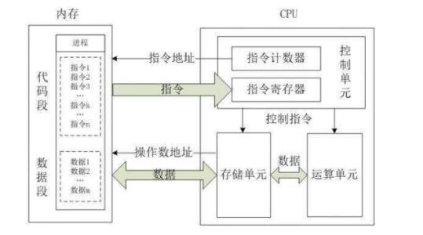

# 计算机的组成

1. 控制器+运算器 ==》CPU==》人类大脑
2. 存储器（IO设备）
   - 内存：--》人类大脑
   - 外存：硬盘 --》人的笔记本
3. 输入设备
4. 输出设备



## CPU取数据：寄存器--》高度缓存--》内存--》硬盘 --》磁带

1. 寄存器：L1缓存，下一步用到的
2. 高度缓存：L2缓存，有可能经常用的，常说的命中缓存在这一步

## 存储器(IO设备)

1. RAM: 内存
2. ROM: 只读内存，存放计算机厂商写死的一段核心程序==》BIOS
3. CMOS: 存取速度慢，断电数据丢失，耗电量极低（主板电池）

   CMOS: 指主板上用于保存系统硬件配置信息的一小块可读写存储器

## 硬盘分为：固态硬盘、传统机械硬盘、现代机械硬盘和LBA

- 传统机械硬盘：由“多个盘片”组成：
  - 概念
    1. 盘片：硬盘内部有多个高速旋转的圆形磁性盘片，数据就存储在这些盘片的表面。
    2. 磁道：每个盘片的每一面都被划分为成千上万个同心圆，这些同心圆环称为磁道。1个磁道就是一圈，1圈数据，对应一串二进制；
    3. 扇区：磁道上的最小存储单元，一段弧；一次读写数据的最小单位，一个扇区通常为512字节；
       - 磁盘读写很慢，攒一波一次读写；
       - 操作系统一次读写的单位是一个block块（默认8个扇区大小，可改），攒够一个block块，一次性交给硬盘，硬盘把block块分8份，进行读写，

    4. 柱面：所有盘片上半径相同的磁道，在垂直方向（三维空间）上形成了一个“柱面”。

  - 扇区编号 + 磁盘旋转 + 控制器调度。
    1. 寻道时间：把磁头臂移动到正确的磁道（柱面） 上方。 (最慢、机械运动)
    2. 旋转延迟：等待磁盘旋转，使“目标扇区”转到磁头下方。 (次慢、机械运动)
    3. 数据传输时间：实际读写数据。(最快、电子信号)

  - IO延迟 = 道时间 + 旋转延迟 + 数据传输时间。
    **注：**优化程序运行的核心法则：能从内存取数据，就不从硬盘取数据；
  - 虚拟内存（linux的swap分区）：程序运行所需的空间超过内存实际空间，在硬盘中划分一个空间，将不急着用的数据保存在硬盘中，当程序需要用到的时候，再从硬盘中取出来。这个空间就是虚拟内存。
    1. 虽然慢，但保证的程序能正常运行

- 驱动程序：
  硬盘通过“接口”（设备控制器）插入到主板中，“接口”（设备的控制器）就是一堆芯片组成的；

  “接口”（设备的控制器）上运行的程序是：驱动程序，
  **注：**操作系统--》驱动程序--》设备控制器--》硬盘

## 总线：组件与组件之间的数据传输通道

## BIOS（basic input output system）

BIOS 只负责“找启动程序”，不负责启动操作系统

1. RAM: 内存
2. ROM: 只读内存，存放计算机厂商写死的一段核心程序==》BIOS
3. CMOS: 存取速度慢，断电数据丢失，耗电量极低（主板电池）

   CMOS: 指主板上用于保存系统硬件配置信息的一小块可读写存储器

- BIOS 被写入ROM设备中，是计算机开机时，第一个被执行的程序； 在BIOS中，修改数据存放在CMOS中。
- 新机（装系统前）：CPU --> ROM(充当内存，存BIOS) -->CMOS（充当硬盘）

## 操作系统的启动流程

### 安装系统流程（从裸机到硬盘）

0️⃣ 上电阶段（硬件层）

- 主机上电
- CPU 从固定地址执行主板固件（BIOS/UEFI）
- 内存初始化，硬件进入可用状态

1️⃣ 固件阶段（BIOS/UEFI）

- 初始化硬件（CPU、内存、PCIe、显卡、键盘、磁盘控制器）
- 执行 POST（硬件自检）
- 读取启动配置（Boot Order）
- 按顺序扫描启动设备（U盘/光盘/PXE）

2️⃣ 启动设备选择（裸机）

- 用户在 BIOS/UEFI 中设置启动顺序
- 固件找到启动介质上的 Bootloader 并加载到内存
- 跳转执行 Bootloader

⚠️ BIOS/UEFI 只负责加载 Bootloader，不直接启动操作系统

3️⃣ 系统安装阶段（Bootloader 启动安装环境）

- Bootloader 启动最小可运行操作系统（安装环境）
  - Windows：WinPE
  - Linux：Live System/Installer
- 安装程序在临时系统中运行
- 安装程序完成：
  - 分区硬盘（MBR/GPT）
  - 创建 EFI System Partition（UEFI 模式）
  - 写入系统文件
  - 安装硬盘 Bootloader

💡 此时系统正式被写入硬盘，但尚未“运行”

### 日常启动流程（系统已安装）

```bash
上电
  → BIOS/UEFI
  → Bootloader
  → 操作系统内核（Kernel）
  → 用户空间
```

🔑 核心记忆：BIOS 找 Bootloader → Bootloader 启动 Kernel → Kernel 启动整个操作系统

## 应用程序的启动流程

双击应用图标：把“程序原始地址”给操作系统，操作系统加载程序

## 变成语言：机器语言-->汇编语言-->高级语言

- 机器语言：高电频、低电频 --> 二进制：01
- 汇编语言：
- 高级语言：AOT 编译、字节码解释、JIT 编译
  1. 编译型（AOT）：源代码在`运行前`就被编译为目标平台的机器码，运行时直接执行。
     - 流程：源代码 → 编译器 → 机器码（可执行文件） → 运行
     - 例如：C/C++、Rust、Go（本质也是 AOT）

  2. 解释型（纯解释执行）：源代码不生成机器码，由解释器在运行时`逐条读取并执行`。
     - 流程：源代码 → 解释器 → 逐句解释并执行
     - 例如：Python（早期CPython模型）、JavaScript（早期引擎）、Shell/Bash
     - 1、⚠️ 注意：解释 ≠ 编译；2、⚠️解释执行过程中通常”不会生成机器码“

  3. 混合型（字节码 + JIT 编译）`【现代主流】`：源代码先被编译为`平台无关的中间代码（字节码）`，运行时由虚拟机解释执行，并对`热点代码`进行 `JIT（Just-In-Time）编译`，生成机器码以提升性能。- 流程：源代码 → 字节码 → 虚拟机（解释执行） → 虚拟机（热点代码 JIT 编译为机器码）- 特点：跨平台、运行越久越快、启动略慢于 AOT - 例：Java（JVM）、Kotlin（JVM）、Scala、C#（.NET CLR）、Python（PyPy）、JavaScript（V8 / SpiderMonkey）

     3.8.2
     2.24
     3.6

pep
