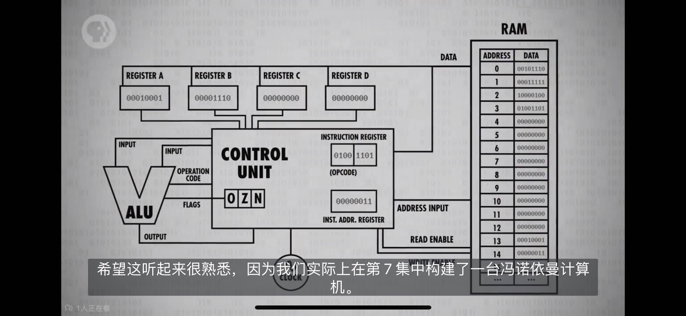
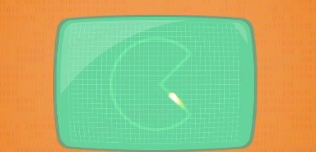
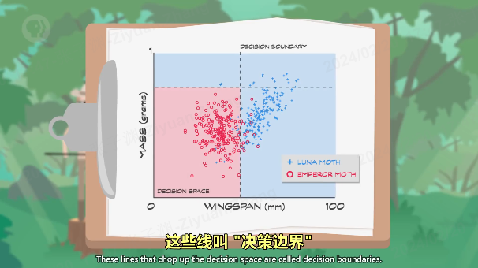
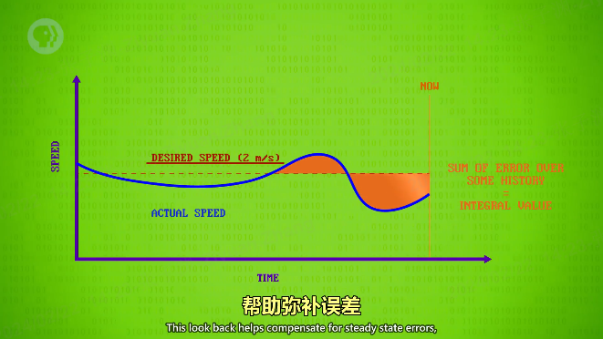

# 计算机科学速成课 https://shimo.im/docs/PJAUY30F1uYksv0h/read

- 计算机鼻祖--算盘：逢十进一
- 星盘：在海上计算维度；
- 计算尺：帮助计算乘法、除法；
- 制作各种工具：算日出、潮汐、天体的位置、或纯粹计算；

##

1.  bug（虫子）:程序出错为什么叫 bug

    早期计算机是巨大的，通过机械传动的，机械中容易出现虫子卡住机械转动，导致程序暂停/停止运行，需要清理虫子才能继续运行；
    出现 bug(虫子)代表机械停止了，程序出问题了；

2.  安全漏洞&补丁由来：

    在 1940 年代，是用打孔纸带进行的，但程序出现了问题（也就是漏洞），为了节约时间，只能贴上胶带也就是打补丁来填补空隙，漏洞和补丁因此得名。

## 第 4 课：二进制

- 概念梳理： 位(bit) / 字节(byte) / 字（word）

  1. 位(bit)：音译为“比特”，表示二进制位。位是计算机内部“数据储存”的最小单位，11010100 是一个 8 位二进制数。

     一个二进制位只可以表示 0 和 1 两种状态；两个二进制位可以表示 00、01、10、11 四种状态；三位二进制数可表示八种状态……。

  2. 字节(byte)：音译为“拜特”，习惯上用大写的“B”表示。字节是计算机中“数据处理”的基本单位。

     1byte=8bit，即 1byte 代表 8 位数字。最早期的电脑为八位的，即以八位为单位处理数据。为了方便，将八位数字命名为 1 字节（1byte）。

     八位二进制数最小为 00000000，最大为 11111111；通常 1 个字节可以存入一个 ASCII 码，2 个字节可以存放一个汉字国标码。

  3. 字（word）：计算机进行数据处理时，一次存取、加工和传送的数据长度称为字(word)。

     一个字通常由一个或多个(一般是字节的整数位)字节构成。例如 286 微机的字由 2 个字节组成，它的字长为 16；486 微机的字由 4 个字节组成，它的字长为 32 位机。

- 如何进行二进制与十进制联系起来：

  1. 二进制的 1011=1*2^0 + 1*2^1 + 0*2^2 + 1*2^3= 11（从右往左数）；
  2. 十进制的 1045= 1*10^3 + 0*10^2 + 4*10^1 + 5*10^0

- 十进制与二进制的图示：

  1. 十进制的 263

     

  2. 二进制的 10110111

     

- 十进制与二进制转换：

  1.  整数十进制转二进制，采用“除 2 取余，逆序排列”法：

      

  2.  纯小数转二进制：采用“乘 2 取整，顺序排列”法： 例如将 0.125 转换为二进制：
      ```
        0.125 * 2 = 0.25 ------0
        0.25 * 2 = 0.5 ------0
        0.5 * 2 = 1.0 ------1
        当小数部分为0就可以停止乘2了，然后正序排序就构成了二进制的小数部分：0.001
      ```
  3.  带有整数部分的小数转二进制， 假设要将 8.125 转换为二进制：

      ```
        现将8转为二进制：得到1000
        再将0.125转为二进制：得到0.001

        合并后为1000.001
      ```

- 二进制在电脑中的单位换算：

  1. 1byte=8bit，1B = 8bit；即 1 字节 代表 8 位数字。
  2. 1KB=1024B，即 1k（kei） 字节 代表 1024 字节;
  3. 1MB=1024KB，
  4. 1GB=1024MB，
  5. 1TB=1024GB，
  6. 1PB=1024TB，
  7. 1EB=1024PB

  你说的是 1K ＝ 2 的 10 次方吧。因为`这里所说的 K 并不是读千，而是读 kei`。这是因为在计算机中，数据是以二进制形式存储的。二进制的意思就是只有两个数 0 和 1，但是 0 和 1 只能表示两个信息，而计算机要表示数以亿计的信息，就只能对 0 和 1 进行组合。比如有两个空位，使用二进制数，每个空位只能放一个 0 或者一个 1，因此每个空位有 2 种情况，2 个空位就有 2 的 2 次方种组合情况(这个懂了吗？)，再比如有三个空位，使用二进制数，每个空位只能放一个 0 或者一个 1，那么就有 2 的 3 次方种组合情况，以此类推，有 10 个空位，使用二进制数，就有 2 的 10 次方种组合情况。`在计算机中，把 2 的 10 次方叫做 K(kei)，`它就和十进制中的万有点类似(1 万＝ 10 的 4 次方，因为有四个空位，每个空位可以放 0 ～ 9 的任意一个数，因此每个空位有 10 种情况，4 个空位就有 10 的 4 次方种组合情况)，就是一个很大的数。`不要把十进制中的 1 千和二进制中的 1K 搞混了`。

  1KB=1024B，1MB=1024KB，1GB=1024MB，1TB=1024GB，1PB=1024TB，1EB=1024PB

  - 中国表示数量的数词:一、二 、三、四、五、六、七、八、九、 十、百、千、万、亿、兆、京、垓 、杼、穰、沟、涧、正、载、极。
  - 佛教的传入加入的数词：恒河沙、阿僧 □、那由它、不可思议、无量。
  - 日本新增：大数（它原本是与小数相对应的，后来才被引申为一个新的数词）

    1. 万：代表的是 10 的四次方.
    2. 亿：代表的是 10 的八次方.
    3. 兆：代表的是 10 的十二次方.
    4. 京：代表的是 10 的十六次方.
    5. 垓：代表的是 10 的二十次方.
    6. 杼：代表的是 10 的二十四次方.
    7. 穰：代表的是 10 的二十八次方.
    8. 沟：代表的是 10 的三十二次方
    9. .......

- 32 位与 64 位电脑的区别:
  1. 32 位的最大数为 43 亿左右 ，32 位能表示的数字：0——2 的 32 次方-1，一共 2 的 32 次方个数；
  2. 64 位的最大数为 `9.2*10^18`;

## 第 5 课: 算术逻辑单元 (ALU)

构成：ALU 有 2 个单元，1 个算术单元和 1 个逻辑单元（Arithmetic Unit 和 Logic Unit）

作用：计算机中负责运算的组件，处理数字和逻辑运算的最基本单元。

- 算术单元：由半加器、全加器组成；半加器、全加器由 AND、OR、NOT、XOR 门组成

  1. 溢出：超出计算机（存储/处理）范围了；8bit 二进制相加结果超出 8 位，超出部分被舍弃；

     8bit 能存储 0~255 的数据；强行放 266 就超过了 255，会把第 0 个向前挤掉变成 1~266，出错；
     8 个位置想坐 9 个人，把第一个人向前挤掉；

  2. 计算机底层只有加减，没有乘除和其他高级运算;

     乘除和其他高级运算：用加减代替；例如 2 乘 5 实际上是 2 加了 5 次；

     2.1、 手机、笔记本等高级处理器，有专门做乘法的算术逻辑单元（更多的逻辑门、没有其他特殊）；普通处理器没有。

- 逻辑单元：执行逻辑操作，如 NOT、AND、OR 等操作，以及做简单的数值测试。

## 第 6 课: 寄存器与内存（RAM）

### 寄存器：

1. 锁存器：存储 1 位数字。
2. 寄存器：一组并排的锁存器；存储多位数字。这个数字有多少位，叫位宽；早期 8 位->16 位->32 位。
3. 门锁矩阵：寄存器的优化版--以矩阵的方式来存"锁存器的组合件"；消耗物理资源少（比如电线），存储的更多。

   - 位址：锁存器在矩阵中的行数与列数。例如 12 行 8 列
   - n*n 门锁矩阵可存放 n^2 个锁存器，但同一时间只能写入/读取 1 个数字。（早期为 16*16 矩阵）

     **注：**但 1 个矩阵只可记录 1 位数字，n 个矩阵组合在一起，才可记录 n 位数。如 1 个 8 位数，会按位数分成 8 个数，分别存储在 8 个矩阵的同一个位址中。

   - 多路复用器：一组电线，输入 2 进制的行址&列址，可启用矩阵中某个锁存器。

4. 多路复用器与矩阵 配合存储数据。

### 内存：---- 指令（程序）存 在内存中

内存的一个重要特性：可以随时访问任何位置，所以叫“随机存取'存储器'”简称 RAM

1.  内存粗略定义：将一堆“独立的存储模块”和“电路”看做一个单元，组成内存方块；n 个内存方块组成内存模块。在一个电路板上所有的内存方块统称为内存(RAM)。
2.  RAM（内存）：地址、数据构成；例如：数据由 8 位构成（00010100），数据的前四位指定“操作码”，后四位代表数据来自哪里--指定“内存地址”或“寄存器”


## 第 7 课: CPU（中央处理器单元）--- 负责执行程序（指令）

程序有一个个操作组成，这些操作叫“指令”（instruction）；因为他们指示计算机要做什么；

CPU 负责执行程序。通常由 寄存器、控制器单元、ALU（计算逻辑单元）、时钟组成。 与 RAM 配合，执行计算机程序。CPU 和 RAM 之间用“地址线”、“数据线”和“允许读/写线”进行通信。

- 概念梳理

  1. 寄存器：不在控制器单元内的(例：ABCD)；
  2. 控制器单元： 像指挥部，有序的控制指令的读取、运行与写入。控制器单元包含：寄存器（临时保存 ALU 的结果）、指令地址寄存器、指令寄存器、解析指令的逻辑门组件

     “例如：” 当启动计算机时，所有寄存器从 0 开始。

     - 寄存器：临时保存 ALU 的结果，关闭 ALU 后，再把值写入正确寄存器；
     - 指令地址寄存器：存当前指令的内存地址，追踪程序运行到哪里了。类似于银行取号，该器件只按顺序通报地址，让 RAM 按顺序将指令交给指令寄存器。
     - 指令寄存器：存当前指令。
     - 解析指令的逻辑门组件：

  3. ALU（计算逻辑单元）--看上面

  4. 时钟：负责管理 CPU 运行的节奏，以精确地间隔，触发电信号，控制单元用这个信号，推动 CPU 的内部操作。

     - 时钟速度：CPU 执行“取指令 → 解码 → 执行”（fetch → decode → execute）中每一步的速度叫做“时钟速度”，单位赫兹 Hz，表示频率。
     - 超频/降频：

       1. 超频，修改时钟速度，加快 CPU 的速度，超频过多会让 CPU 过热或产生乱码。
       2. 降频，降低时钟速度，达到省电的效果，对笔记本/手机很重要。

- CPU 工作过程：

  1. 取指令阶段（fetch）：“指令地址寄存器”发“地址”给 RAM → RAM 发“该地址内的数据”给“指令寄存器” → “指令寄存器”接受“数据”
  2. 解码阶段（decode）：“指令寄存器”发送“数据-指令”给“控制单元” → 由“控制单元”进行解码（逻辑门确认操作码）
  3. 执行阶段（execute）：“控制单元”执行“指令”（ → 涉及计算时 → 调用所需寄存器 → 传输入&操作码给 ALU 执行）→ 调用 RAM 特定地址的数据 → RAM 将结果传入寄存器 → 指令地址寄存器+1


## 第 8 课: 指令和程序

- 概念梳理

  1. 指令：指示计算机要做什么，多条指令共同组成程序。如数学指令，内存指令。
  2. 指令表（给人看的）：记录指令名称、用法、操作码、对应的 “内存地址”或“寄存器”的表格。

  **注:** 指令和数据都是存在同一个内存里的。每个“操作码”对应的一个指令。

- 原则：

  1.  RAM 每一个地址中，都存放 0 或 1 个数据。
  2.  特定的数字组合，就表示为一个指令，否则表示一个值。

- 指令的执行：

  1. LOAD 指令：

     - 计算机会按地址的顺序，读取 RAM 中所记录的指令/数据。
     - 计算机接收到指令后，如 LOAD_A，则通过“数据线”将“数据”传至“寄存器 A”。

  2. ADD 指令：ADD B A 指令告诉 ALU，把寄存器 B 和寄存器 A 中的数字加起来，存到寄存器 A 中。
  3. JUMP 指令：

     - 遇到 JUMP 指令，程序会跳转至对应的 RAM 地址读取数据。
     - JUMP 指令可以有条件跳转（如 JUMP-negative），也可以无条件跳转。

  例如：指令：从后四位指定的内存读取数据然后存到寄存器 A 中（ 处理“后四位数据”把“结果”保存到“指定的存储器”）

  **注：** 可以把 RAM（内存）的数据简化为指令或数据 更容易理解；根据地址找到对应的指令处理数据（指令中指向的寄存器中的）

- 计算机指令长度问题： 由于早期计算机每个字只有 8 位，指令只占 4 位，意味着只能有 16 个指令，这远远不够。

  现代计算机有两种方式解决指令不够用的问题：

  1. 更多位来表示指令，如 32 位或 64 位。
  2. 采用“可变指令长度”，令不同的指令的长度不同，尽量节约位数。


## 第 9 课: 高级 CPU 设计

- 概念梳理

  1. 硬件解码:
  2. 缓存模块（cache）:
  3. 指令流水线：
  4. 多核处理器：

- 内容

  1. 早期通过加快晶体管速度，来提升 CPU 速度。但很快该方法到达了极限。
  2. 给 CPU 设计了“专门除法电路+其他电路”来做复杂操作：如游戏，视频解码 -- 硬件解码？
  3. CPU 添加缓存模块（cache）：  
     为了不让 CPU 空等数据，在 CPU 内部设置了一小块内存，称为缓存；  
     空等原因：从 RAM 到 CPU 的数据传输速度低于处理数据速度（要通过总线，RAM 还要时间找地址、取数据、配置、输出数据）。

     1、加载：计算机数据通常是按顺序排列和处理的，当 CPU 加载一条数据时，从 RAM 中拿当前数据及后面的一整块数据放缓存中；  
     2、使用：命中缓存直接用，没有命中则从 RAM 中拿；  
     3、保存：处理完的数据保存在缓存中（不是保存到 RAM 中），以便后续使用；同时标记缓存存储的每个内存块为“脏位”；  
     脏位：缓存副本中的数据与 RAM 中的数据不一样。  
     4、同步：缓存满时，处理器请求新内存块时，擦除旧块释放空间前，检测脏位写回 RAM；

  4. 指令流水线 ---- 让取址 → 解码 → 执行三个步骤同时进行。并行执行指令，提升 CPU 性能。  
     1、在 CPU 的连续循环中 执行顺序是 fetch-decode-execute（取指令-解码-执行）；需要三个时钟周期来执行一条指令；  
     2、多条指令时，decode（解码）第 N+1 条指令时，fetch(取指令)部分加载第 N+1 条指令；  
     execute（执行）第 N 条指令时，decode（解码）第 N+1 条指令，fetch(取指令)第 N+2 条指令；  
     **注：**数据具有依赖性、跳转程序；解决方法：乱序运行、预测分支（高端 CPU）
  5. 一次性处理多条指令
  6. 同时运行多个指令流（多核 CPU）：  
     多核处理器：一个 CPU 芯片中，有多个独立处理单元。但因为它们整合紧密，可以共享一些资源。
  7. 超级计算机（多个 CPU）：在一台计算机中，用无数个 CPU，做怪兽级的复杂运算，如模拟宇宙形成。

## 第 10 课: 早期编成--程序如何进入计算机

早期，电脑无内存的概念，人们通过打孔纸卡/纸带 等物理手段，输入数据（数字），进入计算机。

- 概念梳理

  1. 控制面板
  2. 储存程序计算机

- 打孔卡片/纸带（机器里有个金属探针）--制表(功能单一)

  1. 打孔卡片被认为是便宜、可靠也易懂。62500 张纸卡=5MB 数据
  2. 当一张卡片被送入“汇总机”时，金属探针通过小孔，连通电路，该特定答案的运行总数加一。
  3. 早期的“汇总机”不是计算机，只能做数据汇总；它的操作固定，不可编成。
  4. 打孔纸卡/纸带 存的是数据，不是程序。

- 控制面板：随后，汇总机（制表机）增加了减、乘、除功能，甚至可以决定何时执行某些指令，为了正确执行不同计算，程序员创造了控制面板；

  1. 面板有很多小插孔，程序员可以插电线，让机器的不同部分 互相传数据和信号。因此也被叫做插线板；
  2. 插线板：通过插拔线路的方式，改变器件之间的连接方式，进行编程。
  3. 面板开关（1980s 前）：通过拨动面板上的开关，进行编程。输入二进制操作码，按存储按钮，推进至下一个内存位，直至操作完内存，按运行键执行程序。（内存式电脑）

  <!-- 4. 不幸的是，运行不同的程序时要重新接线。
  5. 因此到 1920 年代，控制面板变成可插拔的。让编程更方便，可以给机器插入不同程序。例：一个计算工资，一个计算税收
  6. 但给插线板编成很复杂，一堆缠结的电线 -->

- 现代计算机基础结构——冯诺依曼计算机

  1. 储存程序计算机--随着内存普及不再将程序放在物理插线板，放在计算机内存中。内存足够大的话 还可以存程序所需的数据；
  2. 冯诺依曼计算机的标志是，一个处理器(有算术逻辑单元)、数据寄存器、指令寄存器、指令地址寄存器、内存

  

## 第 11 课: 编程语言发展史

- 概念梳理

  1. 伪代码：用自然语言（中文、英语等）对程序的高层次描述;例：获取内存值，数字加一。
  2. 机器码（机器语言）：计算机能处理二进制，二进制是处理器的“母语”，事实上，他们“只能”理解二进制。
  3. 操作码：例 ：上面 RAM（内存）数据的前四位；
  4. 助记符: 每个操作码分配一个简单的名字，叫“助记符”。助记符后面紧跟数据，形成完成指令。例：LOAD_A 14，LOAD_A 就是助记符。
  5. 汇编码：用助记符写的指令。例：LOAD_A 14。
  6. 汇编器：用于将“汇编语言（助记符写的指令）”转换成“机器语言（机器码）”。
  7. 编译器：专门把高级语言转化为低级语言（汇编/机器码）。
  8. 安全漏洞&补丁由来：在 1940 年代，是用打孔纸带进行的，但程序出现了问题（也就是漏洞），为了节约时间，只能贴上胶带也就是打补丁来填补空隙，漏洞和补丁因此得名。
  9. 软件：先前都是硬件层面的编程，硬件编程非常麻烦，所以程序员想要一种更通用的编程方法，就是软件。

- 最早高级编程语言“A-0”

  1.  汇编只是修饰了一下机器码，一般来说，一条汇编语句对应一条机器指令。所以汇编码和底层硬件的连接很紧密，汇编器仍然强迫程序员思考底层逻辑。
  2.  葛丽丝·霍普博士，设计了一个高级编程语言，一行高级编程语言 可以转成几十条二进制指令。
  3.  高级语言没有低级语言运行的快，但是高级语言写代码写的快，取平衡下。
  4.  **过程：** 高级编程语言 → 编译器 → 汇编码/机器码

- 通用编程语言——COBOL

  1. 以前一种语言只能运行在一种类型的电脑上，换成其他类型的电脑不能用，需要重新写代码。
  2. 为此，工业界、学术界、政府的计算机专家组建一个联盟，开发一种通用编成语言，可以在不同计算机上通用。"普通面向商业语言"，简称 COBOL
  3. 每个计算架构需要一个 COBOL 编译器，不管是什么电脑都可以运行相同的代码，得到相同结果。（ 一次编写，到处运行 ）

- 现代编程语言:1960s-2000
  1. 1960s 起，编程语言设计进入黄金时代。
  2. 1960：LGOL, LISP 和 BASIC 等语言
  3. 70 年代有：Pascal，C 和 Smalltalk
  4. 80 年代有：C++，Objective-C 和 Perl
  5. 90 年代有：Python，Ruby 和 Java

## 第 12 课: 编程基础-语句和函数

- 概念梳理

  1. 语法: 规定句子结构的一系列规则。
  2. 程序：由一个个指令组成。
  3. 控制流语句：条件语句（if）、循环语句（while、for）
  4. 函数（方法、子程序）：当一个代码很常用的时候，我们把它包装成一个函数 。
  5. 库：大量函数的集合。

## 第 13 课: 算法入门

- 概念梳理

  1. 算法的复杂度(大 O 表示法)：算法的“输入大小”和“运行步骤”之间的关系 叫做“算法的复杂度”；
  2. 算法的复杂度：来表示运行速度的量级

- 内容

  1. 选择排序:复杂度为 O(n²);--交换
  2. 归并排序的算法复杂度为 `O（n*log n）`，n 是需要比较+合并的次数，和数组大小成正比，log n 是合并步骤所需要的的次数，归并排序比选择排序更有效率；
  3. Dijkstra 算法（图）：一开始复杂度为 O(n²)，优化后复杂度为 `O（nlog n +I）`，n 表示节点数，I 表示有多少条线。

## 第 14 集 数据结构

算法处理的数据 存在内存里的格式是什么？

- 概念梳理

  1. 数组（Array），也叫列表（list）或向量（Vector）：是一种数据结构。

     - 数组在内存中 按顺序储存，在中间插一个值很困难。
     - 为了拿出数组中某个值，我们要指定一个下标（index），大多数编程语言里，数组下标都从 0 开始，用方括号 [ ] 代表访问数组。
     - **偏移**： j[0],会去内存地址 1000，加 0 个偏移，得到地址 1000，拿值：5； j[5]会从 j[0]加 5 个偏移，得到地址 1005，拿值：4

     

  2. 字符串 ：是字母、数字、标点等组成的数组;

     - 字符串在内存里以 0 结尾。（0 不是“字符串 0”，是“二进制 0”，叫字符“null”，标识字符串结尾）

     

  3. 矩阵： 可以把矩阵看成数组的数组

     

  4. 结构体(Struct)：把几个有关系的变量存在一起叫做结构体

     - 存结构体的数组和其他数组一样，创建时就有固定大小，不能动态增加大小。
     - 但结构体可以创建更复杂的数据结构，消除（数组的）这些限制。

     

  5. 指针：指针是一种特殊变量，指向一个内存地址，因此得名。
  6. 节点（结构体的一种）：存一个变量，一个指针（pointer）
  7. 链表：用节点可以做链表，链表是一种灵活数据结构，能存很多个 节点 (node)，灵活性是通过每个节点 “指向” 下一个节点实现的。

     - 链表可以是循环的，也可以是非循环的，非循环的最后一个指针是 0（“null”代表链表的尽头）
     - 数组大小需要提前定好，链表大小可以动态增减。通过改变指针值，把新节点插入链表。
     - 链表 很容易 重新排序、两端缩减、分割、倒序等。

     

  8. 队列（用的链表）："队列" 就像邮局排队，谁先来就排前面，这叫 先进先出（FIFO——first in first out）。

     - 入队、出队

  9. 栈（用的链表）：把"栈"想成一堆松饼,做好一个新松饼，就堆在之前上面,吃的时候，是从最上面开始。

     - 栈是后进先出(LIFO)
     - 入栈（push）、出栈(pop)

  10. 树（ 链表加一个指针，nextLeft【左侧】、nextRight【右侧】、value【值】）

      - 根节点
      - 子节点
      - 母节点
      - 页节点（leaf）：没有任何子节点。
      - 二叉树：有两个子节点。
      - 看子节点数量，也可以三叉树、四叉树。。。
      - **重要**：树的“根到“叶”是单向的

  11. 图（链表的一种）：如果数据随意连接，有循环，我们称之为图，

## 第 15 课 阿兰图灵

- 可判定性问题

  是否存在一种算法，输入正式逻辑语句 输出准确的"是"或"否"答案？【被证明不存在--计算机解决问题的能力是有极限的】

  上帝是否是万能的：上帝能否创造出一块上帝都举不起的石头

  1.  阿隆佐邱奇，Lambda 算子:

      美国数学家 阿隆佐·丘奇，开发了一个叫"Lambda 算子"的数学表达系统，证明其不存在。

  2.  图灵机:

      只要有足够的规则，状态和纸带，图灵机可以解决一切计算问题。和图灵机一样完备，叫做“图灵完备”。

  3.  停机问题: 证明图灵机不能解决所有问题。

- 图灵测试

  向人和机器同时发信息，收到的回答无法判断哪个是人，哪个是计算机，则计算机达到了智能程度。  
  应用：机器验证

- 二战加密与破解：

  加密后的字母等于自身，排除掉自身；查找剩余的字母组成的单词；

## 第 16 课 软件工程

- 概念梳理

1. 对象：

   - 当任务庞大，函数太多，我们需要把函数打包成层级，把相关代码都放一起，打包成“对象”。
   - 对象可以包括其他对象，函数和变量。
   - 把函数打包成对象的思想叫做“面向对象编程”，面向对象的核心是隐藏复杂度，选择性的公布功能。

2. 程序编程接口（AP）：I
3. 集成开发环境（IDE）：程序员用来专门写代码的工具
4. 调试（debug）：IDE 帮你检查错误，并提供信息，帮你解决问题，这个过程叫调试
5. 文档与注释：
6. 版本控制：
7. 质量控制：测试可以统称“质量保证测试”（QA），作用是找 bug
8. alpha 与 beta

   - beta 版软件，即是软件接近完成，但没有完全被测试过，公司有时会向公众发布 beta 版，以帮助发现问题。
   - alpha 是 beta 前的版本，一般很粗糙，只在内部测试

## 第 17 课 集成电路与摩尔定律（硬件的发展）

继电器 → 真空管（电子管）→ 晶体管

“晶体管”标志着“计算 2.0 时代”
“集成电路”标志着“计算 3.0 时代”

- 概念梳理

  1. 分立元件： 一开始，计算机都有独立组件构成，叫“分立元件”，然后不同组件再用线连在一起。
  2. 数字暴政： 如果想提升性能，就要加更多部件，这会导致计算机的构成更复杂，这个问题叫做“数字暴政”。
  3. 集成电路（IC）：与其把多个独立部件用电线连起来，拼装出计算机，不如把多个组件包在一起，变成一个新的独立组件。这种新的独立组件就叫集成电路（IC）。
     - 早期一个 “集成电路（IC）” 只有几个晶体管。
     - 即使只有几个晶体管，也可以把简单的电路（逻辑门）封装成单独组件。
     - IC 就像乐高积木一样，可以组合出无数种设计。
     - 最终还需要连接起来，创造更复杂的电路，例如计算机。
  4. 印刷电路板（PCB）：为了不用焊接 IC 或用一大堆线连接 IC，发明了印刷电路板（PCB）；它通过蚀刻金属线的方式，把零件连接到一起。
  5. 硅：有时可导电，有时不能导电。根据其特性，控制其能不能导电，做成半导体。
  6. 光刻： 即用光把复杂图案印到材料上。我们把一片薄片状的硅叫做晶圆，通过一系列生产步骤，将晶圆表面薄膜的特定部分除去的工艺叫做光刻。
  7. 摩尔定律：每两年左右，得益于材料和制造技术的发展 ，同样大小的空间，能塞进两倍数量的晶体管。【已经不存在了】

- 进一步小型化会碰到的问题【摩尔定律已经到“数字暴政”了】

  1. 由于光的波长限制，精度已到极限。
  2. 量子隧穿效应：当晶体管非常小，电极之间可能只距离几个原子，电子会跳过间隙，会产生漏电问题

- 光刻

  
  
  
  
  
  

## 第 18 课 操作系统

- 概念梳理

1. 操作系统(OS)： 操作系统也是一种程序，不过它有操作硬件的特殊权限，可以运行和管理其他程序。

   - 以前计算机只能运行一个程序，运行完需要手动放下一个程序，后来计算机运行效率提升，放程序的时间大于运行的时间。
   - 需要一种方式让计算机自动运行，于是操作系统(OS)诞生了。
   - 操作系统一般是计算机启动的第一个程序，其他程序有它启动和管理。

2. 批处理：一个程序运行后会自动运行下一个程序。
3. 外部设备：和计算机连着的其他设备，如打印机。
4. 设备驱动程序：为了使所写程序和不同类型的电脑兼容，我们需要操作系统充当软件和硬件之间的媒介，更具体地说，操作系统提供程序编程接口(API)来抽象硬件,叫“设备驱动程序”。程序员可以用标准化机制，和输入输出硬件（I/O）交互，

   - 问题：不同牌子的同一种设备（例：打印机），底层调用不一样，写代码很痛苦。

5. 多任务处理：操作系统能使多个程序在单个 CPU 上同时进行的能力，叫做“多任务处理”

   - 问题：CPU 处理太快，其他部分处理太慢（例：打印）；不能闲置昂贵的 CPU，其他部分工作时给它任务处理。

6. 虚拟内存：多程序处理带来了一个程序所占用内存可能不连续的问题，导致程序员难以追踪一个程序，为了解决这个问题操作系统会把内存地址虚拟化，这叫“虚拟内存”。

   - 使程序以为它用的内存是连续的（地址从 0 开始）；“虚拟内存”映射“物理内存”，操作系统做的。

7. 动态内存分配：虚拟内存的机制使程序的内存大小可以灵活增减，叫做“动态内存分配”，对程序来说，内存看上去是连续的。
8. 内存保护：给每个程序分配单独的内存，那当这个程序出现混乱时，它不会影响到其他程序的内存，同时也能有效地防止恶意程序篡改其他程序，这叫做内存保护。
9. 多用户分时操作系统（Multics）：用来处理多用户同时使用一台计算机的情况，即每个用户只能用一小部分处理器，内存等，
10. Unix：把操作系统分成两个部分，

    - 一个是操作系统的核心部分，如内存管理，多任务和输入/输出处理，这叫做“内核”，
    - 第二部分是一堆有用的工具，比如程序和运行库。
    - **注**：可能造成“内核恐慌”，重启电脑就好，用户可以接收。

## 第 19 课 内存和储存介质（存储技术的发展）

存储器（storage）、内存（memory）

- 概念梳理

1. 纸卡/纸带 问题：读取慢 难修改 难存临时值
2. 延迟线存储器：利用线的延迟在线里存储数据，又叫顺序存储器或者循环存储器。

   - 存在问题：
     1. 不能随意调出数据；
     2. 难以增加内存密度；

3. 磁芯（磁环）：利用电磁感应原理；

   - 问题：成本高

4. 磁带：问题: 访问速度慢（机械寻址）；
5. 磁鼓：与磁带相似（机械寻址）；
6. 硬盘：与磁带相似（机械寻址）（寻址时间）；
7. 内存层次结构：在计算机中，高速昂贵和低速便宜的内存混合使用以取得一个平衡；
8. 软盘：除了磁盘是软的，其他都和硬盘一样，好处是便携（机械寻址）；
9. 光盘：原理：光盘表面有很多小坑，造成光的不同反射，光学传感器会捕获到，并解码为 1 和 0；
10. 固定硬盘（SSD）：里面是集成电路；

## 第 20 课 文件系统

为什么要采用文件格式：可以随便存文件数据，但按格式存会更方便

- 概念梳理

  1. TXT 文本文件：存文字，用 ASCII 解码；
  2. WAV 音频文件（波形文件）：存音频数据，记录的是振幅；

     - 元数据：存在文件开头，在实际数据前面，也叫“文件头”；包含：码率、声道（单声道、立体声）

  3. 位图（BMP）文件：存图片，记录每个像素的红绿蓝 RGB 值；

     - 开头有元数据（文件头）：保存图片宽高、颜色深度
     - 假如：图片宽度 `4*4`，颜色深度 24，8 位红、8 位绿、8 位蓝；8 位（bit）= 1 字节（byte）；
     - 1 字节能标识（0-255），红色 255、绿色 255、蓝色 255。三原色

  4. 目录文件：用来解决多文件问题，存各个文件的信息，比如开头，结尾，创建时间，类型等。

     - 文件是连续存在“存储器”中的（例：硬盘）；
     - 存储器没有文件的概念，只有存储大量位；
     - 要添加、删除、更改文件名等，必须更新“目录文件”；
     - 抽象为我们说的文件夹；

  5. 文件系统：专门负责管理文件。

     - 目录文件，以及对目录文件的管理是一个非常简单的文件系统。
     - 平面文件系统（Flat File System）：文件都在同一个层次，平的；早期空间小，只有十几个文件，平面系统够用。
     - 某个文件新增，导致其后的文件被覆盖。决解办法：

       1. 把（硬盘）空间划分成一块块；
       2. 文件拆分存在多个块里；（目录文件会记录）

     - 删除某个文件：只需在“目录文件”删除它的记录，让那些块空间变得可用；

       1. **注**：没有擦除数据，只是删除记录；
       2. 之后某个时刻，那些块被新的数据覆盖；在覆盖前 数据还在原处。（计算机取证团队可以“恢复数据”）；

     - 不同目录文件间移动：不用移动任何数据块，只需改两个目录文件，一个目录文件里删除一条记录，一个目录文件里添加一条记录。

  6. 碎片整理：文件的增删改查会不可避免的造成文件散落在各个块里，打开文件需要花费时间读取。所以需要碎片整理--计算机把“文件内容”调换位置，放在一起、排成正确顺序、方便读取。
  7. 分层文件系统（Hierarchical File System）：有不同文件夹（多个目录文件），文件夹可以层层嵌套；
     - 根目录：包含文件和子目录

## 第 21 课 压缩

压缩的好处：能存更多文件，传输也更快；
无压缩：wav\flac
无损压缩：gif\png\pdf\zip
有损压缩：mp3

- 概念梳理

  1. 无损压缩 （Lossless compression）：没有损失任何数据的压缩。解压后，数据和压缩前完全一样。
  2. 无损压缩--游程编码（Run-Length Encoding）适合经常出现相同值的文件，以吃豆人游戏为例：

       
     然后删掉后面的重复数据  
     
     

  3. 无损压缩--霍夫曼树 （Huffman Tree）和字典编码 （Dictionary coders）

     - 有一个“字典”，存储“代码”和“数据”间的对应关系；
     - 一种高效的编码模式；
     - 以压缩图片为例：把图像看成一个一个块而不是像素，为了简单，可以把 2 个像素看成一个块（占 6 字节），只有 4 对：白黄、黑黄、黄黄、白白（WY、BY、YY、WW）；他们出现的频率不同。
       
       1.   
          这里 黑黄和白白 的频率最低，他们都是 1；  
            
          现在完成了一轮算法；
       2. 现在我们重复这样子做，这次有 3 个可选；  
          
          
       3.   
          现在看起来像这样，它有一个很酷的属性：按频率偶排序。
       4. 我们可以把每个分支用 0 和 1 标注。  
          
       5. 现在来压缩图片，第一个像素对，白黄替换成 10；  
            
          之前 48 字节（byte）现在变成了 14 位（bit）, 注意是位（bit）不是字节（byte）
       6. 把字典加到 14bit 前面；  
          

     * “消除冗余”和“用更紧凑的表示方法”，这两种方法通常会组合使用，几乎所有无损压缩格式都用了他们。
     * “游戏编码”和“字典编码”都是无损压缩的，压缩时不会丢失信息，解压后，数据和之前完全一样

  4. 有损压缩--感知编码 Perceptual coding 和 jpeg 格式

     - 删掉人类无法感知的数据的有损压缩方法，叫做“感知编码”，如音频文件，人类听不到超声波，所以可以舍去，MP3 就是音频的一种压缩形式。
     - 网络通话：声音怪怪的，压缩声音（微信、QQ）
     - 图片为例：

         
       几乎每个像素都和相邻像素不同，用无损技术很难压缩，因为太多不同点了；很多小细节，但人眼看不出来这些细节，
         
       这看起来一样，但可能只占 10%的原数据；  
         
       进行高度压缩，只有原始大小的八分之一，通常可以取得平衡，图片看起来差不多，但文件小不少；

     - 视频：时间冗余（Temporal redundancy）
       一个视频由很多图片构成，其中很多图片的背景一样，这就构成了时间冗余，很多视频编码格式，只存变化的部分。进阶的视频压缩模式会找到帧与帧的相似性，然后打补丁，MPEG-4 是视频压缩的常见标准。

## 第 22 课 命令行界面

1.  人机交互 （Human-Computer Interaction）发展史

    - 计算机早期同时输入程序和数据（用纸卡/纸带） 运行开始直到结束，中间没有人类进行操作，原因是计算机很贵，不能等人类慢慢输入，执行完结果打印到纸上.
    - 为了让人类输入到计算机，改造之前就有的打字机，变成电传打字机
    - 到 1970 年代末，屏幕成本足够低，屏幕代替电传打字机，屏幕成为标配

2.  人机交互工具的变化

    - 早期输出数据是打印到纸上，而输入是用纸卡/纸带一次性把程序和数据都给进去
    - QWERTY 打字机的发展（键盘字母排版）。
    - 电传打字机 （Teletype machine） 作用：用于发电报，使两人可以远距离沟通

3.  命令行界面（Command line interface）
    - 输入命令，计算机会给予回应

## 第 23 课 屏幕与 2D 图形显示

PDP-1 计算机、键盘和显示器分开，屏幕显示临时值（调试），最终值打印在纸上；

- 概念梳理--显示技术

  1. 阴极射线管(CRT)：

     - 原理：把电子发射到“有 磷光体涂层的屏幕上”，当电子撞击涂层时会发光几分之一秒，由于电子是带粒子的，路径可以用磁场控制，屏幕内用板子或线圈 把电子引导到想要的位置，上下左右都行。
     - CRT 有两种绘图方式：

       1. 矢量扫描 Vector Scanning：引导电子束描绘出形状，这叫矢量扫描；因为发光只持续一小会儿，如果重复得够快 可以得到清晰的图像。

          

       2. 光栅扫描 Raster Scanning：按固定路径，一行行从上向下，从左到右，不断重复，只有在特定的点打开电子束，以此绘制图形。这叫“光栅扫面”

          

     - 在屏幕上显示的清晰的点，叫"像素";
     - 早期显示器不用像素，像素占内存太多了（早期内存小）

  2. 【光栅】液晶显示器 (LCD) ：LCD 也用光栅扫描。
  3. 【光栅】字符生成器 Character generator：

     - 相比于像素，为了减少内存，人们更喜欢使用字符，计算机需要额外硬件来从内存读取字符，转换成光栅图形，这样才能显示到屏幕上，这个硬件叫 "字符生成器"，基本算是第一代显卡。
     - 它内部有一小块只读存储器，`简称 ROM`，存着每个字符的图形，叫"点阵图案"；
     - 例如：如果图形卡看到一个 8 位二进制，发现是字母 K，会把字母 K 的“点阵图案”光栅扫描显示到屏幕的适当位置
     - 字符生成器 是一种省内存的技巧，但没法绘制任意形状。

  4. 【光栅】屏幕缓冲区 Screen buffer：

     - 为了显示，"字符生成器" 会访问内存中一块特殊区域 这块区域专为图形保留，叫 屏幕缓冲区；程序想显示文字时，修改这块区域里的值就行。

  5. 【光栅】位图显示和画矩形

     - 位图显示：内存中的位（bit）对应着屏幕上显示的像素。（可以把图形想成一个巨大的像素值矩阵）。
     - 帧缓冲区：计算机把像素数据存在内存中的一个特殊区域，这个区域叫“帧缓冲区”。
     - 早期，这些数据（帧缓冲区）存在内存中；后来存在高速视频内存里（简称 VRAM）， VRAM 在显卡上，这样访问更快。
     - 想画更复杂的图形，如画矩形，我们需要四个值，起点的 x y 坐标，高度和宽度（for 循环画）， 0 代表黑色、255 代表白色、127 代表灰色（255/2=127.5）

  6. 【矢量】矢量命令画图：为了绘制任意形状，同时不吃掉内存，计算科学家用 CRT 上的“矢量模式”

     - 概念非常简单：所有东西都由线组成,矢量指令可以画出线，把许多矢量指令存在硬盘上，就能画出很多由线组成的复杂图形。
     - 矢量指令存在内存中，通过矢量图案卡画到屏幕上；线的亮度从 0 --> 100（开始画）--> 0（画完）

  7. 【矢量】画板（Sketchpad）, 光笔 （Light pen）

     - Sketchpad：一个交互式图形界面，用途是计算机辅助设计 (CAD)。被广泛的认为是第一个完整的图形程序。
     - 光笔：就是一个有线连着电脑的触控笔，有了它们，用户可以画出很完美的线条并进行移动、缩放等操作。

## 第 24 课 冷战和消费主义

本课概括：政府和消费者推动了计算机的发展

1. 范内瓦·布什 预见了计算机的潜力，提出假想机器 Memex（类似 维基百科） ；帮助建立 国家科学基金会，给科学研究提供资金；
2. 苏联 1961 年把宇航员加加林送上太空，导致美国提出登月，NASA 预算大大增加，用集成电路来制作登月计算机；
3. 集成电路的发展实际上是由军事应用大大推进的，阿波罗登月毕竟只有 17 次；

## 第 25 课 个人计算机革命

本集概括：继续讲计算机发展史

1. 1970 年代初成本下降，个人计算机变得可行

   - RAM：random-access memory 随机访问存储器
   - ROM：read-only memory 只读存储器

2. Altair 8800 第一台取得“商业成功”的个人计算机；用的“机器码”，程序需要自己写。
3. 比尔·盖茨 和 保罗·艾伦写 BASIC `解释器`，解释器和编译器类似，区别是：解释器运行时转换，而编译器提前转换。

   - BASIC 是一门更受欢迎更简单的编成语言。

4. 乔布斯提议卖组装好的计算机，Apple-I 诞生。

   - 1977 年出现 3 款开箱即用计算机："Apple-II"，"TRS-80 Model I"，"Commodore PET 2001"

5. IBM 意识到个人计算机市场，IBM PC 发布，采用“开放架构”，兼容的机器都叫 IBM Compatible (IBM 兼容)
6. 生态系统产生雪球效应：

   - 因为用户多，软硬件开发人员更愿意花精力在这个平台
   - 因为软硬件多，用户也更乐意买 "IBM 兼容" 的计算机

7. 苹果选“封闭架构”，一切都自己来，只有苹果在非 "IBM 兼容" 下保持了足够市场份额。

   - 苹果采用“图形界面”，以前都是命令行界面。

## 第 26 集：图形用户界面 (GUI)

- 概念梳理

  1. GUI 是“事件驱动编程”，代码可以在任意时间执行以响应事件，而不像传统代码一样自上而下。（回调）
  2. 图形界面先驱：道格拉斯·恩格尔巴特（Douglas Engelbart）—— 设想计算机成为未来知识性员工应对问题的工具；  
     并发明了鼠标，发明了 桌面、窗口、文档、剪切、复制、粘贴等计算机概念

- 历史

  1. 1973 年完成 Xerox Alto(施乐奥托) 计算机——创立了桌面，窗口等计算机概念
  2. 1981 年的 Xerox Star system(施乐之星系统) 创建了文档概念
  3. 所见即所得 WYSIWYG——施乐打印出来的东西和计算机上一样，并发明了剪切 复制 黏贴等计算机概念
  4. 史蒂夫·乔布斯去施乐参观后，改进苹果电脑，推出 Apple Lisa 失败，推出 Macintosh 成功
  5. 1985 年推出 Windows 1.0，之后出到 3.1
  6. 1995 年推出 Windows 95 提供新的图形界面，并有 Mac 没有的新功能，如多任务和受保护内存

## 第 27 集：3D 图形--GPU

- 概念梳理

  1. 线框渲染 Wireframe Rendering：有图形算法 负责把 3D 坐标"拍平"显示到 2D 屏幕上，这叫 3D 投影(包括正交投影和透视投影)，所有的点都从 3D 转成 2D 后，就可以用画 2D 线段的函数来连接这些点，这叫线框渲染；

     - 正交投影：立方体的各个边，在投影中互相平行；
     - 透视投影:在真实 3D 世界中，平行线段会在远处收敛与一点；

  2. 网格（Mesh）：如果我们需要画比立方体复杂的图形，三角形比线段更好，在 3D 图形学中我们叫三角形"多边形"(Polygons)，一堆多边形的集合叫 网格，网格越密，表面越光滑，细节越多；
  3. 三角形更常用：因为三角形的简单性、空间中三个点能定义一个平面。（能定义唯一的平面）
  4. 扫描线渲染（Scanline Rendering）：填充图形的经典算法。

     - 填充的速度叫做“填充速率”
     - 抗锯齿：边缘羽化，如果像素在多边形内部，就直接涂颜色，如果多边形划过像素，颜色就浅一些

  5. 遮挡（Occlusion）：

     - 画家算法： 用排序算法，从远到近排列，然后从远到近渲染，这叫“画家算法”。
     - 深度缓冲 “Z-Buffering”：另一种画遮挡的方法，简而言之，Z-buffering 算法会记录场景中每个像素和摄像机的距离，在内存里存一个数字矩阵，首先，每个像素的距离被初始化为"无限大"，然后 Z-buffering 从列表里第一个多边形开始处理，也就是 A，它和扫描线算法逻辑相同，但不是给像素填充颜色，而是把多边形的距离和 Z-Buffer 里的距离进行对比，它总是记录更低的值，因为没对多边形排序，所以后处理的多边形并不总会覆盖前面的。

       - 问题：Z-Fighting 错误：采用深度缓冲算法，哪个图形在前将会变化。（后面的图形有可能跑前面）
       - 解决：背面剔除 （Back Face Culling）：由于游戏角色的头部或地面，只能看到朝外的一面，所以为了节省处理时间，会忽略多边形背面；这很好,但有个 bug 是 如果进入模型内部往外看，头部和地面会消失。

  6. 灯光 也叫 明暗处理

     - 表面法线（Surface Normal）：在 3D 图形上任取一小个区域，它面对的方向叫“表面法线”。
     - 平面着色 （Flat Shading）：基本的照明算法，缺点是使多边形边界明显，看上去不光滑。
     - 高洛德着色 （Gouraud shading）, 冯氏着色 （Phong Shading）：不只用一种颜色给整个多边形上色

  7. 外观--纹理：纹理在图形学中指外观，而不是手感，纹理有多种算法来达到花哨效果，最经典的是纹理映射。

     - 纹理映射（Texture Mapping）

       
       

  8. 图形处理单元 （GPU）
     - GPU 在显卡上，周围有专用的 RAM，所有网格和纹理都在 RAM 中，让 GPU 的多核心可以高速访问。
     - 专门的硬件加速，让运算快如闪电；
     - 可以把 3D 场景分解成多个小部分，然后并行渲染，而不是按顺序渲染；方便并行处理多个图形，并把图形分成一个个小块来处理。

## 第 28 集：计算机网络

- 概念梳理

1. 局域网 Local Area Networks - LAN ：

   计算机近距离构成的小型网络，叫局域网（LAN），以太网是经典的局域网

2. 媒体访问控制地址 Media Access Control address - MAC 地址：（唯一的）用于确认局域网和 WiFi 传输的对象。

   - 这个唯一的地址放在头部，作为数据的前缀发送到网络中；计算机只需要监听以太网只有看到自己的 MAC 地址，才处理数据。

3. 载波侦听多路访问 Carrier Sense Multiple Access - CSMA：多台电脑共享一个传输媒介，叫做载波侦听多路访问；

   - 共享媒介（又称载体）：指运输数据的共享媒介，。如 WiFi 的载体是传播无线电波的空气，以太网的载体是电线。
   - 带宽：载体传输数据的速度叫“带宽”；
   - 很多计算机同时侦听载体，所以叫“侦听”和“多路访问”。
   - **问题**：多台计算机同时传数据，产生冲突（谁先谁后问题）

4. 【解决】指数退避 Exponential Backoff：

   当多台计算机同时想要传输数据时，就会发生冲突，当计算机检测到冲突 就会在重传之前等待一小段时间。这一段时间包括固定时间+随机时间，再次堵塞时固定时间将会指数级增加，这叫做“指数退避”。

   - 以太网和 wifi 都用这种方法，很多其他传输协议也用。
   - **问题**：有“指数退避”，想用一根网线连接整个大学的计算机还是不可能的。

5. 【解决】冲突域 Collision Domain：载体和其中的设备总称为“冲突域”，

   - 减少同一个载体中的设备数量。（例：减少同一根网线中计算机数量）
   - 为了避免冲突，可以用“交换机”把 1 个冲突域 拆成 2 个冲突域； 交换机位于 2 个更小的网络之间必要时才在两个网络间传数据。
   - 交换机会记录一个列表写了哪些 MAC 地址在哪边网络。  
        
     A 给 C 发，同时 D 也可以给 F 发；不会互相干扰；如果 A 给 F 发，两边的网络都会被短暂的占用；

6. 路由：

   - 电路交换 Circuit Switching：缺点：不灵活且数量昂贵。 好处：随意用，无需共享。（军队-军用光缆、政府、一些机构）

     

   - 报文交换 Message Switching：

     1. 报文具体格式由“互联网协议”定义（简称 `IP`），每一个电脑都会有一个 IP 地址。
     2. 好处：可以用不同路由，通信更可靠也更能容错。
     3. 坏处：当报文比较大的时候，会堵塞线路。
        - 解决办法：将大报文分成很多小块（叫`数据包`）来进行运输（这叫`分组交换`）。像报文交换一样，每个数据包都有目标地址，因此路由器知道发到哪里。
     4. 路由器会平衡与其他路由器之间的负载，以确保传输可以快速可靠，这叫`阻塞控制`。数据包阻塞的瓶颈出现与消失是毫秒级的，很快。
     5. 消息沿着路由跳转的次数 叫`跳数(hop count)`； 跳数记录在消息中，而且传输时会更新跳数，看到哪条线路的跳数很高，说明出了故障，这叫`跳数限制`。
     6. 在 IP 之上还有其他协议（例 TCP/IP 协议）解决数据包乱序问题。

        

     7. 路由去中心化，没有中心权威机构，没有单点事变问题。因为冷战怕核威胁，所以创造了“分组交换”。

        - 如今，全球路由器协同工作，找出最高效的路线，用各种标准协议运输数据，例：“因特网控制消息协议”（ICMP）和“边接网关协议”（BGP）。
        - 世界第一个分组交换网络以及现代互联网的祖先是 ARPANET（赞助这个项目的机构命名的-美国高级研究计划局）

        

## 第 29 集：互联网

- 概念梳理

  1. 电脑连接互联网的过程：  
     你所用的电脑首先要连接到局域网（LAN）；家里 WiFi 路由器连着的所有设备，组成了局域网；局域网再连到广域网（WAN），广域网的路由器一般属于你的互联网服务提供商（ISP-电信、联通），再连更大的 WAN，往复几次，最后连到互联网主干。用`traceroute`查看

     数据包-->局域网--> ... -->互联网主干--> ... -->服务器

  2. IP - 互联网协议 - Internet Protocol ：IP 负责把数据包送到正确的计算机；

     - IP 头部：只包含目标地址，在数据包的头部（前面）；头部存“关于数据的数据”也叫 “元数据（metadata）”；
     - 问题：当数据包到达对方电脑，对方不知道把包交给哪个程序。

  3. UDP - 用户数据报协议 - User Datagram Protocol：UDP 负责把数据包传送到正确的程序；

     - UDP 头部：位于 IP 的后面，数据包的前面；（IP - UDP - 数据包）
     - 头部包含：

       1. 端口号（哪个程序）：每个想访问网络的程序都要向操作系统申请一个端口号。

          当数据包到达时，接收方的操作系统会读 UDP 的头部，读里面的端口号，交给对应的程序处理。

       2. 校验和（数据是否损坏）：检测的方式是把数据求和来对比，以 16 位形式存储，超过这个数，弃高位。

     - UDP 只管发，不管其他的（不提供数据修复或数据重发的机制，不管对方是否收到）。
     - 用处：视频通话、视频会议

  4. TCP - 传输控制协议 - Transmission Control Protocol：如果要控制所有数据必须到达，就用传输控制协议。

     - TCP 头部：位于 IP 的后面，数据包的前面；（IP - TCP - 数据包） 人们叫这个组合为“TCP/IP”；
     - 头部包含：
       1. 端口号（哪个程序）：
       2. 校验和（数据是否损坏）：
     - TCP 特点：
       1. TCP 数据包有序号，序号可以使接收方对数据包正确排序。
       2. 要求接收方确认无误后发送确认码（ACK），如果过了一定时间没收到确认码（ACK）发送方会再次发一次。网络延时等原因，如果收到重复的数据包就删掉。
       3. TCP 可以同时发送多个数据包，收多个确认码。
       4. 确认码的成功率和来回时间可以用来推测网络的拥堵程度，TCP 可以根据这个调整传输率。
       5. TCP 的缺点：“确认码”数据包使发送量多了一倍，但并没有传输更多信息；由于这个特点，TCP 对时间要求高的程序不适用

  5. DNS - 域名系统 - Domain Name System：计算机访问网站时需要两样，IP 地址和端口号；但记数字很难，所以互联网通过“域名系统”把域名和 IP 地址一一对应。域名系统是树状结构  
     
  6. OSI - 开放式系统互联通信参考模型 - Open System Interconnection  
     

## 第 30 集：万维网（WWW）

- 万维网（Word Wide Web）和互联网（Internet）不是一回事；

  1. 万维网在互联网上运行，它的基本单位是页面。
  2. 互联网还有其他（例：客户端）；互联网是传递数据的管道，各种程序都会用。 其中传输最多数据的程序是万维网，分布在全球服务器上，可以有浏览器来访问万维网。

- 万维网：

  1. 超链接 Hyperlinks ：点超链接可以去到另一个页面，文字超链接又叫超文本；
  2. 状态码：状态码代表所访问网页的状态；
  3. URL - 统一资源定位器 - Uniform Resource Locator：网页的唯一网址；
  4. HTTP - 超文本传输协议 - HyperText Transfer Protocol;
  5. HTML - 超文本标记语言 - HyperText Markup Language

- 万维网发展史:

  1. 第一个浏览器和服务器是 Tim Berners-Lee 花了 2 个月在 CERN 写的;
  2. 1991 年万维网就此诞生；
  3. 搜索引擎 JumpStation：（包括爬虫 索引 用法）；搜索页面关键词出现最多的页面排在前面；问题：写一堆没用的关键字页面；
  4. 搜索引擎 Google ：改进排序方法，按照链接指向的多少来排序；（搜索关键词，被其他网页引用量，排序）；

- **网络中立性**：平等地对待每个数据包；

  1. 运营商优先发自己的数据包，拦截或者滞后其他人的数据包；打压对手。

## 第 31 集：计算机安全

1. 保密性, 完整性, 可用性 Secrecy, Integrity, Availability: 计算机为了安全，要实现三性:

   - 保密性：只有有权限的人，才能“读取”计算机系统和数据;（黑客泄露别人的信用卡信息）
   - 完整性：只有有权限的人，才能“使用和修改”系统和数据;（黑客知道你的邮箱密码，假冒你发邮件）
   - 可用性：只有有权限的人，可以“随时访问”计算机系统和数据;（黑客发送大量请求到服务器，让网站变慢或者挂掉）

2. Threat Model 威胁模型：

   - 为了实现这三个目标，安全专家会从抽象层面想象"敌人"可能是谁，这叫"威胁模型分析"，
   - 模型会对攻击者有个大致描述：能力如何，目标可能是什么，可能用什么手段，攻击手段又叫"攻击矢量"，
   - "威胁模型分析"让你能为特定情境做准备，不被可能的攻击手段数量所淹没。

   - **注**：很多安全问题可以总结成两个：你是谁？你能访问什么？

3. 身份验证 (Authentication) 的三种方式：（各有利弊--2 中以上组合使用）

   - What you know, 你知道什么？（例：用户名和密码）
   - What you have, 你有什么？（用户有特定物体：钥匙和锁）
   - What you are, 你是什么？（例：指纹、虹膜）

4. 访问控制 Access Control：

   - 规范：说明 谁能访问什么，修改什么，使用什么。
   - 通过“权限”或“访问控制列表（ACL）”来实现。

     1. 读：允许用户查看。
     2. 写：允许用户修改。
     3. 执行：允许用户运行文件。（例：程序）

   - Bell LaPadula model：（公开、机密、绝密）不能向上读取，不能向下写入（修改权限底的文件）

5. 安全内核：应该有一组尽可能少的操作系统软件，和尽量少的代码。
6. 独立安全检查和质量验证：最有效的验证手段；
7. 隔离 Isolation, 沙盒 Sandbox：

   - 优秀的开发人员，应该计划当程序被攻破后，如何限制损害，控制损害的最大程度，并且不让它危害到计算机上其他东西，这叫"隔离"。
   - 要实现隔离，我们可以"沙盒"程序，这好比把生气的小孩放在沙箱里，他们只能摧毁自己的沙堡，不会影响到其他孩子，方法是给每个程序独有的内存块，其他程序不能动。
   - 一台计算机可以运行多个虚拟机，如果一个程序出错，最糟糕的情况是它自己崩溃，或者搞坏它处于的虚拟机。

## 第 32 集：黑客与攻击

1. 社会工程学 Social Engineering： 欺骗别人获得信息，或让人安装易于攻击的系统；
2. 钓鱼 Phishing：邮件连接；
3. 假托 Pretexting：伪装内部人员，打电话给 A ，让 A 转给 B；（B 信 A 转过来的是真内部人员）；
4. 木马 Trojan Horses：伪装成无害的东西，例：照片或电子发票；1、偷数据；2、加密文件，勒索；
5. NAND 镜像 NAND Mirroring：如果能物理上接近目标（内存），通过接几根线修改内存数据，达到来避免输错密码后等待；（暴力破解--一直尝试）；
6. 远程攻击：漏洞利用 Exploit；常见的漏洞：

   - 问题：缓冲区溢出 Buffer Overflow：

     1. 解决：边界检查 Bounds Checking：防止缓冲区溢出的手段；
     2. 解决：金丝雀，留出一些不用的空间，当空间变少时，说明有攻击者乱来。

   - 问题：代码注入 Code Injection：把代码注入到程序中，造成混乱

7. 零日漏洞 Zero Day Vulnerability：当软件制造者不知道软件有新漏洞被发现了，这个漏洞被称为“零日漏洞”
8. 计算机蠕虫 Worms：如果有足够多的电脑有漏洞，让恶意程序可以在电脑间互相传播，这种恶意程序叫做蠕虫；
9. 僵尸网络 Botnet：如果黑客掌握足够多电脑，那他们可以组成“僵尸网络”；（挖矿，请求攻击、瘫痪服务器）

## 第 33 集：加密

计算机安全中最常见的防御形式--密码学；

加密 - Encryption，解密 - Decryption

- 概念梳理

  1. 发动者和接收者都知道密钥：

     - 凯撒加密 （Caesar cipher）：一种替换加密  （Substitution cipher），把字母替换成其他字母。
     - 移位加密 （Permutation cipher）

       

     - 德国 Enigma 加密机： 一种进阶的替换加密，每一次的映射都不同。（计算机试错暴力破解）
     - 1977 年"数据加密标准" - Data Encryption Standard (DES)：用 56 位加密；2 的 56 次方；约 72 千万亿个不同密码；（1999 年计算机 2 天内暴力破解--试错）
     - 2001 年"高级加密标准" - Advanced Encryption Standard (AES):用 128/192/256 位加密；（目前地球上所有计算机一起，也需要上万亿年尝试--暂时无解）
       1. AES 将数据切成一块一块，每块 16 个字节，然后用密钥加密，每块数据重复 10 次以上；用 128 位不用 1000 位，加密与时间平衡（性价比）；

  2. 密钥交换（Key exchange）：是一种不发送密钥，也能让两台计算机在密钥上达成共识的算法。

     
     
     
     
     
     
     
     
     

     实例：迪菲-赫尔曼密钥交换 - Diffie-Hellman Key Exchange：用模幂计算来得到秘钥

     1. 有公开值--基数 B 和模数 M；
     2. 自己拿出秘密指数 X，然后算 B^X mod M 的结果，发给接收方；
     3. 接收方拿出秘密指数 Y，然后把 B^Y mod M 的结果发给我；
     4. 为了拿到密钥，把接收方的数，用自己的秘密指数 X，进行模幂运算（B^Y mod M）^X；
     5. 接受方：用他的秘密指数 Y+上我的 B^X mod M 的结果，进行模幂运算（B^X mod M）^Y；
     6. 双方都拿到了最终结果；

     

     7. 我们可以用这个大数字当密钥，用 AES 之类的加密技术来加密通讯

  3. 非对称加密 - Asymmetric encryption

     以上的例子，双方用一样的秘钥加密和解密信息，叫对称加密。

     一个公钥，一个私钥；人们用公钥加密信息，只有有私钥的人能解密，或者反过来，这叫非对称解密。

     最有名的非对称加密算法是 RSA

     用处：数字签名

## 第 34 集：机器学习与人工智能

以区分飞蛾为例

1. 分类（Classification）
2. 做分类的算法叫“分类器” （Classifier）
3. 很多算法会减少复杂性，把数据简化成“特征”，“特征”是用来帮助“分类”的值

   - 用于分类的值是特征 Feature
   - 拿最主要的特征；例： 翼展与重量

4. 标记数据 （Labeled data）：专家能分辨出“月娥”和“帝娥”，专家捕获“飞蛾”记录“特征值”和“种类”，叫“标记数据”；
   

5. 决策边界 （Decision boundaries）：只有两个特征，很容易用散点图把数据视觉化；可以看到大致分成两组，中间有一定的重叠。
     
   所以机器学习算法登场，找出最佳区分；翼展小于 45 毫米的 并且 重量小于 0.75 很可能是帝娥;  
   

6. 混淆矩阵 （Confusion matrix）: 右下角的表叫“混淆矩阵”； 86 和 82 是正确的，14 和 18 是错误的；平均准确率 84%；
   

   - **注**：没法画出 100%正确分类的线；
   - **目的**：机器学习算法的目的是 最大化正确分类+最小化错误分类

7. 未标签数据：如果我们碰到一只不认识的飞蛾，可以测量它的特征，并绘制到决策空间上，这叫“未标签数据”；

   - 决策边界可以猜测飞蛾种类

8. 决策树 （Decision tree）：  
   

   - 生成决策树的 机器学习算法：需要选择用什么特征分类，每个特征用什么值；
   - “决策树”只是机器学习的一个简单例子，还收数百种算法，并且算法不断出现；

9. 森林：一个算法甚至用多个“决策树”来预测，计算机科学家叫这个“森林”，因为有多个树。

10. 支持向量机 （Support Vector Machines）:（不用树的方法） 本质上是用任意线段来切分“决策空间”，不一定是直线；
    

    - 机器学习算法：负责找出最好的线，最准的决策边界；
    - 决策树 与 向量机 出现在统计学；

11. 人工神经网络 （Artificial Neural Network）：不用统计学的算法。模拟人类学习的过程，将数据进行加权求和修正等一系列处理。

    - 做神经网络时，这些偏差和权重一开始会设置成随机值，然后算法会调整这些值 来训练神经网络，使用“标记数据”来训练和测试，逐渐提高准确性，最后神经元有激活函数，也叫“传递函数”，会应用于输出，对结果执行最后一次数学修改。例：把值限制在-1 和+1 之间，或者把负数改为 0。

    
      
    这只是一个神经元，但加权、求和、偏置、激活函数 会应用于一层里的每个神经元;
    

12. 深度学习 （Deep learning）： 重要的是，隐藏层不止一层，可以有很多层，“深度学习”因此得名。
    

    深度学习 50 年代就出现了，但受限于 CPU 和 GPU 物理条件。

13. 弱 AI, 窄 AI (Weak AI, Narrow AI): 只能做指定内容的内容。例如下围棋的 AIPhaGo
14. 强 AI （Strong AI）：通用的，和人一样智能的 AI 叫做强 AI，目前没有人能做到。ChatGPT？
15. 强化学习 （Reinforcement Learning）：学习什么管用，什么不管用，自己发现成功的策略，这叫强化学习。

## 第 35 集：计算机视觉

1. 颜色跟踪算法：跟踪一个像素；
2. 检测垂直边缘的算法：物体的边缘有多个色素，不适合颜色跟踪算法。

   - 要识别物体边缘，可以判断其两边像素的颜色差异程度；差异越大越有可能是边缘。

3. 核/过滤器（ kernel or filter）：用来检测垂直边缘的算法的数学符号，如下绿色的图。
   
   
   

   里面的数字用来做像素的乘法，总和存到中心象素里。

   1. 把所有像素转换为灰度值；
   2. 把核的中心，对准像素；
   3. 指定每个像素要乘的值；
   4. 然后把所有像素加起来；
   5. 得到的值成为新像素的值；
   6. 值较大就是边缘；

4. 卷积 （convolution）：把核应用于像素块。

   如果把核用于照片中的每个像素，结果会是垂直边缘的像素值很高，水平边缘几乎看不见；如果要突出那些特征要用不同的核；
   
   

5. Prewitt 算子（Prewitt Operators）：水平和垂直边缘增强的核叫 Prewitt 算子

   “核”能做很多种图像转换（例如：锐化、模糊）；
   也能匹配特定形状；

6. 维奥拉·琼斯 人脸检测 Viola-Jones Face Detection
7. 卷积神经网络 Convolutional Neural Networks：
   用一层层不同的核来识别复杂场景，用脸来举例，先识别边缘，然后形状，器官...直至某一层把所有特征堆积在一起，识别出脸之后，可以进一步用其他算法定位面部标志，如眼睛和眉毛具体位置，从而判断心情等信息

## 第 36 集：自然语言处理（简称 NLP）

- “短语结构规则”来代表“语法规则”
- 词性：英语代词有 9 种基本类型：名词、代词、冠词、动词、形容词、副词、介词、连词和感叹词。这叫“词性”；
- 单数名词 VS 复数名词 / 副词最高级 vs 副词比较级

1. 过程：通过“词性”和“短语结构规则”构建“分析树”，并结合“语言模型”来实现“语音识别”；
2. 实现原理：快速傅立叶变换，把波形转换成频率；
3. 音素：构成单词的声音片段；
4. 语音合成 Speech Synthesis

- 声音识别过程

1.  这个信号来自 麦克风内部隔膜震动的频率。横轴代表时间，竖轴是隔膜移动的幅度（振幅），但是不能识别是 a/e  
    

2.  为了识别 a/e 用谱图，横轴还是时间，竖轴不是振幅，是不同频率的振幅，颜色越亮，那个频率的声音越大。

    

3.  波形到频率的转换是“快速傅立叶变换”算法做的；

    

4.  立体声音系统的 EQ 可视化器，他们差不多一回事，谱图是随时间变化的，信号的螺纹图案是声道的回声。

5.  为了发不同的声音，要把声带，嘴巴和舌头变成不同形状，放大或减少不同的共振，可看到有些区域更亮，有些更暗；

    

6.  所有元音都如此，这让计算机可以识别元音，然后识别出整个单词；

    

7.  这些构成单词的声音片段叫“音素”，语音识别软件 知道这些“音素”，英语有大概 44 种“音素”，所以本质上变成了“音素”识别，还要把不同的词分开，弄清句子的开始和结束点，最后把语音转换成文字；

    

8.  因为口音和文字错误等原因，人们说的单词的方式略有不同，所以结合“语音模型”后，语音转文字的准确度会大大提高，里面有单词顺序的统计信息；例如：“她”后面很可能根一个形容词，比如“很开心”

## 第 37 集：机器人

- 机器人发展中的例子

  1. 第一台计算机控制的机器出现在 1940 年代晚期，叫数控机器, Computer Numerical Control(CNC)

     - 数控机器：提高了制造能力和精确度，还降低了生产成本。

  2. 1960 年 Unimate，第一个商业贩卖的 可编程工业机器人。

- 机器人控制的回路

  1. 负反馈回路 negative feedback loop

  2. 比例-积分-导数控制器（PID 控制器）：  
     通过控制三个值，比例值：实际值和理想值差多少，积分值：一段时间误差的总和，前两者用来修正错误；导数值（微分值）：期望值和实际值之间的变化率，用来避免未来的错误，这也叫预期控制，来控制进程。

     
     
     
     

- 机器人三定律 Three Laws of Robotics：让机器人不要伤害人类

## 第 38 课 计算机心理学

计算机中用到的心理学原理：社会心理学、 认知心理学、 行为心理学、 感知信息学

1. 易用度：指人造物体，比如软件，达到目的的效率有多高；

2. 颜色强度排序和颜色排序：

   - 人类擅长给颜色强度排序，所以颜色强度很适合现实连续值；
   - 而人类不擅长给颜色排序，所以如果数据没有顺序，用不同颜色就很合适，如分类数据。

3. 分组更好记：信息分块会更好记。分块是指把信息分成更小，更有意义的块，如电话号码分块，界面设计分块。

4. 直观功能: 直观功能为如何操作物体提供线索，如平板用于推，旋钮用来转，直观功能做得好，用户只需要看一眼就知道怎么搞，而不需要其他东西来说明。

   - 例如：门把手让人想拉开门，但如果门需要推开，那这就是个不好的直观功能，不如直接采用平板门来的好。

5. 认出 VS 回想：  
   和直观功能相关的一个心理学概念是认出和回想，这就是选择题比填空题简单的原因。一般来说，用感觉触发记忆会容易得多，比如文字、图片和声音，所以我们用图标表示功能，如垃圾桶表示回收站。但是，让所有菜单选项好找好记，有时候意味着用的时候会慢一些。这与另一个心理学概念冲突："专业知识”，当你用界面熟悉之后，速度会更快一些，所以 好的界面应该提供多种方法来实现目标，一个好例子是复制粘贴，可以在"编辑"的下拉菜单中找到，也可以用快捷键，两者都不耽误，鱼与熊掌兼得。

6. 让机器有一定的情商以及 Facebook 的研究：

   我们也希望电脑能有一点情商，能根据用户的状态做出合适地反应，让使用电脑更加愉快。因为情绪会影响日常活动，比如学习，沟通和决策，情感系统会用传感器，录声音，录像（你的脸）以及生物指标，比如出汗和心率，得到的数据和计算模型结合使用，模型会估算用户的情绪，给最好的回应用户。

7. 用软件修正注视位：

   心理学研究也表明，如果想说服，讲课，或引起注意 ，眼神注视非常重要。为此，研究人员开发了计算机视觉和图形软件 来纠正头部和眼睛，看视频的人会觉得对方在直视他们

8. 把机器人做得像人：

   人也喜欢像人的机器人。人机交互，简称 HRI，是一个研究人类和计算机交互的领域。  
   

9. 开放性问题:计算机该不该对人类说谎等

## 第 39 集：教育科技

1. 通过调速，暂停等技巧，加强学习效率；
2. 大型开放式在线课程 - Massive Open Online Courses (MOOC)；
3. 智能辅导系统 - Intelligent Tutoring Systems；
4. 判断规则 - Production rule；
5. 域模型 - Domain Model：判断规则和选择算法，组合在一起成为域模型；
6. 叶斯知识追踪 Bayesian knowledge tracing：

   把学生的知识掌握当成隐藏变量，根据学生答题的正确度，更新学生掌握程度的估算值。具体而言，贝叶斯知识追踪有一组方程，会用这四个概率，更新学生模型，评估其掌握程度。

   - 学生已经学会的概率
   - 瞎猜的概率
   - 失误的概率
   - 做题过程中学会的概率

7. 自适应性程序：一种算法，选择适合学生的问题，让学生学。
8. 教育数据挖掘 Educational Data Mining：看学生答题时停顿的时间，观察学生停顿和加速视频的时间段，看论坛问题，来评估学生的程度。

## 第 40 集：奇点，天网，计算机的未来

1. 普适计算 Ubiquitous Computing:计算机融入生活的方方面面;
2. 奇点 Singularity：智能科技的失控性发展；

   - 越来越快的技术发展速度和人类生活方式的改变，看起来会接近人类历史中的某些重要的奇点，这个势头不会永久继续下去；

3. 把工作分为 4 个象限，讨论自动化带来的影响；
   工作可以用 2 个维度概括：手工型工作（例：组装玩具）或思维型工作（例：选股票）；重复性工作或非重复性（需要创造性的解决问题）

   - 重复性手工型工作：让机器自动化；已经在代替，剩下的在逐渐替代；
   - 非重复性手工型工作：让人担心的，例：厨师、服务员、保安；
   - 重复性思维型工作： 让人担心的，例：客服、收银员、银行柜员和办公室助理；
   - 非重复性思维型工作：暂时比较安全的：教师、艺术家、小说家、律师、医生、科学家；

   

4. 机器人的存在时间可能长过人类，可以长时间探索宇宙
