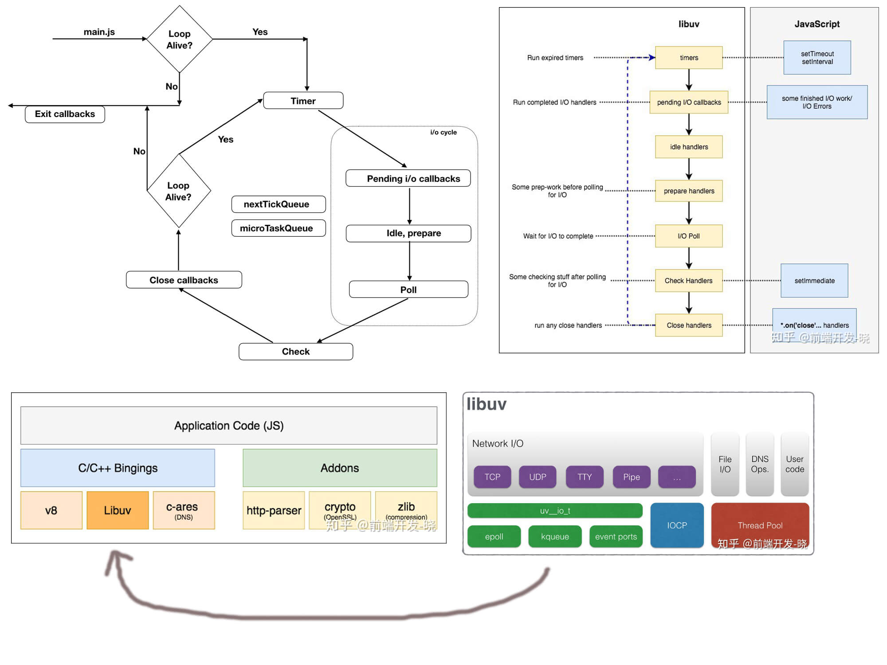

## 事件循环机制 -- nodeJS 端（由 libuv 库实现）

**重要重要：**

1.  事件循环机制由宿主环境实现, js 引擎（V8）只负责执行代码；
2.  事件循环机制有多个队列参与（多个）

3.  事件循环运行在一个单独的线程里面;

4.  事件循环有**多个**任务队列（task queues）参与；任务队列是一组任务（task）；（多个队列相互来回切换的）

- 图片中的不同的盒子代表不同的阶段，每个阶段执行特定的工作。每个阶段都有一个队列，Javascript 可以在任何一个阶段执行（除了 idle & prepare）。
- 你在图片中也能看到 nextTickQueue 和 microTaskQueue，它们不是循环的一部分，它们的回调可以在任意阶段执行。它们有更高的优先级去执行。nextTickQueue 的优先级高于 microTaskQueue。

#### 事件循环的主要机制就是任务队列机制:

1. 每个任务都来自一个特定的任务源（task source）；来自同一个特定任务源且属于特定事件循环的任务必须被加入到同一个任务队列中，来自不同任务源的任务可以放在不同的任务队列中;

2. 浏览器调用这些队列中的任务时采取这样的做法:
   相同队列中的任务按照先进先出的顺序,
   不同的队列按照提前设置的队列优先级来调用，不保证多个任务队列中的任务优先级，具体实现可能会交叉执行
   **注意：** 浏览器优先选择性能敏感的任务，比如用户输入等。

3. 在调用任务的过程中, 会产生新的任务, 浏览器就会不断执行任务, 因此称为事件循环.
