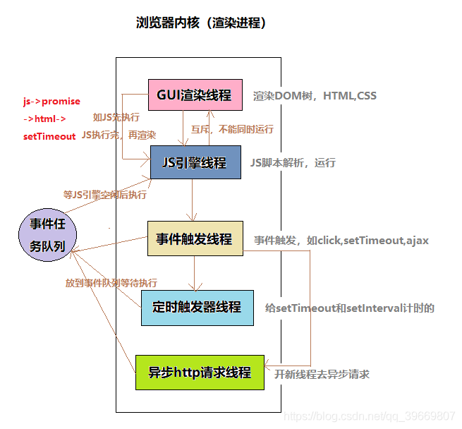

## 渲染进程是如何工作的 [1.原文链接](https://zhuanlan.zhihu.com/p/47407398) [2.参考链接](https://www.cnblogs.com/fogwind/p/6160456.html)

渲染进程几乎负责 Tab 内的所有事情，渲染进程的核心目的在于转换 HTML CSS JS 为用户可交互的 web 页面。

渲染进程中主要包含以下线程：

1.  GUI 渲染线程

    - 当浏览器收到响应的 html 后，该线程开始解析 HTML 文档构建 DOM 树，解析 CSS 文件构建 CSSOM，合并构成渲染树，并计算布局样式，绘制在页面上
    - 当界面样式被修改的时候可能会触发 reflow 和 repaint，该线程就会重新计算，重新绘制

2.  JS 引擎线程

    - JS 内核，也称 JS 引擎（例如 V8 引擎），负责处理执行 javascript 脚本程序；
    - 由于 js 是单线程（一个 Tab 页内中无论什么时候都只有一个 JS 线程在运行 JS 程序），依靠任务队列来进行 js 代码的执行，所以 js 引擎会一直等待着任务队列中任务的到来，然后加以处理。

3.  事件触发线程

    - 归属于渲染进程（浏览器内核），不受 JS 引擎线程控制。主要用于控制事件（例如鼠标，键盘等事件），当该事件被触发时候，事件触发线程就会把该事件的处理函数添加进任务队列中，等待 JS 引擎线程空闲后执行；

4.  定时器出发线程

    - 传说中的 setInterval 与 setTimeout 所在线程
    - 浏览器的定时器并不是由 JavaScript 引擎计数的，因为 JavaScript 引擎是单线程的, 如果处于阻塞线程状态就会影响计时的准确，因此通过单独的线程来计时并触发定时器，计时完毕后，满足定时器的触发条件，则将定时器的处理函数添加进任务队列中，等待 JS 引擎线程空闲后执行。
    - W3C 在 HTML 标准中规定，规定要求 setTimeout 中低于 4ms 的时间间隔算为 4ms

5.  异步 HTTP 请求线程

    - 当 XMLHttpRequest 连接后，浏览器会新开的一个线程，当监控到 readyState 状态变更时，如果设置了该状态的回调函数，则将该状态的处理函数推进任务队列中，等待 JS 引擎线程空闲后执行

    **注意：**浏览器对通一域名请求的并发连接数是有限制的，Chrome 和 Firefox 限制数为 6 个，ie8 则为 10 个。

**总结：2-5 四个线程参与了 JS 的执行，但是永远只有 JS 引擎线程在执行 JS 脚本程序，其他三个线程只负责将满足触发条件的处理函数推进任务队列，等待 JS 引擎线程执行。**

- 主线程 Main thread
- 工作线程 Worker thread
- 排版线程 Compositor thread
- 光栅线程 Raster thread

#### 当渲染进程接收到导航的确认信息，开始接受 HTML 数据时；

1. 主线程会解析 HTML 文档，构建 DOM 树：  
   在解析 HTML 文档的同时， preload scanner 会同时运行“扫描文档”（不占据主线程）；
   当遇到 `` `<link>` 等标签，preload scanner 会把这些请求传递给 Browser process 中的 network thread 进行相关资源的下载。  
   当遇到 `<script>` 标签时，渲染进程会停止解析 HTML，而去加载，解析和执行 JS 代码，（`async` 或 `defer` 另算）；  
    defer(延迟脚本):立即下载，文档解析完成再执行（DOMContentLoaded 事件触发之前执行）  
    async(异步脚本):立即下载，下载完在“浏览器空闲时”再执行(互不依赖；在 load 前，在 DOMContentLoaded 前后执行都可以)

2. 构建 CSS 规则树:（把 CSS 放 head 防止 css 阻塞渲染，CSS 解析可以与 DOM 解析同时进行）;

3. 构建渲染树：将 DOM 节点与 CSS 关联起来（header/display: none 不在渲染树中;visibility: hidden 在，伪元素也在）;  
   **注：** js 文件的下载不会阻塞其他线程（HTML 的解析，树的构建等）；js 的执行不会阻塞 CSS 的解析，但是会阻塞 HTML 文档的解析。  
    渲染树的构建又依赖 DOM 树和 CSS 规则树。所以 js 的执行会阻塞渲染树的构建。

4. 渲染树--布局：计算元素的位置和大小（输出盒子模型；float，absoulte，fixed 发生位置偏移；脱离文档流就是脱离渲染树）

5. 渲染树--绘制各元素：主线程会遍历布局树以创建绘制记录。绘制记录可以看做是记录各元素绘制先后顺序的笔记。
   <!-- 调用渲染器的 paint()方法在屏幕上显示其内容（由浏览器的 UI 后端组件完成） -->

6. 合成帧：主线程会遍历布局树来创建层树，一旦层树被创建，渲染顺序被确定，主线程会把这些信息通知给合成器线程（compositor 线程）；(添加了 `will-change` CSS 属性的元素，会被看做单独的一层)

   合成器线程会栅格化每一层。有的层的可以达到整个页面的大小，因此，合成器线程将它们分成多个磁贴，并将每个磁贴发送到栅格线程，栅格线程会栅格化每一个磁贴并存储在 GPU 显存中。  
   一旦磁贴被光栅化，合成器线程会收集称为绘制四边形的磁贴信息以创建合成帧。

   合成帧随后会通过 IPC 消息传递给浏览器进程，由于浏览器的 UI 改变或者其它拓展的渲染进程也可以添加合成帧，这些合成帧会被传递给 GPU 用以展示在屏幕上，如果滚动发生，合成器线程会创建另一个合成帧发送给 GPU。

   **优点：** 其工作无关主线程，合成器线程不需要等待样式计算或者 JS 执行，这就是为什么合成器相关的动画 最流畅，如果某个动画涉及到布局或者绘制的调整，就会涉及到主线程的重新计算，自然会慢很多。

**注：**

- 生成各种树，包括 dom tree, css tree, layout tree, layer true, render tree，这些是 Render Process 中的 GUI 渲染线程做的事。
- js 脚本的解析执行是同进程下的 js 引擎线程来做的，也就是大名鼎鼎的 V8 引擎。
- 至于定时器回调，是定时器线程来计数，计数完毕会把回调推入“事件触发线程”维护的任务队列，当 js 线程空闲并且此线程维护的微任务队列无事件，才会去任务队列拿宏任务执行处理。
