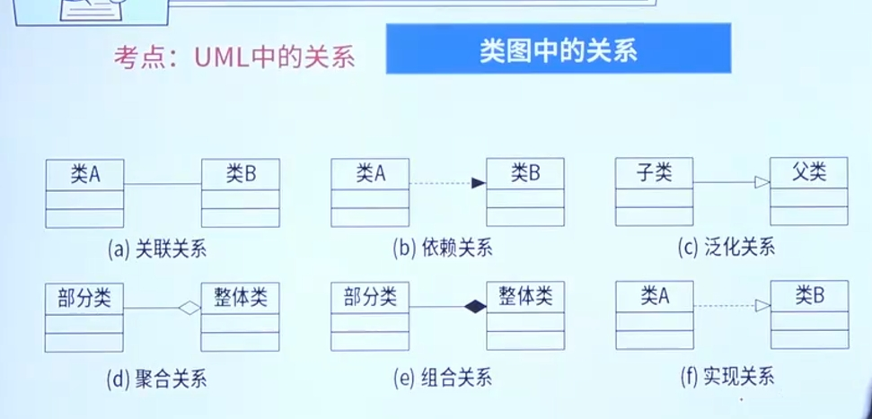
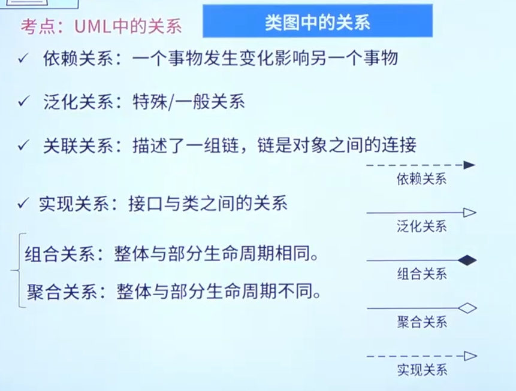
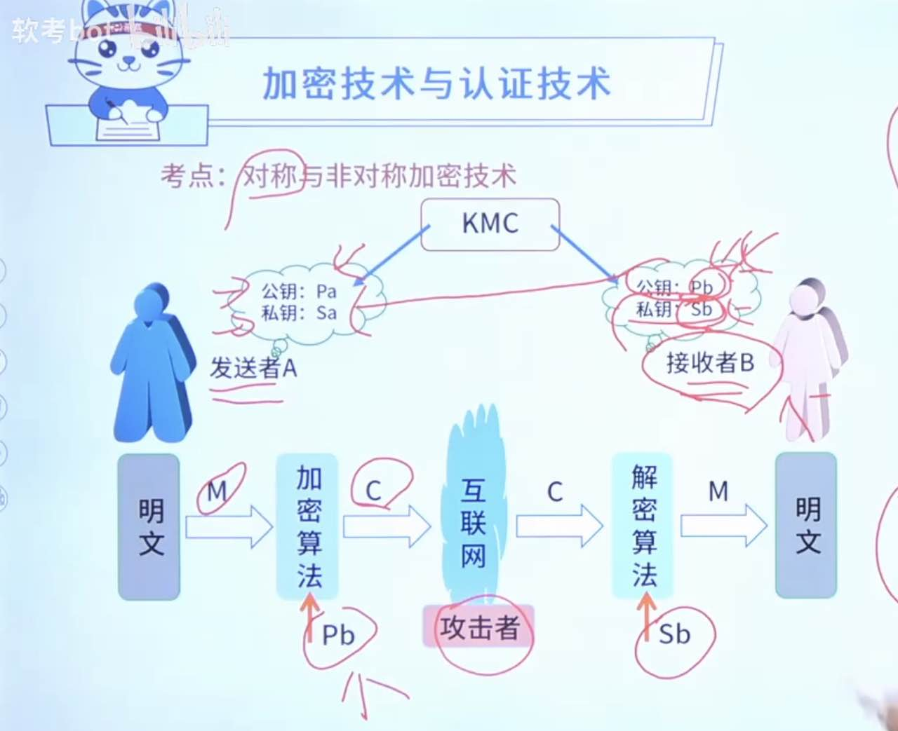
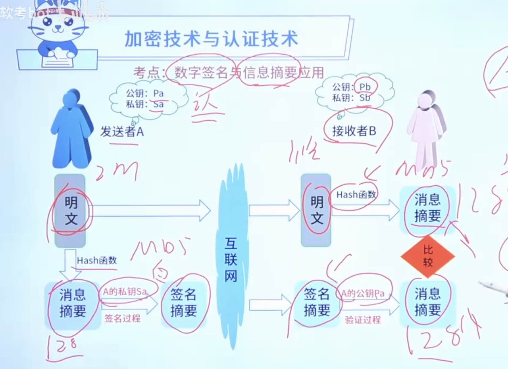
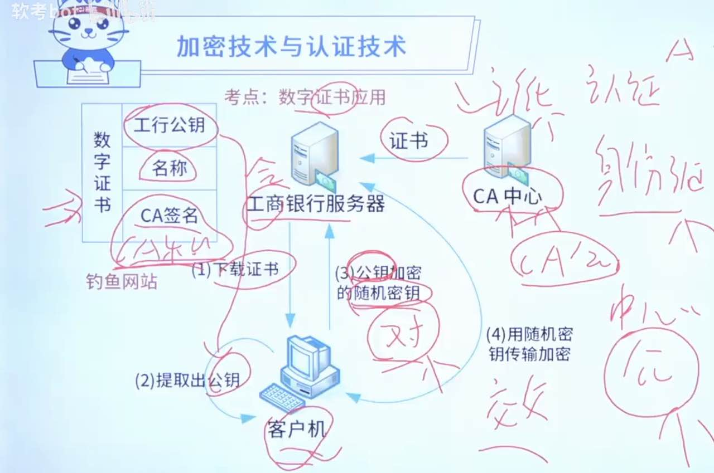
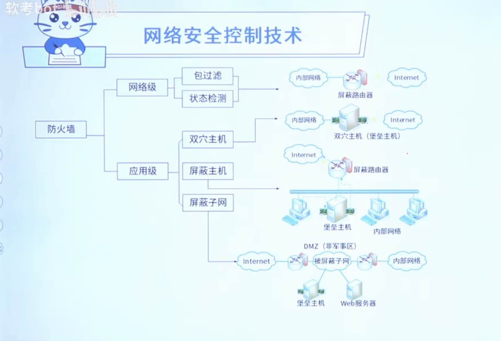

# 考试

1. 信号量(S)与 PV 操作：
   - 信号量(S):是一种特殊的变量，；表示资源数量；为负数时表示排队进程数。
   - P：要资源；V：释放资源；
2. 页，段储存；页/段混合储存； `2^13 = 2^3*2^10 = 8kb`

## （渐进）时间复杂度 --- 指运行的次数

### 查找算法

1. 顺序查找：从头到尾与表中元素比较；
2. 二分查找（折半查找）：（前提：原始数据是`有序数组`）

   - mid = (low+high)/2
   - 复杂度：O(log2n)

3. 哈希查找（散列函数）: 没空间，可以循环放前面；
   散列函数为 H(key) = key%11,对于关键码序列(23,40,91,17,19,10,,31,65,26),用线性探查法解决冲突构造的哈希表为：

   |          |     |     |     |     |     |     |     |     |     |     |     |
   | -------- | --- | --- | --- | --- | --- | --- | --- | --- | --- | --- | --- |
   | 哈希地址 | 0   | 1   | 2   | 3   | 4   | 5   | 6   | 7   | 8   | 9   | 10  |
   | 关键码   | 65  | 23  |     | 91  | 26  |     | 17  | 40  | 19  | 31  | 10  |

### 排序算法

| 类别     | 排序方法   | 时间复杂度            | 时间复杂度                    | 空间复杂度 | 稳定性 |
| -------- | ---------- | --------------------- | ----------------------------- | ---------- | ------ |
|          |            | 平均情况              | 特殊情况                      | 辅助储存   |        |
| 插入排序 | 直接插入   | O(n2)      | 基本有序最优 O(n)             | O(1)       | 稳定   |
| 插入排序 | shell 排序 | O(n1.3)    | --                            | O(1)       | 不稳定 |
| 选择排序 | 直接选择   | O(n2)      | --                            | O(1)       | 不稳定 |
| 选择排序 | 堆选择     | O(n log2n) | --                            | O(1)       | 不稳定 |
| 交换排序 | 冒泡排序   | O(n2)      | --                            | O(1)       | 稳定   |
| 交换排序 | 快速排序   | O(n log2n) | 基本有序最差 O(n2) | O(1)       | 不稳定 |
|          | 归并排序   | O(n log2n) | --                            | O(n)       | 稳定   |
|          | 基数排序   | O(d(n+rd))            | --                            | O(rd)      | 稳定   |

- shell 排序：分组；奇数做增量，分组，组内插入排序；
  57、68、59、52、72、28、96、33、24、19

  1. d1 = n/2 = 5; （取奇数）【1、6】【2、7】【3、8】【4、9】【5、10】
  2. d2 = d1/2 = 3;（取奇数）【1、4、7、10】【2、5、8】【3、6、9】
  3. d3 = d2/2 = 1;（取奇数）【1、2、3、4、5、6、7、8、9、10】

- 直接选择：选择最小的和第一个交换位置，剩余中选择最小的和第二个交换位置，以此类推；
- 堆选择：小顶堆，大顶堆（最小二叉树、最大二叉树）
  `arr[0]`是堆顶；`n/2`是最后一个父节点；`2n+1`是左节点；`2n+2`是右节点

  1. 组成小顶堆（大顶堆），拿走顶部的；
  2. 剩余的再组成小顶堆（大顶堆），拿走顶部的；
  3. 以此类推

     

- 冒泡排序：相邻元素之间比较并交换；

- 快速（交换）排序：

  1. 找到基准的元素，比它小的放左边数组，比它大的放右边数组；
  2. 对左右数组，各找出基准元素；比它小的放左边数组，比它大的放右边数组；
  3. 一次类推；

- 归并排序/合并排序：

  1. 两两分组，再排序；【1、2】【3、4】【5、6】【7、8】
  2. 相邻两组，依次比较、获取最小值、排序； 【1、2、3、4】【5、6、7、8】
  3. 以此类推；

  

- 基数排序：
  1. 新建一个长度为 10 的二维数组【arr1】；原始数组按照`个位`放到【arr1】的对应小标中；
  2. 将 arr1 扁平化成一维数组【arrA1】；
  3. 新建一个长度为 10 的二维数组【arr2】；数组【arrA1】按照`十位`放到【arr2】的对应小标中；
  4. 将 arr2 扁平化成一维数组【arrA2】；
  5. 新建一个长度为 10 的二维数组【arr3】；数组【arrA2】按照`十位`放到【arr3】的对应小标中；
  6. 依次类推，直到数组中最大位数；
  7. 最后扁平化最后的二位数组；

#### 排序选择：

1. 当数据 n 较小时，采用 直接插入排序/简单选择排序；
2. 当数据基本有序，采用直接插入排序/冒泡排序；
3. 当 n 很大且`关键字【位数较少】`时，采用基数排序；

### 算法策略

1. 分治法：一定会用递归；归并排序、快速排序、二分搜索
2. 贪心法：局部最优，但整体不见得最有。背包问题、找零问题、最小生成树；
3. 动态规划法：“最优子结构”-要解决规模为 n 的，必须先解决小规模的，才能解决 n 的；斐波那契数列（12358...）
4. 回溯法：如果不通，回到上一个点；

## 面向对象技术

面向对象基础、UML【案例】、设计模式

### 面向对象基础

- 对象 object：属性（数据）+方法（操作）+对象 ID(对象名)

  1. 静态特征：属性、状态； 动态特征：方法、函数、功能
  2. 封装：隐藏对象的属性和实现细节，仅对外公开接口（信息隐藏基数）； \*
     - （对象名、属性、方法）封装在对象内，外界访问受限制、只能通过接口访问，
     - 看修饰符：+ public（都可以访问） 、 # protected（同胞和子类可以） 、-private（内部可访问）、default（同胞可访问）
  3. 在面向对象的系统中，对象是运行时实体；在代码没运行起来时“它”都是以“类的形式”存在的，跑起来后会把类的对象 new 出来。

- 类 class:

  1. 类：是抽象的概念（猫类），对象：是具体的实例化（猫大、猫二）；
  2. 分类：

     - 实体类：（数据类）有大量属性存数据；
     - 接口类：（功能类）有大量方法；
     - 控制类：利用“实体类、接口类”再结合“具体业务”实现相关代码；做具体的事

     * 接口：一种特殊的类，只有“方法定义”，没有实现；

  3. 继承与泛化：子类是父类的特殊化；父类是子类的泛化；
     - java 不支持多重继承，c++支持；
     - new 出来的对象赋值给父类变量（这个过程叫泛化）
     - 重写（覆盖）和重载：
       1. 重写（覆盖）：重写发生在类之间（子父 2 个类）；在子类中重新定义父类中已存在的方法；
       2. 重载：重载发生在类之内（1 个类）；一个类中可以有 多个同名、但参数类型不同 的方法；
  4. 多态：重写（覆盖）和重载是多态具体的表现形式；（不同对象收到同样的消息产生不同的结果）
     - 过载多态（方法重载）：同一个类中，多个方法，参数不一样；一个名字在不同的“上下文（参数）”中所代表的含义不同
  5. 动态绑定和多态： 动态绑定：运行时；静态绑定：编译时（例：int i=3）；
     - 子父之间重写实现多态是动态绑定产生的原因；
  6. 常见多态：
     - 参数多态：方法的参数用父类，不用具体子类；
     - 包含多态：集合写父类，不写具体子类；
     - 强制多态：数据类型强制转化；例：整数和浮点类型加减，强制转换为浮点型后再加减；
     - 过载多态：同一个类中，多个方法，参数不一样；

- 包 package:
  1. 重用发布等价原则：架包；用的人越多，发布约勤快；
  2. 共同封闭原则：一个类变化对一些类产生影响，这些类放一个包中；方便维护；
  3. 共同重用原则：A 依赖 B,B 依赖 C，ABC 放一个包；
  4. 无环依赖原则：A 依赖 B，B 依赖 C，C 依赖 A 形成环状；不好；

* 面向对象的开发流程：

  1. 面向对象分析：关键字“对象”
  2. 面向对象设计：关键字“识别”、“定义”
  3. 面向对象程序设计：1、设计范型；2、选择一种 OOPL（L：Language）；
  4. 面向对象测试：从内到外（算法层-方法、类层、模板层-模块、系统层）；

* 面向对象的开发的 7 大原则：
  1.  单一职责原则：单一的类
  2.  开放-封闭原则：修改不行，扩展、新加可以；
  3.  里氏（Liskov）替换原则：子类可以替换父类；
  4.  依赖倒置原则：要依赖于抽象，而不是具体实现；
  5.  接口隔离原则：使用多个专门接口比单一的总接口好；
  6.  组合重用原则：尽量使用组合、而不是继承；
  7.  迪米特（Demeter）原则：（低耦合）一个对象应当对其他对象尽可能少的了解；
* 其他原则：
  1. 稳定抽象原则：约抽象约稳定，父类没有具体实现，不同子类有不同实现，父类动的几率少；
  2. 稳定依赖原则：依赖不经常变得；

## UML（统一标志语言-- unified markup language）

标志语言（ML）-->统一标志语言（UML）

- 结构图：

  1. 类图：通常对系统词汇、交单协作、逻辑数据库模式建模【只有首字母大写的类名】
  2. 对象图：对象快照（某一时刻）【对象名：类名】
  3. 包图：---没出现过
  4. 组合构件图：----
  5. 构件图：
  6. 部署图：软硬件之间映射
  7. 制品图：---

- 行为图：

  1. 用例图：系统与外部参与者的交互
  2. 顺序图：强调按时间顺序
  3. 通信图：（协作图）
  4. 定时图：----
  5. 状态图：
  6. 活动图：类似程序流程图，并行行为
  7. 交互概览图：----

- 概念及作用：
  1. 类图：一组对象、接口、协作和它们之间的关系；
  2. 对象图：一组对象以及他们之间的关系
  3. 用例图：一组用例、参与者以及它们之间的关系
  4. 序列图：（顺序图）场景的图像化表示，以时间顺序组织的对象间的交互活动
  5. 通信图：强调手法消息的对象之间的组织结构
  6. 状态图：展现了一个状态机，由状态、转换、事件和活动组成
  7. 活动图：专注于系统的动态视图，一个活动到另一个活动的流程，（业务层面，白话文描述）
  8. 组件图：一组构件之间的组织和依赖，专注于系统的静态实施试图
  9. 部署图：运行处理结点以及构件的配置，给出体系结构的静态实施试图

- 用例图：1、包含关系（include--功能之间）；2、扩展关系（extend--特定条件下存在）；3、泛化关系（父子：注册-手机/邮箱）

  - 区别 java 继承（extends）

- 顺序图/通信图：箭头指向（调用）； 顺序图更详细，显示每一步；

* 活动图：（产品/业务人员）业务层面，白话文描述
* 状态图：（开发人员）具体操作，状态转移/转换；格式：事件（参数）【条件】/动作
  1、 信号事件； 2、 调用事件； 3、 变换事件； 4、时间事件；
  一个状态有以下部分： 状态名、进入/退出动作、内部转移、子状态、延迟事件
* 构件图：半圆是需要接口，整圆是提供接口的；

## 信息安全

信息安全基础知识、加密技术与认证技术、网络安全协议、网络安全威胁、网络安全控制、安全防御体系

- 信息安全基础知识（5 个）：机密性、完整性、可用性、可控性、可审查性

  1. 机密性：
  2. 完整性：允许的人才能修改数据，并且能判断数据是否被修改（权限？）；
  3. 可用性：可访问数据，但不能占用所有资源，阻碍授权者工作；
  4. 可控性：可以控制授权范围内的`信息流向及行为方式`；
  5. 可审查性：对出现信息安全问题提供调查依据和手段（日志）；

- 加密技术与认证技术：加密技术-->数字签名-->信息摘要-->数字证书应用

  1.  常见的对称加密：【DES、AES、3DES（3 重 DES）、IDEA】- 分组加密、【RC-5】- 流密码 `3S 5I`

      - 加密强度不高，但效率高；密钥分发困难

  2.  非对称加密：A、B 方都有公私；发送方下载对方的公钥并用它加密，接收方用自己的私钥解密；

      - RSA、DSA、ECC；`AA CC`
      - 加密强度高，但速度慢

      

  3.  数字签名：（认证是 A 发的）

      - 接收者可验证消息来源的真实性
      - 发送者无法否认发送过该消息
      - 接收者无法伪造或篡改消息

  4.  消息摘要（确保信息没被修改）

      - 强一致性：对于相同的输入，摘要的结果总是一样的。
      - 高度散列：即使两段非常相似的信息，其生成的摘要也会大相径庭。
      - 不可逆性：通过摘要无法回推原始的信息。

      常用的摘要算法：MD5（生成 128 位）、SHA（生成 160 位）

      

  5.  数字证书

      - CA 签名：用 CA 中心的私钥加密的
      - 下载证书-->用 CA 公钥`解密` CA 签名-->验证通过-->提取网站公钥

      

- 网络安全协议：
  

- 网络安全威胁：网络攻击、计算机病毒

  1.  网络攻击: 主动攻击、被动攻击

      - 主动攻击：可中断、篡改、伪造
      - 被动攻击：监听-等信息上门

  2.  计算机病毒：：具有隐蔽性、传染性、潜伏性、触发性、和破坏性等特点。

      - 病毒：破坏程序
      - 木马：远程控制计算机

  3.  病毒位置

      - 引导型病毒 -- 引导盘
      - 文件型病毒 -- exe 文件、bat 文件
      - 宏病毒 -- doc、xls 等办公软件
      - 网络型病毒 -- 电子邮件
      - 混合型

- 网络安全控制：网络安全控制技术、防火墙技术、入侵检测与防御

  1. 常见网络安全控制技术

     - 用户识别技术
     - 访问控制技术：不通用户对资源不通权限
     - 访问控制列表（ACL）：局域网（多台机器）
     - 漏洞扫描：扫描完必须下补丁
     - 入侵检测技术：本地的入侵检测软件`检测`计算机的操作，拿操作与模型库匹配；匹配到：提醒操作者危险操作，未匹配到：也有可能拿可疑操作与远程的专家系统匹配；
       1. IDS 入侵检测：报警不阻断
       2. IPS 入侵防御：报警并阻断

  2. 防火墙：建在内外网之间；认为内部安全，外部不安全；只检测外部进来的；
     - 访问控制功能（ACL）
     - 内容控制功能
     - 全面的日志功能
     - 集中管理功能
     - 自身的安全和可用性
     - 流量控制
     - 网络地址转换（NAT）
     - VPN

  

       - 堡垒主机：是一种被强化的可以防御进攻的计算机，作为进入内部网络的一个检查点，以达到把整个网络的安全问题集中在某个主机上解决，从而达到省时省力，不用考虑其它主机的安全的目的。

         一个堡垒主机使用两块网卡，每个网卡连接不同的网络。一块网卡连接你公司的内部网络用来管理、控制和保护，而另一块连接另一个网络，通常是公网也就是 Internet。

       - 双穴主机：这种配置是用一台装有两块网卡的堡垒主机做防火墙。堡垒主机上运行着防火墙软件，可以转发应用程序，提供服务等。

- 安全防御体系：物理环境的安全性、操作系统的安全性、网络的安全性、应用的安全性、管理的安全性；
