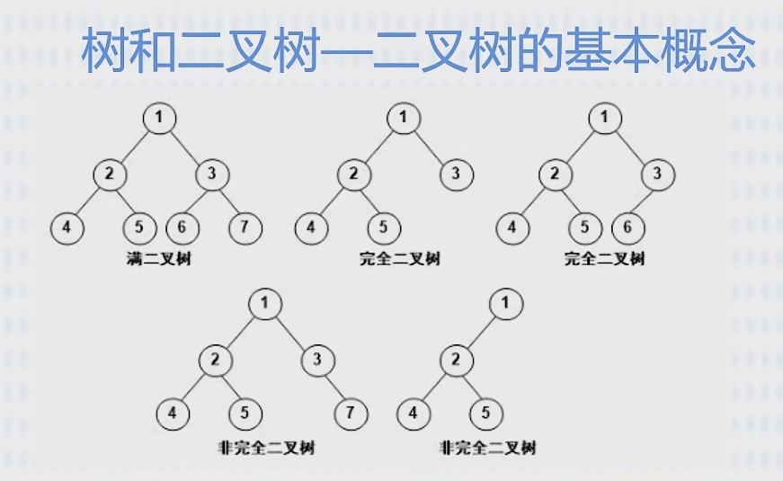

#

## 树和二叉树

1.  - 结点的度：指结点的分支有几个；
    - 树的度：整个树最大结点的度==树的度 ；
    - 分支结点：一个结点的子节点；
    - 内部结点：除了跟结点和子结点外的；

    

2.  - 前序遍历：根左右；
    - 中序遍历：左根右；
    - 后序遍历：左右根；
    - 层次遍历：广度优先；
    - 前序、中序、后序 指的父节点的位置；

3.  树转二叉树：父节点的`第1个左子节点`保留，`第2个左子结点`转化为`第1个左子结点`的`右节点`,`第3左子结点`转化为`右节点`的右节点。
    也就是，父节点的`左子节点`保留，`父节点其余节点`依次转化为`右子节点`
4.  。。。
5.  霍夫曼树（最优树），带权路径最小

        - 叶节点的路径长度：从“根节点”到“叶节点”的步数；
        - 树的路径长度：各个之和；
        - 权：权重=叶节点的值；
        - 带权路径长度：`叶节点的权重*叶节点的路径长度`；
        - 树的带权路径长度：各个`叶节点的权重*叶节点的路径长度`相加；

        * 构建霍夫曼树

            1. 先拿最小的 2 个数构建，并得到“和”；
            2. 拿剩余中最小的 2 个数与上一步的“和”，3 个数比较，取最小的 2 个数继续构建；
            3. 如果最小的 2 个数包含“和”，则继续向上构建；如果不包含，另起分支构建；
            4. 继续 ，一个“和”与剩余最小 2 个数比较；或两个“和”与剩余最小 1 个数比较，构建；
            5. 。。。。
            6. 最终 2 个“和”构建成根

6.  线索二叉树
7.  平衡二叉树：任意节点的左右子树深度相差不超过 1，每个节点的平衡度只能是-1、0 或 1。

## 图

有向图、无向图、完全图

存储结构：邻接矩阵、邻接表、

图的遍历：深度优先、广度优先
拓扑排序：
最小生成树：最短，访问到各个节点

## 查找

静态查找：顺序查找、折半查找（有序）、分块查找（块内无序，块间有序）
动态查找：二叉树顺序、平衡二叉树、B-树
哈希表：散列表

## 排序
