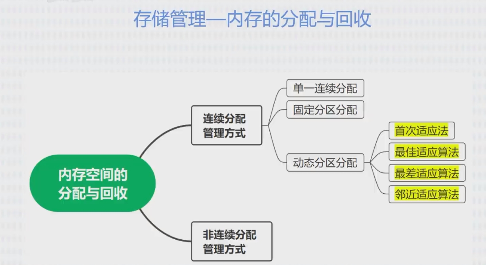

#

## 树和二叉树

## 图

## 查找

## 排序

# 操作系统

## 基本概念

## 进程

进程具有异步性；
进程同步机制：先写后读，保持顺序；
进程的“并发”需要“共享”的支持；
临界资源：一段时间内只允许一个进程使用的资源；（打印机）
对临界资源的访问，必须互斥地进行；

- 进入区：检查是否进入临界区；（锁住）
- 临界区：正在访问
- 退出区：（解锁）
- 剩余区：处理其他资源

1、 空闲让进；2、忙则等待；3、有限等待；4、让权等待(不能进入，立即释放)；

- 信号量机制

1. 实现进程互斥
2. 实现进程同步
3. 实现进程的前驱关系

信号(S)：可用的数量
P(S)：申请一个资源 S；
V(S)：释放一个资源 S；

- 死锁
  1、 互斥条件；2、不剥夺条件；3、请求和保持条件；4、循环等待条件

## 存储管理

- 内存空间的分配与回收

1. 首次适应算法：每次都从低地址开始查找，找到第一个能满足大小的空闲分区。
2. 最佳适应算法：优先使用最小的空闲分区。
3. 最差适应算法：优先使用最大的连续空闲区，
4. 邻近适应算法：每次从上次查找结束的位置开始检索。

- 分页存储管理：系统将进程的地址空间划分为若干个大小相同的区域。
- 分段存储管理

## 文件管理

## 设备管理

## 微内核操作系统
