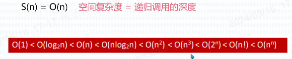
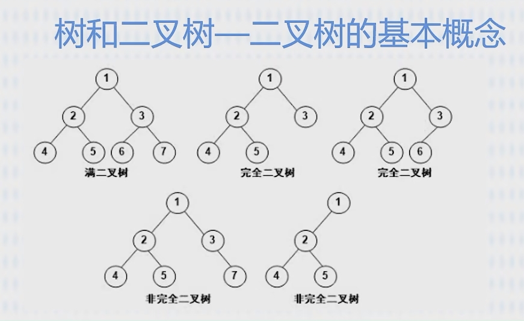

# 软考个人

## 第 1 章 计算机组成原理与体系结构基础知识

计组（硬件）-->操作系统-->C、数据结构（软件）
CPU 、内存（RAM）、硬盘、主板
计算机硬件唯一能识别的数据--二进制 0/1（低/高电平 - 0/1）

1. 数据表示

十进制：975.36  
`9*100  + 7*10   + 5*1    +  3*0.1      + 6*0.01`  
`9*10^2 + 7*10^1 + 5*10^0 +（3*10*10^-1 + 6*10^-2）`

D：十进制；H：十六进制；B：二进制
定点数的表示：1、无符号；2、有符号
有符号：原码、反码、补码、移码

浮点数：阶符、阶码、数符、尾数

2. 校验码
   奇偶校验、循环冗余检验
3. 计算机体系结构
4. 指令系统
5. 储存系统
   【CPU（寄存器）--> Cache(高速缓冲存储器)】 --> 主存（内存）--> 辅存（硬盘） -->外存（U 盘、光盘）
6. 总线系统
7. 输入输出技术
8. 可靠性

## 第 2 章 数据结构与算法基础

1.  基础概念与三要素

    - 数据结构三要素：逻辑结构、物理结构（存储结构）、数据运算；

          1. 逻辑结构：数据与数据之间的关系，抽象的；
             集合、线性结构、树形结构、图状结构（网状结构）
          2. 物理结构：描述如何在计算机中存储的；
             顺序存储、链式存储、索引存储、散列存储（hash 存储-根据元素关键字`计算出`存储地址）

    - 程序 = 数据结构+算法

2.  算法

    - 算法：5 个特性；有穷性、确定性、可行性、输入、输出
      确定性：相同的输入，相同的输出；
      可行性：算法中描述的操作都可以通过已实现的`基本运算执行有限次`来实现;

    

3.  线性表
4.  栈和队列
5.  串、数组、矩阵和广义表
    - 串相等：
    - 串比较：两个串比较大小时以字的 ASCII 码值作为依据；从第一位开始；
6.  树和二叉树

    - 概念

    1.  节点的度：指节点的分支有几个；
    2.  树的度：整个树最大节点的度==树的度 ；
    3.  分支节点：一个节点的子节点；
    4.  内部节点：除了跟节点和子节点外的；

    

    - 概念

      1. 前序遍历：根左右；
      2. 中序遍历：左根右；
      3. 后序遍历：左右根；
      4. 层次遍历：广度优先；
      5. 前序、中序、后序 指的父节点的位置；

    - 树转二叉树：父节点的`第1个左子节点`保留，`第2个左子节点`转化为`第1个左子节点`的`右节点`,`第3左子节点`转化为`右节点`的右节点。
      也就是，父节点的`左子节点`保留，`父节点其余节点`依次转化为`右子节点`

    - 霍夫曼树（最优树），带权路径最小

          - 叶节点的路径长度：从“根节点”到“叶节点”的步数；
          - 树的路径长度：各个之和；
          - 权：权重=叶节点的值；
          - 带权路径长度：`叶节点的权重*叶节点的路径长度`；
          - 树的带权路径长度：各个`叶节点的权重*叶节点的路径长度`相加；

          * 构建霍夫曼树

              1. 先拿最小的 2 个数构建，并得到“和”；
              2. 拿剩余中最小的 2 个数与上一步的“和”，3 个数比较，取最小的 2 个数继续构建；
              3. 如果最小的 2 个数包含“和”，则继续向上构建；如果不包含，另起分支构建；
              4. 继续 ，一个“和”与剩余最小 2 个数比较；或两个“和”与剩余最小 1 个数比较，构建；
              5. 。。。。
              6. 最终 2 个“和”构建成根

    - 线索二叉树：各个节点添加前后指针；
    - 平衡二叉树：任意节点的左右子树深度相差不超过 1，每个节点的平衡度只能是-1、0 或 1。

7.  图

    - 有向图、无向图、完全图

    - 存储结构：邻接矩阵、邻接表、
    - 图的遍历：深度优先、广度优先
    - 拓扑排序：
    - 最小生成树：最短，访问到各个节点

8.  查找
    - 静态查找：1、顺序查找；2、折半查找（有序）；3、分块查找（块内无序，块间有序）
    - 动态查找：二叉树顺序、平衡二叉树、B-树
    - 哈希表：散列表
9.  排序

## 第 3 章 算法分析与设计

1. 分治法：分解--求解--合并；（用递归）

   - 一个细胞经过 x 次分裂得到 n 个，2^x=n , x=log n; 反过来, 有 n 个元素，每次减少一半，x 次之后变成 1，x = log n;
   - 分治法: 1、最优解：基础元素左右两边相等，比较 n-1 次，`n*log n`；2、最坏解：基础元素最大/最小，每次左边/右边只有一个，比较 n-1 次，分 n 次，`n^2`
   - 二分查找：`log n`

2. 回溯法：`深度优先`搜索法；
3. 贪心法：局部最优；（最优子结构）
4. 动态规划法：整体最优；有多个解，找最优解； （最优子结构、重叠子问题）
   - 0-1 背包问题：合计价值大的优先装，装不下`就空着`；
   - 部分背包问题：单位价值大的优先装，装不下`切开装`；

## 第 4 章 操作系统基本原理

1. 基本概念
2. 进程管理

   - 创建态：进程正在被创建；分配 Pid、进程所属的 Uid、给进程分配的哪些资源（使用 cpu,文件）等；信息保存在 PCB（进程控制模块） 数据结构中；
   - 就绪态：已经具备运行条件，但没有空闲的 CPU，暂时不能运行
   - 运行态：在 CPU 上运行
   - 阻塞态：进程运行时，可能会`请求等待某个事件的发生`（例：IO ），此时操作系统会让进程下 CPU，进入“阻塞态”，当 CPU 空闲时，选择另一个“就绪态”进程上 CPU 运行；
     IO 完成变“就绪态”
   - 终止态：当进程掉“exit 系统”，请求操作系统终止该进程，此时该进程进入“终止态”，操作系统会让进程下 CPU，并回收内存空间等资源，最后回收 PCB。

3. 存储管理
4. 文件管理
5. 设备管理
6. 微内核操作系统

## 第 5 章 计算机网络基础

## 第 6 章 数据库系统基础知识

## 第 7 章 程序设计语言基础知识

## 第 8 章 软件工程基础知识

## 第 9 章 结构化开发方法-数据流图

## 第 10 章 UML 建模

## 第 11 章 面向对象技术

## 第 12 章 信息安全与多媒体知识

## 第 13 章 法律法规与标准化知识

## 第 14 章专业英语词汇知识
