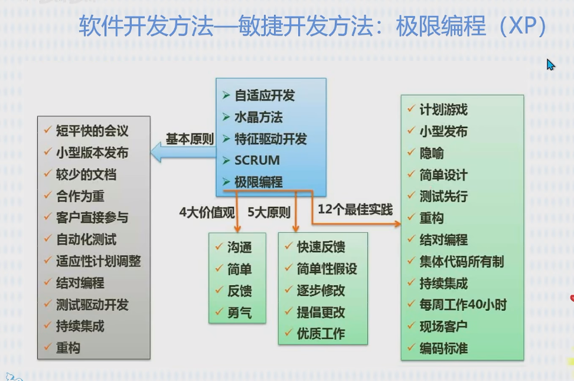
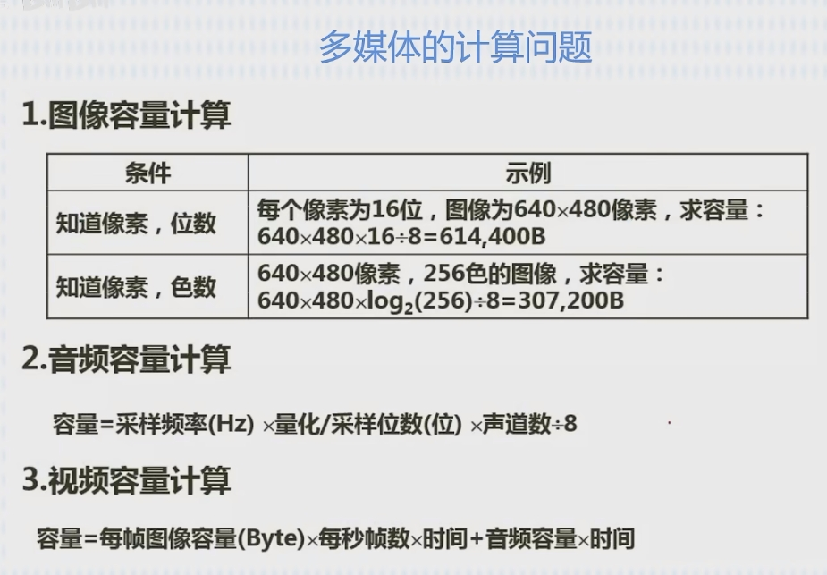

# 软考个人

## 第 1 章 计算机组成原理与体系结构基础知识

计组（硬件）-->操作系统-->C、数据结构（软件）
CPU 、内存（RAM）、硬盘、主板
计算机硬件唯一能识别的数据--二进制 0/1（低/高电平 - 0/1）

1. 数据表示

十进制：975.36  
`9*100  + 7*10   + 5*1    +  3*0.1      + 6*0.01`  
`9*10^2 + 7*10^1 + 5*10^0 +（3*10*10^-1 + 6*10^-2）`

D：十进制；H：十六进制；B：二进制
定点数的表示：1、无符号；2、有符号
有符号：原码、反码、补码、移码

浮点数：阶符、阶码、数符、尾数

2. 校验码
   奇偶校验、循环冗余检验
3. 计算机体系结构
4. 指令系统
5. 储存系统
   【CPU（寄存器）--> Cache(高速缓冲存储器)】 --> 主存（内存）--> 辅存（硬盘） -->外存（U 盘、光盘）
6. 总线系统
7. 输入输出技术
8. 可靠性

## 第 2 章 数据结构与算法基础

1.  基础概念与三要素

    - 数据结构三要素：逻辑结构、物理结构（存储结构）、数据运算；

          1. 逻辑结构：数据与数据之间的关系，抽象的；
             集合、线性结构、树形结构、图状结构（网状结构）
          2. 物理结构：描述如何在计算机中存储的；
             顺序存储、链式存储、索引存储、散列存储（hash 存储-根据元素关键字`计算出`存储地址）

    - 程序 = 数据结构+算法

2.  算法

    - 算法：5 个特性；有穷性、确定性、可行性、输入、输出
      确定性：相同的输入，相同的输出；
      可行性：算法中描述的操作都可以通过已实现的`基本运算执行有限次`来实现;

    

3.  线性表
4.  栈和队列
5.  串、数组、矩阵和广义表
    - 串相等：
    - 串比较：两个串比较大小时以字的 ASCII 码值作为依据；从第一位开始；
6.  树和二叉树

    - 概念

    1.  节点的度：指节点的分支有几个；
    2.  树的度：整个树最大节点的度==树的度 ；
    3.  分支节点：一个节点的子节点；
    4.  内部节点：除了跟节点和子节点外的；

    

    - 概念

      1. 前序遍历：根左右；
      2. 中序遍历：左根右；
      3. 后序遍历：左右根；
      4. 层次遍历：广度优先；
      5. 前序、中序、后序 指的父节点的位置；

    - 树转二叉树：父节点的`第1个左子节点`保留，`第2个左子节点`转化为`第1个左子节点`的`右节点`,`第3左子节点`转化为`右节点`的右节点。
      也就是，父节点的`左子节点`保留，`父节点其余节点`依次转化为`右子节点`

    - 霍夫曼树（最优树），带权路径最小

          - 叶节点的路径长度：从“根节点”到“叶节点”的步数；
          - 树的路径长度：各个之和；
          - 权：权重=叶节点的值；
          - 带权路径长度：`叶节点的权重*叶节点的路径长度`；
          - 树的带权路径长度：各个`叶节点的权重*叶节点的路径长度`相加；

          * 构建霍夫曼树

              1. 先拿最小的 2 个数构建，并得到“和”；
              2. 拿剩余中最小的 2 个数与上一步的“和”，3 个数比较，取最小的 2 个数继续构建；
              3. 如果最小的 2 个数包含“和”，则继续向上构建；如果不包含，另起分支构建；
              4. 继续 ，一个“和”与剩余最小 2 个数比较；或两个“和”与剩余最小 1 个数比较，构建；
              5. 。。。。
              6. 最终 2 个“和”构建成根

    - 线索二叉树：各个节点添加前后指针；
    - 平衡二叉树：任意节点的左右子树深度相差不超过 1，每个节点的平衡度只能是-1、0 或 1。

7.  图

    - 有向图、无向图、完全图

    - 存储结构：邻接矩阵、邻接表、
    - 图的遍历：深度优先、广度优先
    - 拓扑排序：
    - 最小生成树：最短，访问到各个节点

8.  查找
    - 静态查找：1、顺序查找；2、折半查找（有序）；3、分块查找（块内无序，块间有序）
    - 动态查找：二叉树顺序、平衡二叉树、B-树
    - 哈希表：散列表
9.  排序

## 第 3 章 算法分析与设计

1. 分治法：分解--求解--合并；（用递归）

   - 一个细胞经过 x 次分裂得到 n 个，2^x=n , x=log n; 反过来, 有 n 个元素，每次减少一半，x 次之后变成 1，x = log n;
   - 分治法: 1、最优解：基础元素左右两边相等，比较 n-1 次，`n*log n`；2、最坏解：基础元素最大/最小，每次左边/右边只有一个，比较 n-1 次，分 n 次，`n^2`
   - 二分查找：`log n`

2. 回溯法：`深度优先`搜索法；
3. 贪心法：局部最优；（最优子结构）
4. 动态规划法：整体最优；有多个解，找最优解； （最优子结构、重叠子问题）
   - 0-1 背包问题：合计价值大的优先装，装不下`就空着`；
   - 部分背包问题：单位价值大的优先装，装不下`切开装`；

## 第 4 章 操作系统基本原理

逻辑地址：是指程序在运行过程中使用的地址，也称为虚拟地址（Virtual Address）。它是由 CPU 生成的，用于访问内存中的数据。逻辑地址的大小和位数取决于处理器的架构和操作系统的设计，通常是一个定长的二进制数值。在执行指令时，CPU 通过将逻辑地址转化为物理地址来获取数据。

物理地址：是指内存中实际的地址，也称为实地址（Real Address）。物理地址表示内存模块中每个存储单元（通常是字节）的唯一标识符，因此具有唯一性，且直接与内存相关联。物理地址通常是一个以十六进制表示的数字，它确定了计算机中的实际内存位置。

1.  基本概念
2.  进程管理

    - 进程状态转化：

      1. 创建态：进程正在被创建；分配 Pid、进程所属的 Uid、给进程分配的哪些资源（使用 cpu,文件）等；信息保存在 PCB（进程控制模块） 数据结构中；
      2. 就绪态：已经具备运行条件，但没有空闲的 CPU，暂时不能运行
      3. 运行态：在 CPU 上运行
      4. 阻塞态：进程运行时，可能会`请求等待某个事件的发生`（例：IO ），此时操作系统会让进程下 CPU，进入“阻塞态”，当 CPU 空闲时，选择另一个“就绪态”进程上 CPU 运行；
         IO 完成变“就绪态”
      5. 终止态：当进程掉“exit 系统”，请求操作系统终止该进程，此时该进程进入“终止态”，操作系统会让进程下 CPU，并回收内存空间等资源，最后回收 PCB。

    - 进程同步机制：

      1. 进程具有异步性；
      2. 进程同步机制：先写后读，保持顺序；

    - 进程互斥机制：-->I/O 设备

      1. 进程的“并发”需要“共享”的支持；
      2. 临界资源：一段时间内只允许一个进程使用的资源；（打印机）
      3. 对临界资源的访问，必须互斥地进行；

         - 进入区：检查是否进入临界区；（锁住）
         - 临界区：正在访问
         - 退出区：（解锁）
         - 剩余区：处理其他资源

      4. 互斥的情况下，保持系统整体性能：
         1、 空闲让进；2、忙则等待；3、有限等待；4、让权等待(不能进入，立即释放)；

    - 信号量机制：**【重要】**

      1. 实现进程互斥
      2. 实现进程同步
      3. 实现进程的前驱关系

      - 信号(S)：可用的数量
      - P(S)：申请一个资源 S；
      - V(S)：释放一个资源 S；

    - 死锁：
      1、 互斥条件；2、不剥夺条件；3、请求和保持条件；4、循环等待条件

3.  存储管理

    - 内存空间的分配与回收

      1. 首次适应算法：每次都从低地址开始查找，找到第一个能满足大小的空闲分区。
      2. 最佳适应算法：优先使用最小的空闲分区。
      3. 最差适应算法：优先使用最大的连续空闲区，
      4. 邻近适应算法：每次从上次查找结束的位置开始检索。

    

    - 存储管理

      1. 分页存储管理：系统将进程的地址空间划分为若干个大小相同的区域称之为页。（各页长度相同）
      2. 分段存储管理：（各段长度不同）
      3. 段页存储管理：（先分段，再分页）

    - 页面置换算法：有操作系统负责将内存暂不用的信息换到外存。
      1.  最佳算法（OPT）：淘汰“以后永不使用”或“最长时间内不使用”的（当前位置往后找）。
      2.  先进先出算法（FIFO）：
      3.  最近最久未使用算法（LRU）：当前位置往前找；
      4.  时钟算法（CLOCK）：

4.  文件管理
5.  设备管理
6.  微内核操作系统

## 第 5 章 计算机网络基础

- SNMP:基于 TCP/IP 的 SNMP(网络管理框架)
- SMTP:属于 TCP/IP 协议簇
- ARP/RAPP: ARP 地址解析协议(将 IP 转化为物理地址)，RAPP：反地址解析协议（将物理地址转化为 IP 地址）；
- IP 地址：长度为 32 位，分 4 段，每段 8 位，每段数字范围 0~255。IP 地址由 2 部分组成，一部分网络地址，另一部分主机地址；
- IPV6：长度 128 位，地址空间增大 2^96 倍；

1. DNS 域名服务：用 `UDP`，端口 `53`；
2. 远程登录服务（Telnet）：用 TCP，端口 `23`；
3. www 服务：用 TCP，端口 80；
4. 电子邮件服务：
   - SMTP（简单邮件传送协议）：用 TCP，端口号 `25`；
   - POP3（接收邮件）：用 TCP，端口 `110`；
5. 文件传输服务：建 2 条 TCP 连接；
   - 一条控制连接：用于传输命令和参数，端口 `21`；
   - 一条数据连接：用于传送文件，端口 `20`；

## 第 6 章 数据库系统基础知识

1. 基本概念

   - 数据库：Database(缩写 DB)
   - 数据库管理系统（DBMS）：主要包括数据定义功能、数据操作、数据库的运行管理、数据组织、存储、管理和数据库的建立与维护。
   - DBMS 的分类：1、关系数据库系统；2、面向对象的数据库系统；3、对象关系数据库系统；

2. 数据库三级模式两级映像

   - 外模式：用户与数据库系统的接口；
   - 概念模式：是全体数据的逻辑结构和特征的描述；
   - 内模式：是数据的物理结构和存储方式的描述；

   - 外模式-概念模式映射；
   - 概念模式-内模式映射；

   - DBMS 的两级映像功能保证了数据的独立性；

3. 数据库的分析与设计过程

   需求分析-->概念结构设计（ER 模型）-->逻辑结构设计（关系模型）-->物理设计

4. 数据模型：

   - 数据模型的 3 要素：数据结构、数据操作、数据的约束条件；

   - 数据模型--ER 模型：用图

     1. 实体-联系模型：简称 E-R 模型；3 要素 实体（矩形）、联系（菱形）和属性（椭圆形）。
     2. 联系 3 种类型：1、一对一（1:1）； 2、一对多（1：n）； 3、多对对（m:n）

   - 数据模型--关系模型：用表格
     1. 关系模式中有下划线的属性是主码属性

5. 关系代数

   - 概念：
     1. 候选码（键）：某一属性或属性组的值能唯一标识；
     2. 主码（键）：从候选码中选一个作为主码；
     3. 主属性：在候选码中的属性称为主属性，不在称为非主属性；
     4. 外码（键）：公共属性在一个关系中是主属性，那么这个公共属性被称为另一个关系的外码。
        （外码表示两个关系之间的相关联系）
     5. 全码：若关系模式的所有属性组都是候选码，称全码；

   * 关系的三种类型

     1. 基本表（基表、基本关系）：实际存在的表；
     2. 查询表：查询结果对应的表；
     3. 试图表：是由基本表或其他试图表导出的表，不单独存储在数据库中，也称 虚表；

   * 七种基本运算

     1. 并：合并，去掉重复的
     2. 交：
     3. 差：
     4. 笛卡尔积（交叉连接）：第 1 个表中每一项都与第 2 个表中的每一项连接；（双 for 循环连接-扫描）； 数据库表 A 和 B，`A*B` 表示的是两个表 A 和 B 的笛卡尔积；
     5. 投影：`π sno,sname（S1）` 从 S1 表中抽出列名为（sno,sname）的 “列”，组成新表；
     6. 选择：`σ sno=No0003 (S1)` 从 S1 表中抽出“指定列名 = 指定值” 的 “行”（sno=No0003）组成新表；
     7. 连接： 等值连接、自然连接、θ 连接（Theta Join）

        - 等值连接：根据具体的相等条件进行连接，使用操作符"="进行比较。（有两个表 A 和 B，它们的连接条件是 A.id = B.id，等值连接将返回 A 和 B 表中 id 列值相等的所有记录--返回合并的新表。）

        - 自然连接：具有相同列名的表之间的连接，自动根据列名进行连接。（有两个表 A 和 B，它们具有相同的列名（例如 id，name），自然连接将会自动以这些列为连接条件进行连接。--id,name 的值都相等-返回合并的新表）

        - θ 连接（Theta Join）：根据任意连接条件进行连接，可以使用比较运算符（如>, <, >=, <=, !=等）和其他逻辑运算符实现更加灵活的条件连接。

6. 数据库完整性约束：防止对数据的意外破坏

7. 关系型数据库 SQL 简介

8. 关系数据库的规范化

   - 部分函数依赖：A->C,B->C；A，B 都可以到 C；
   - 传递函数依赖：(A->B->C)A 决定 B，B 决定 C，A 也决定 C；
     

   * 求候选码：

     1. 函数依赖用“有向图”表示；
     2. 从入度为 0 的属性，开始遍历全图；能遍历全图，该属性（可能是多个）称候选码（键）；
     3. 不能遍历全图，将一些中间节点和入度为 0 的属性合起来，直到该集合能遍历全图，集合称候选码（键）

     
     AB 和 AC 为候选码（候选键、候选关键字），A、B、C 为主属性；

   * 规范化理论：1NF、2NF、3NF、BCNF(巴斯克斯范式)、4NF、5NF

     1. 1NF：每一个分量都是不可再分的数据项；
     2. 1NF->2NF：消除“非主属性”对候选键的“部份依赖”；
     3. 2NF->3NF：消除“非主属性”对候选键的“传递依赖";
     4. 3NF->BCNF：消除“主属性”对候选键的“传递依赖”；

   * 关系模式分解：1、无损连接（通过计算能还原）；2、保持函数依赖

9. 数据库的控制功能

   - 事务管理：
     1. 排他锁：只有添加者能读写，其他事务不能操作，直到释放；
     2. 共享锁：只读，其他人也只能添加只读，直到全部释放；

   * 备份和恢复：
     1. 静态转储：转储期间不允许对数据库有任何操作；
     2. 动态转储：
     3. 海量转储：每次数据全部转储；
     4. 增量转储：

10. 数据仓库与数据挖掘基础

11. 大数据基本概念

## 第 7 章 程序设计语言基础知识

1. 基本概念

   - 低级语言：机器语言和汇编语言

     1. 机器语言：0、1 字符串组成的机器指令序列，是最基本的计算机语言；
     2. 汇编语言：用符号表示指令的语言；

   - 高级语言：从人类的逻辑思维出发；

   * 自然语言中：语法、语义、语用、语境

     1. 语法：语法是语言的结构规则，它规定了如何组织和构造语句、短语和单词以形成正确的句子。【它关注的是语言的形式和组织，包括词法（单词的构成和分类）、句法（句子的结构和成分）以及标点符号等。】

     1. 语义：语义是研究（词语、短语和句子的意义）的学科。【它关注的是语言的意义和解释，包括词义（单词的定义和含义）、句义（句子的含义和解释）、语用含义（从上下文中推断出的含义）以及逻辑关系等。】

     1. 语用：语用是研究语言（在实际使用中的功能和效果）的学科。【它关注的是语言的交际和运用，包括语言的目的、意图、对话和推断等。语用考虑的是说话者和听话者之间的关系，以及语言在特定情境下的使用和解释。】

     1. 语境：语境是指语言使用的具体环境和背景，包括物理环境、社会环境、文化背景、上下文信息等。【语境对于理解和解释语言是至关重要的，因为同样的语言表达在不同的语境中可能有不同的意义和效果。】

   * 在程序设计语言中：语法、语义、语用、语境
     1. 语法：语法规则规定了如何正确地使用语言的组成元素（例如关键字、运算符、标识符等）进行编写程序。【它关注的是语言的结构和组成规则，包括符号的排列顺序、括号的匹配、语句的结束符号等】
        - 词法规则：由基本字符构成的符号 “书写规则” 称词法规则；`关键字`
        - 语法规则：由符号构成语法成分的规则 称语法规则；`if、 elseif 不匹配，缺少分号`
     2. 语义：语义规定了程序中各个语句和表达式的意义和行为。【它关注的是程序的含义和执行结果，包括变量的赋值、运算符的操作、控制流程的转移等。程序的语义描述了程序的逻辑和功能。】`死循环，除数为0、逻辑错误`
     3. 语用：语用强调的是程序运行的实际效果和实用性。【它关注的是程序与用户和环境的交互，包括用户输入的处理、界面设计、错误处理、性能优化等。语用考虑的是程序的实际使用情景和实际需求。】
     4. 语境：语境是指程序的上下文环境和执行环境。【它包括程序所依赖的库和框架、操作系统和硬件平台、执行时的内存和资源等。程序在不同的语境中可能会有不同的行为和结果。】
   * 程序设计语言分类：
     1. 命令式：Fortran、Pascal、C
     2. 面向对象：C++、java、Smalltalk
     3. 函数式：2-演算为基础，LISP
     4. 逻辑型： Prolog

2. 编译与解释

   - 编译过程：词法分析-->语法分析-->语义分析-->中间代码生成-->代码优化-->目标代码生成
   - 解释过程：词法分析-->语法分析-->语义分析；直接执行源程序或源程序的内部形式（中间代码），不产生目标代码

   

   1. 词法分析阶段 ：对源程序从前到后（从左到右）逐个字符进行扫描，从中识别出一个个`"单词"符号`。  
      `“单词”符号`是程序设计语言的基本语法单位，如关键字、标识符等。

   2. 语法分析阶段：在词法分析的基础上，根据语言的语法规则将“单词符号”序列分解成各类 语法单位，如表达式、语句、程序等。

      `词法分析`和`语法分析`本质上都是对源程序的结构进行分析。

   3. 语义分析阶段：审查源程序是否存在语义错误，并收集类型信息供后面的代码生成阶段使用，只有语法和语义都正确的源程序才能翻译成正确的目标代码。

      `语义分析`的主要工作是进行类型分析和检查。

   4. 中间代码生成阶段：
   5. 代码优化阶段：
   6. 目标代码生成：把中间代码变换成特定机器上的绝对指令代码、可重定位的指令代码或汇编指令代码。

      这是编译的最后阶段，它的工作与具体的机器密切相关。

3. 文法--》语法推导树
4. 有限自动机 --》推导
5. 正规式--》推导
6. 表达式： （和二叉树一样）--前缀表达式（根左右）、中缀表达式（左根右）、后缀表达式（左右根）
   - 先按二叉树一级一级拆分；例 `(a-b)*(c+5)`：一级：【(a-b)、`*`、(c+5)】，二级：【a、-、b】、【c、+、5】
   - 再按（前缀、中缀、后缀）组合；
7. 传值与引用（传址）
8. 各种程序语言特点

## 第 8 章 软件工程基础知识

1. 软件工程概述

   - 软件生存周期：可行性分析、项目开发计划、需求分析、设计（摘要设计和详细设计）、编码、测试、维护等
   - 能力成熟度模型（CMM）：

     1. 初始级：无序的，混乱的
     2. 可重复级：能重复早先类似项目的成功
     3. 已定义级：过程“文档化、标准化”
     4. 已管理级：对过程和产品“有定量的理解和控制”
     5. 优化级：过程的量化反馈和先进的新思想，促使不断改进；

   - 能力成熟度模型（CMMI）：1、阶段管理；2、连续模型

   * 

2. 软件工程模型

   - 瀑布模型：软件计划--》需求分析--》软件设计--》程序编码--》软件测试--》运行维护
   - 演化模型：特点：对软件需求缺乏准确认识；【敏捷】获取需求后，快速构造一个可运行的初始版本（原型），然后使用中改进。
   - 增量模型：特点：引进了增量包的概念；【敏捷】融合了“瀑布模型”、“原型迭代”；
   - 螺旋模型：特点：增加了风险分析；【敏捷】融合了“瀑布模型”、“演化模型”
   - 快速原型模型：
   - V 模型：瀑布模型的变体
   - 喷泉模型：以用户需求为动力采用对象技术，迭代和无间隙特征
   - 基于构件的开发模型：特点：以迭代方式构建软件。本质上是演化模型，

3. 软件工程方法
   - 结构化方法：它是一种“面向数据流”的开发方法，用“数据流图”来建立系统的功能模型。
     1. 指导思想：自上而下、逐层分解；基本原则：功能的分解与抽象。
   - jackson 方法：是一种“面向数据结构”的开发方法。
   - JSP 方法：“以数据结构为驱动的”，适合小规模羡慕。
   - 原型化方法：适合用户需求不清、业务理论不确定 、需求经常变化的情况；
   - 面向对象开发方法：统一建模语言（UML）
   - 敏捷开发方法：
     1. 目标：尽可能早的、持续的对有价值的软件 的交付是客户满意。
     2. 方法：1、极限编程（XP）、水晶法等
     3. 极限编程（XP）：轻量级（敏捷）、高效、低风险、柔性、可预测、科学的
        
4. 需求分析

5. 系统设计
   

   

   

6. 系统测试

   - 静态测试：1、人工测试；2、计算机辅助静态检测
   - 动态测试：

     1. 黑盒测试：函数间、模块间 的逻辑（表面展示）
     2. 白盒测试：函数内部 、模块内部（代码内部逻辑）

   - 单元测试（模块）--》集成测试（单个构件）--》确认测试（软件包）--》系统测试
     

7. 项目管理

   - Gantt 图：以日历为基准描述项目任务（例:年月日）。

     1. 同一时间段存在多个水平条时，表示任务之间`并发`;
     2. 不能表示各任务间的`依赖`

   - PERT 图：有向图，用箭头表示任务
     1. 能表示 开始时间、结束时间、任务的松弛时间
     2. 能反映依赖，不能反映并发。

8. 软件质量
   质量特性--》质量子特性--》度量指标
   - 质量特性 与 质量子特性含义
     1. 功能性：
        - 适合行
        - 正确性
        - 互用性
        - 依从性
        - 安全性
     2. 可靠性
        - 成熟型
        - 容错性
        - 易恢复性
     3. 易使用性
        - 易理解性
        - 易学性
        - 易操作性
     4. 效率
        - 时间特性
        - 资源特性
     5. 可维护性
        - 易分析性
        - 易改变性
        - 稳定性
        - 易测试性
     6. 可移植性
        - 适应性
        - 易安装性
        - 一致性
        - 易替换性
   * 度量指标 --McCabe 度量法
     1. 程序的复杂性很大程度取决于控制的复杂度；
     2. 单一循序机构最简单，循环和选择构成的环路约多，程序约复杂

## 第 9 章 结构化开发方法-数据流图（数据结构）

1.  系统设计基本原理

    - 抽象：说明一个实体的本质方面，忽略或掩盖不重要的/非本质的方面。
    - 模块化：
    - 信息隐蔽：定义每个模块时尽可能少的显露其内部的处理。
    - 模块独立：每个模块完成一个相对独立的特定功能，并与其他模块的联系简单。
      衡量模块独立程度的 2 个标准：耦合与内聚：
      1. 耦合：指模块间的联系；耦合度越高，模块独立性越差；
      2. 内聚：指模块内各元素间的联系紧密程度；内聚度越低，模块独立性越差。

2.  系统总体结构设计
    - 模块是系统组成的基本单位，可组合、分解、更换。
3.  数据流图

    - 概念：

      1. 数据流图：是一种“便于 用户理解”、“分析 系统数据流程”的图形工具。
         数据流图描述了系统分解，但没有对图中各成分进行说明。
      2. 数据字典：用于对数据流图中的每个数据流、文件、加工、以及组成数据流或文件的数据项做出说明。
         数据字典 4 个条目：数据流条目、数据存储条目、加工条目、数据项条目

      
      

      3. 对 图和加工进行编号：1、父图与子图；2、编号

## 第 10 章 面向对象开发方法--统一建模语言（UML 建模）

1. 概念

   - UML 由 3 个要素组成：1、 UML 的基础构造快；2、支配这些构造块如何放置在一起的规则；3、运用于整个语言的一些公共机制。
   - UML 的词汇表：事物、关系、图；
     1. 事物：是对“模型中最具代表性的成分”的抽象；
     2. 关系：把事物结合在一起
     3. 图：聚集了相关的事物

   * 事物：包括构建事物、行为事物、分组事物、注释事物
   * UML 中 4 中关系：依赖、关联、泛化（父子间）、实现

     

   - 类图：静态设计视图；
     
   - 用例图：一组用例、“参与者”、以及两者之间的关系；
     
   - 顺序图：强调 “消息时间序列” 的交互图，
     
   - 协作图：强调 “接收和发消息的对象” 的结构组织的交互图
   - 活动图：专注于 系统的动态视图；
     
   - 状态图：动态视图，强调对象行为的事件顺序。
     
   - 通信图：强调参与交互的对象的组织。
     
   - 构件图：一组构件之间的组织和依赖，专注于系统的静态实现视图。
     

2. 类图
3. 用例图
4. 顺序图
5. 活动图
6. 状态图
7. 通信图
8. 构件图

## 第 11 章 面向对象技术

1. 基本概念

   - 面向对象=对象+分类+继承+通过消息的通信
     1. 对象：基本的运行实体；一个对象通常由 对象名、属性、操作 3 部分组成。
     2. 消息：
     3. 类：是对象之上的抽象，对象是类的具体化，是类的实例。
     4. 继承：是父类和子类之间共享数据和方法的机制。子类可以继承父类的属性和操作（不必在子类中定义）；
     5. 多态：不同的对象收到同一消息可以产生完全不同的结果。

2. 设计原则

   - 单一职责原则：设计目的单一的类
   - 开放-封闭原则：对扩展开放，对修改封闭
   - 李氏（Liskov）替换原则：子类可以替换父类
   - 依赖倒置原则：要依赖于抽象，而不是实现；
   - 接口隔离原则：使用多个专门接口比使用单一的接口好；
   - 组合重用原则：尽量使用组合，而不是继承；
   - 迪米特（Demeter）原则：一个对象应当对其他对象少了解；

3. 设计模式的概念与分类
   

4. 创建型模式：抽象了实例化过程
   

5. 结构型模式：如何组合类和对象以获得更大的接口。采用“继承”机制来组合接口或实现。
   

6. 行为型模式：设计算法和对象间职责的分配； 使用“对象复合”而不是继承；
   
   

7. java 程序设计

   - 重载：同一个类中 两个或两个以上方法，名字相同、参数个数不同/参数类型不同，叫 重载；
     **注：**方法名和参数都一样，仅仅返回值类型不同，不是重载。

   - 静态属性和静态方法：只属于类（static）
     1. new 出来的对象 共享类的静态属性和方法；“类.静态属性，类.静态方法”
     2. 静态方法和对象无关，在静态方法中 只能访问静态属性或调用静态方法。

   * this：代表当前对象；super：代表当前对象的父类
   * final：
     1. 用 final 关键字定义常量；在初始化或第一次 赋值后，其值不能被改变。第一次赋值只能在构造函数中进行
     2. final 对象的值不能改变，但对象内部的属性值可以改变；
     3. 函数参数声明为 final 后，函数中的值不能改变；
     4. final 方法不能被重置；
     5. final 类不能被继承，其所有方法都是 final，但属性可以不是 final 的；
   * 抽象类和接口
     1. 抽象类：关键字 abstract；抽象类只能用继承，不能创建对象；
     2. 接口：关键字 interface；只能用于继承。
     3. 抽象类与接口的异同：
        - 抽象类与接口：都不能创建对象；
        - 抽象类：不能参与多继承
        - 接口：可以参与多继承

## 第 12 章 信息安全与多媒体知识

1. 网络安全基本概念
2. 网络安全威胁
3. 网络攻击
4. 防火墙技术
5. 加密与数字签名
6. 各个网络层次的安全保障
7. 音频相关概念
8. 图像相关概念
9. 多媒体的种类

   - 感觉媒体：视觉、听觉、触觉、味觉等；
   - 表示媒体：文字、图像、动画等；
   - 显示媒体（表现媒体）：物理硬件；键盘、鼠标、显示器、打印机、音箱等；
   - 存储媒体：
   - 传输媒体：电缆、光缆、交换机等

10. 多媒体的计算问题
    

## 第 13 章 法律法规与标准化知识

## 第 14 章专业英语词汇知识
