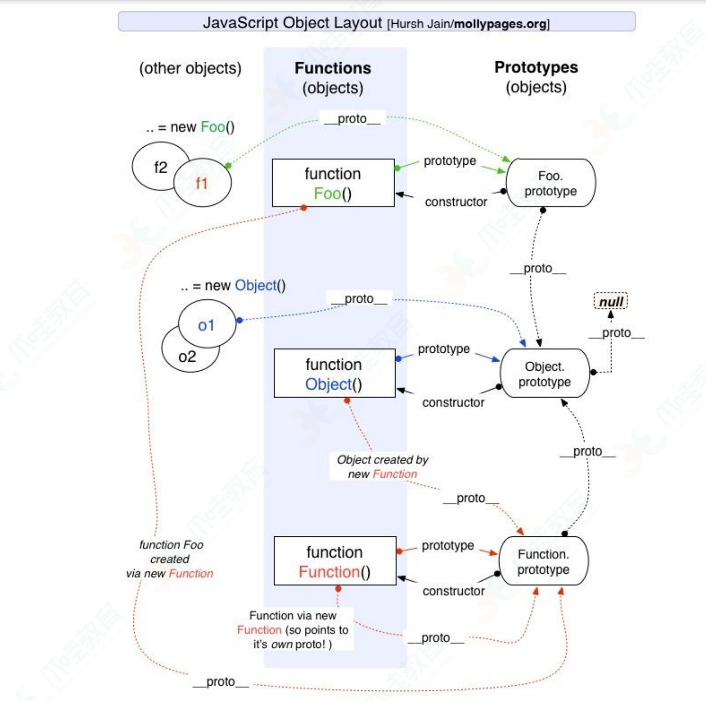
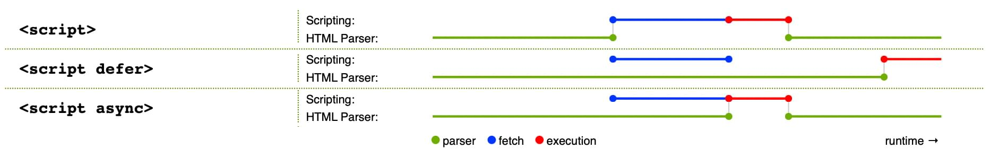

# JS、TS; TS 问题 参考“日常踩坑 / TS.md”

## array 与 string 方法

| array 与 string 共用方法         | string                                | array                                                          |
| -------------------------------- | :------------------------------------ | :------------------------------------------------------------- |
| concat(" world","!");            | str.split(",") 分割                   | arr.join(",")  ---  arr.toString()                             |
| slice(0, 3) --3 下标,返回截取的; | =================                     | =========================                                      |
| length;                          | str.toUpperCase()                     | arr.splice(1,2,"d","e")                                        |
| arr[0] / str[0];                 | str.toLowerCase()                     | ========================                                       |
| indexOf('world');                | ================                      | arr.push('a','b') 添加                                         |
| includes;                        | str.trim()                            | arr.pop() 删除最后一个                                         |
|                                  | str.charAt()                          | arr.unshift("a","b") 添加                                      |
|                                  | ===============                       | arr.shift() 删除第一个                                         |
|                                  | str.substring(3,7) --7 为下标         | =======================                                        |
|                                  | str.substr(0, 5)  ---5 为长度         | arr.sort()  ---  对数组进行排序                                |
|                                  | ================                      | arr.reverse()  ---对数组进行反转                               |
|                                  | str.match（找到一个或多个正则的匹配） | ========================                                       |
|                                  | str.search(检索与正则匹配的值)        | arr.map()                                                      |
|                                  | str.replace(替换与正则匹配的子串)     | arr.forEach()                                                  |
|                                  | =========                             | arr.filter()                                                   |
|                                  | =========                             | arr.some()                                                     |
|                                  | =========                             | arr.every()                                                    |
|                                  | =========                             | arr.reduce( callBack(prevResult, curVal, curIndex, arr), init) |

str 是不变对象，而 array 是可变对象。

```code
   let a = 'abc';
   let b = a.replace('a', 'A');
   console.log(a); // 输出：abc
   console.log(b); // 输出：Abc
```

当我们调用 a.replace('a', 'A')时，实际上调用方法 replace 是作用在字符串对象'abc'上的，而这个方法虽然名字叫 replace，但却没有改变字符串'abc'的内容。
相反，replace 方法创建了一个新字符串'Abc'并返回，如果我们用变量 b 指向该新字符串，就容易理解了，变量 a 仍指向原有的字符串'abc'，但变量 b 却指向新字符串'Abc'了：

## js 数据类型及区别

共 8 中：是 Undefined、Null、Boolean、Number、String、Object、Symbol、BigInt；

- （基本/原始）数据类型 ：String、Number、Boolean、Null（空）、Undefined（未定义）、Symbol 、Bigint

  1. Symbol: ES6 引入的，表示独一无二的值；
  2. Bigint: ES6 引入的，表示任意大的整数；比 Number.MAX_SAFE_INTEGER 【2^53-1】 大的整数值；

     js-big-decimal.js / bignumber.js 库处理数据加减乘除；

- 引用数据类型：对象(Object)【除了基本类型以外都是对象, 数组, 函数, 正则表达式】

1. 基本类型的数据（数值、字符串、布尔值）：其值保存在内存地址；
2. 引用类型的数据（主要是对象和数组）：内存地址保存的只是一个指针，const 只能保证这个指针是固定不变的，至于它指向的数据结构是不是可变的，就完全不能控制了。

## const 对象的属性可以修改吗？

const 保证的并不是`变量的值`不能改动，而是变量指向的`那个内存地址`不能改动。

## 基本数据类型和复杂数据类型的区别

1. 存储位置不同（栈和堆）
2. 访问机制不同（按值，引用访问）
3. 变量赋值不同（值的副本，引用）
4. 参数传递不同（传值，引用）

## null / undefined / NaN

- null：空值（主要用于赋值给一些可能会返回对象的变量，作为初始化。）
- undefined：1、只声明未赋值；2、对象属性未定义；3、函数无返回值；4、 =未赋值的变量；
- typeof bb -->（返回 undefined）；
- NaN：不是一个数字（Not-a-Number）；

```null
 ==== 空对象指针 ====
   let person = null;
 ==== 清空对象引用 ====
   let person ={name:"LiSi"}
   person = null;
 ==========================
 console.log(undefined == null); //true
 console.log(undefined === null); //false

 Object.is(null,null); //true
 Object.is(undefined,undefined); //true
 Object.is(undefined,null); //false
```

```undefined
 ====== 1、只声明未赋值 ========
   let b
   console.log(b); // 输出：undefined
 ====== 2、对象属性未定义 ========
   let obj={}
   console.log(obj.name); // 输出：undefined
 ====== 3、函数无返回值 ========
   function say(){ console.log("H")}
   let result = say(); // 调用函数
   console.log(result); // 输出：undefined
 ====== 4、=未赋值的变量； ========
   let a;
   let b = a;
   console.log(b); // 输出：undefined
```

```NaN
==== 1、非法数学运算 ======
  let d = 0/0;
  let e = Math.sqrt(-1);
  console.log(d,e) // 输出：NaN , NaN
==== 2、无效的类型转换 =====
  let f = parseInt("Hello");
  console.log(f); // 输出：NaN
========================
console.log(NaN === NaN); //false
console.log(NaN == NaN); //false

isNaN() 会对参数进行类型转换。
Number.isNaN() 不进行类型转换，只在值本身是 NaN 时返回 true。

console.log(isNaN("Hello")); //true
console.log(isNaN(NaN)); //true
console.log(Number.isNaN(NaN)); //true
console.log(Number.isNaN("Hello")); //false
Object.is(NaN,NaN); //true

console.log(-0 == +0); //true
console.log(-0 === +0); //true
Object.is(-0,+0); //false
```

## JS 中的包装类

在 js 中，基本类型是没有属性和方法的，但是为了便于操作基本类型的值，在调用基本类型的属性或方法时 js 会在后台隐式地将基本类型的值转换为对象;

- `let a ="abc"; a.length;` 当 访 问 'abc'.length 时 ， JavaScript 将'abc' 在后台转换成 String('abc')，然后再访问其 length 属性;

- `let b = Object(a); //String{"abc"} ` JavaScript 也可以使用 Object 函数显式地将基本类型转换为包装类型;

- `let c = b.valueOf(); //"abc"` 也可以使用 valueOf 方法将包装类型倒转成基本类型;

- 如下代码会打印出什么：

  ```code
    let a = new Boolean(false);
    if(!a){
       console.log("Oops"); //从不运行；
    }
  ```

答案是什么都不会打印，因为虽然包裹的基本类型是 false，但是 false 被包裹成包装类型后就成了对象，所以其非值为 false，所以循环体中的内容不会运行。

## 栈、堆、队列之间的区别是？

动态语言：在使用时需要检查数据类型的语言。
弱类型语言：支持隐式转换的语言。

1. 栈（stack）：存（原始/基本）数据类型；占据空间小、大小固定，属于被频繁使用数据，所以放入栈中存储；  
   上下文切换之后，栈顶的空间会自动被回收【像 桶 先进后出】

2. 堆（heap）：存 引用数据类型（对象、数组和函数）；占据空间大、大小不固定。如果存储在栈中，将会影响程序运行的性能；

   引用数据类型在栈中存储了指针，该指针指向堆中该实体的起始地址。当解释器寻找引用值时，会首先检索其在栈中的地址，取得地址后从堆中获得实体。

   需要垃圾回收机制不定时回收；【书架中的书，知道书名就可以拿到书，可以无序】

3. 在操作系统中，内存被分为栈区和堆区：

   - 栈区内存：由编译器自动分配释放；存放函数的参数值，局部变量的
     值等。（上下文切换之后，栈顶的空间会自动被回收）
   - 堆区内存：一般由开发者分配释放，若开发者不释放，程序结束时可
     能由垃圾回收机制回收。

4. 队列只能在队头做删除操作,在队尾做插入操作。（先进先出）
   理解队列数据结构的目的主要是为了清晰的明白事件循环机制

## 进程、线程：参考 “计算机基础系列 / 进程-线程-协程-纤程”

## 变量提升：javascript 代码是按顺序执行的吗

js 先编译后解析；

1. 在编译阶段，变量和函数会被存放到变量环境中，

   - 变量：默认值会被设置为 undefined；
   - 两个相同的函数：最终放在变量环境中的是最后定义的那个（后定义的覆盖先定义的）；

2. 在代码执行阶段，JavaScript 引擎会从变量环境中查找自定义的变量和函数；

## 块级作用域：var 缺陷以及为什么要引入 let 和 const

let、const 声明的变量不会被提升。在 js 引擎编译后，会保存在词法环境中。

词法环境内部维护一个小型的栈结构，作用域内部变量压入栈顶。作用域执行完，从栈顶弹出。

## 调用栈：为什么 js 代码会出现栈溢出（内存泄漏）

js 代码出现栈溢出错误: 通常发生在递归调用过深 或者 无限循环的情况下。

这是因为 js 使用了一个有限大小的调用栈来跟踪函数调用。每次函数被调用时，都会有一个新的执行上下文被推入调用栈。当函数执行结束并返回时，其对应的执行上下文会被从栈中弹出。

由于调用栈的大小是有限的，当一个函数递归调用自身太多次而没有合适的退出条件时，或者在一个循环中反复调用函数却没有终止条件，调用栈最终会达到其最大容量。一旦超过这个限制，JavaScript 引擎就无法再往栈里添加更多的执行上下文，这时就会抛出一个“RangeError: Maximum call stack size exceeded”的错误，这也就是所谓的栈溢出。

- “执行上下文对象”包含以下重要的属性和组成部分：

  1. 变量环境：用于存储声明的变量、函数声明和函数参数。
  2. 词法环境：包含变量环境，并构成了作用域链（Scope Chain）。
  3. 外部环境：指向外部（父级）执行上下文的词法环境，用于处理作用域链和词法嵌套。
  4. this 值：指向当前函数执行的上下文对象内部的 this 关键字。
  5. 闭包函数：如果当前函数是一个闭包，执行上下文对象中还会包含闭包的引用和相关信息。

当函数执行完毕后，执行上下文对象将被销毁，从执行栈中弹出。但是，如果函数是一个闭包并且被外部引用，它的执行上下文可能会被保留在内存中，以供后续访问和使用。

## 作用域（Scope） / 作用域链（Scope Chain） / 闭包

1. 作用域（词法环境）：是一套约定好的规则。我们写代码，应该按照这个规则写，JS 引擎对 JS 源码进行词法分析，也是按照这个规则来。

   - 全局作用域、函数作用域、块级作用域

2. 作用域链是：在代码执行过程中"会动态变化的一条索引路径"(由当前环境与上层环境的一系列变量对象组成)。

   在当前作用域中查找所需变量，如果在自己作用域找不到该变量就去父级作用域查找，依次向上级作用域查找，直到访问到 window 对象就被终止，这一层层的关系就是作用域链。

3. 作用域链的作用是：它保证了当前执行环境对“符合访问权限的变量和函数”的有序访问。

4. 闭包：根据词法作用域的规则，内部函数总是可以访问其外部函数中声明的变量，当通过调用一个外部函数返回一个内部函数后，即使外部函数已经执行结束了，但是内部函数引用外部函数的变量依旧保存在内存中，把这些变量的集合称为闭包；

## 闭包： 一种特殊的对象，本质是当前环境中存在指向父级作用域的引用

它由两部分组成。执行上下文(代号 A)，以及在该执行上下文中创建的函数（代号 B）。
当 B 执行时，如果访问了 A 中变量对象中的值，那么闭包就会产生。（模块化是闭包最强大的一个应用场景）

闭包的问题在于，一旦有变量引用这个中间函数，这个中间函数将不会释放，同时也会使原始的作用域不会得到释放，作用域中产生的内存占用也不会得到释放。除非不再有引用，才会逐步释放。

## 原型（原型对象） / 原型链

1. 我们创建的每一个函数，js 引擎会为函数添加一个  prototype  属性，该属性指向一个对象。这个对象就是我们所说的原型。

2. 查找对象的某个属性，如果对象本身没有，会通过`__proto__`去它的构造函数的 prototype（原型对象）中查找；如果还没有找到，会继续通过原型对象的`__proto__`去【原型对象的原型】中查找，直到 Object.prototype 对象为止，这样就形成一个链式结构,  即原型链。

3. 每个对象都有`__proto__`属性，但只有函数对象才有 prototype 属性;

4. 由于 Object 是构造函数，原型链终点 `Object.prototype.__proto__`，而 `Object.prototype.__proto__=== null` // true，所以，原型链的终点是 null。原型链上的所有原型都是对象，所有的对象最终都是由 Object 构造的，而 Object.prototype 的下一级是`Object.prototype.__proto__`。



## constructor /prototype /`__proto__`   <https://www.jianshu.com/p/dee9f8b14771>

1. 原型对象（Person.prototype）有一个 constructor 属性（指向构造函数）。
2. 实例没有 constructor,调用的是原型上的 constructor

   ```code
      var person1 = new Person();
      person1.constructor == Person
      Person.prototype.constructor == Person
      person1.__proto__ == Person.prototype;
   ```

3. getPrototypeOf 是 Object 对象自带的一个方法，能够拿到参数的原型对象
      Object.getPrototypeOf(person1)=== Person.prototype;

## hasOwnProperty / isPrototypeOf / for...in

1. Object 的 hasOwnProperty(key)方法返回一个布尔值，判断对象是否包含特定的自身（非继承）属性。
2. for...in 循环对象的所有枚举属性（包括继承的）,然后再使用 hasOwnProperty()方法来忽略继承属性。
3. isPrototypeOf 的字面意思就是谁的原型链中是否包含了 XX 的原型(例如:obj1.isPrototypeOf(obj2)  这个意思是，obj1 是否被包含在 obj2 的原型链中)

## typeof / Object.prototype.toString.call / instanceof

1. typeof

   - 数组、对象、null 都会被判断为 object，其他判断都正确
   - typeof (object、Function、Array、Date、Number、String、Bootlean)-->结果是:funciton

2. Object.prototype.toString:判断某个对象属于哪种内置类型，但不能判断自定义类型。

   Object.prototype.toString.call(null); // "[object Null]"-- [Object type]，其中 type 为对象的类型。

   【array、function 等 obj】.toString()的结果和 Object.prototype.toString.call(obj)的结果不一样， 这是因为 toString 是 Object 的原型方法，而 Array、function 等类型作为 Object 的实例，都重写了 toString 方法。

3. instanceof：检测构造函数的 prototype 属性是否出现在某个实例对象的原型链上。

   - 1、自定义类型; 2、只能用来判断对象类型，原始类型不可以；3、并且所有对象类型 instanceof Object 都是 true。
   - [] instanceof Array; // true; ------ [] instanceof Object; // true
   - //语法：object instanceof constructor ，
   - 参数：object（实例对象）constructor（构造函数）
   - console.log(person instanceof Person); // true

4. Array.isArray()方法。  Array.isArray([1, 2, 3]); // true

## this 、 new 、 call / apply / bind

- this 的指向，是在函数被调用的时候确定的:

  1. 如果函数被某一个对象所拥有，那么该函数在调用时，内部的 this 指向该对象。
  2. 如果函数独立调用：在严格模式下，this 值是 undefined；非严格模式下 this 指向的是全局对象 window；
  3. 箭头函数没有自己的执行上下文，this 是外层函数的 this；
  4. 谁调用函数，this 指向谁；

- 当执行 new CreateObj 的时候，JavaScript 引擎做了四件事：

  1. 首先创建一个空对象 tempObj；
  2. 新对象 tempObj 原型指向构造函数 Func 原型对象；
  3. 将构建函数 Func 中的 this 绑定到新建的对象 tempObj 上，并执行；
  4. 如果构造函数返回非空对象，则返回该对象；否则，返回刚创建的新对象

  ```
  function myNew(Func, ...args) {
      // 1.创建一个新对象
      const obj = Object.create(null);
      // 2.新对象原型指向构造函数原型对象
      obj.__proto__ = Func.prototype
      // 3.将构建函数的this指向新对象
      let result = Func.apply(obj, args)
      // 4.如果构造函数返回非空对象，则返回该对象；否则，返回刚创建的新对象
      return typeof result === 'object' ? result : obj;
  }
  ```

- call / apply / bind---改变 this 的指向

  它们在功能上是没有区别的，它们的区别主要是在于方法的实现形式和参数传递上的不同；

  1. 函数.call( 对象,arg1,arg2.... )  ----->会自执行
  2. 函数.apply( 对象,[ ] )  ----->会自执行
  3. var ss=函数.bind(对象,arg1,arg2,....)   ----->不会自执行，需要调用

## 箭头函数的 this 指向哪⾥？

箭头函数并没有属于⾃⼰的 this，它所谓的 this 是捕获其所在上下⽂的 this 值，作为⾃⼰的 this 值

## js 继承 <https://www.cnblogs.com/humin/p/4556820.html>

1. 原型链继承
2. 构造继承(Person.call(this,a,b))
3. 实例继承（new Person()）
4. 拷贝继承
5. extends

## JS 事件循环机制: 参考 “浏览器系列”

JavaScript 代码的执行过程中，除了依靠“函数调用栈”来搞定函数的执行顺序外，还依靠“任务队列(task queue)”来搞定另外一些代码的执行。

1. 一个线程中，事件循环是唯一的，但是任务队列可以拥有多个。

2. 任务队列又分为 macro-task（宏任务）与 micro-task（微任务）
   macro-task 大概包括：script(整体代码), setTimeout, setInterval。
   micro-task 大概包括: Promise.then, MutationObserver(html5 新特性-监听 DOM 节点变化)

3. setTimeout/Promise 等我们称之为任务源。而进入任务队列的是他们指定的具体执行任务。（setTimeout 作为一个任务分发器，这个函数会立即执行，而它所要分发的任务，也就是它的第一个参数，才是延迟执行）

4. 来自不同任务源的任务会进入到不同的任务队列。其中 setTimeout 与 setInterval 是同源的。

5. 事件循环的顺序，决定了 js 代码的执行顺序。它从 script(整体代码)开始第一次循环。之后全局上下文进入函数调用栈，直到调用栈清空(只剩全局)。然后执行所有的 micro-task（微任务中套微任务，执行）。当所有可执行的 micro-task 执行完毕之后。循环再次从 macro-task 开始，找到其中一个任务队列执行完毕，然后再执行所有的 micro-task，这样一直循环下去

6. 其中每一个任务的执行，无论是 macro-task 还是 micro-task，都是借助函数调用栈来完成

|                宏任务 | 浏览器 | node |     |                     微任务 | 浏览器 | node |
| --------------------: | :----: | :--: | --: | -------------------------: | :----: | :--: |
|            setTimeout |  支持  | 支持 |     | Promise.then catch finally |  支持  | 支持 |
|           setInterval |  支持  | 支持 |     |           MutationObserver |  支持  |  不  |
| requestAnimationFrame |  支持  |  不  |     |           process.nextTick |   不   | 支持 |
|          setImmediate |   不   | 支持 |     |                            |        |      |

```

        console.log(2);
        let doit;
        const prom = new Promise((resolve, reject) => {
            console.log(3);
            doit = resolve;
            console.log(6)
        })
        prom.then(n => console.log(4));
        async function s1() {
            console.log(7);
            await s2();
            console.log(1);
            doit();
            console.log(8);
        }
        async function s2() {
            console.log(9)
        }
        s1();
        console.log(5)
        prom.then(n => console.log(10));

await：后面的同步函数会立即执行，再阻挡；
resolve 执行后才执行 then 方法

```

## js defer 和 async / type="module" 区别

- defer(延迟脚本):遇到后立
  即下载，初始的 HTML 文档解析完成再执行（DOMContentLoaded 事件之前执行）；

  1. 有多个，按在页面出现的顺序执行；

- async(异步脚本):遇到后立即下载，下载完 立即执行(在 load 前)；

  1. 有多个，先下载完先执行；

- type="module":遇到后立即下载，等到整个页面渲染完，再执行模块脚本，等同于打开了`<script>`标签的 `defer` 属性；
  1. 有多个，按在页面出现的顺序执行；
  2. defer 属性不生效；如果添加 async 属性，则按 async 规则执行

1、当初始的 HTML 文档被完全加载和解析完成之后，DOMContentLoaded 事件被触发（无需等待样式表、图像和子框架的完成加载）

2、页面上所有的资源（图片，音频，视频等）被加载以后才会触发 load 事件



## 跨域

1. jsonp 跨域: `http://aa.com/jsonp/result.aspx?code=CA1998&callback=flightHandler`
2. CORS（跨域资源共享）
3. 代理转发（nginx/node）
4. WebSocket
5. 图像 ping
6. iframe

## 深 copy / 浅 copy

深 copy：基础类型（字符串、数字、布尔、Null、Undefined、symbol）
浅 copy：引用数据类型（包含普通对象-Object，数组对象-Array，正则对象-RegExp，日期对象-Date，数学函数-Math，函数对象-Function）

```code
1、structuredClone //let newObj = structuredClone(obj)
2、function deepClone(target, cache = []) {
      if (target === null || typeof target !== 'object') {
        return target
      }

     let hit = cache.filter(item => item.origin === target)[0];
      if (hit) {
        return hit.copy;
      }

      if (Array.isArray(target)) {
         return target.map(item => {
           return deepClone(item, cache);
        })
      }
      let copy = target.constructor === Object ? {} : Object.create(target.constructor.prototype)
      cache.push({
         origin: target,
         copy
      })
      return [...Object.keys(target), ...Object.getOwnPropertySymbols(target)].reduce((clone, key) => {
        clone[key] = deepClone(target[key], cache);
        return clone;
      }, copy)
    }
```

## 构造函数  /  普通函数 de 区别

```code
function Person(name, age, job) {
     this.name = name;
     this.age = age;
     this.job = job;
     this.sayName = function () {
        console.log(this.name);
     }
}
//-------当做构造函数使用
var per = new Person('Nicholas', 29, 'Software'); //this-->实例（per）
per.sayName(); //'Nicholas'    
//-----当做普通函数调用          　　
  Person('Greg', 27, 'Doctor'); //this-->window         　　
  window.sayName(); //'Greg'
```

## JQ 中类似 promise

// $.when().done().fail().then()

## 排序：参考计算机基础系列 / 数据结构与算法

## RegExp 对象方法

RegExpObject.exec(string) // 匹配到，返回值，否则返回 null。

RegExpObject.test(string) // 匹配到，返回 true ，否则返回 false。

## AMD/CMD/CommonJs/ES6

1. 异步模块定义（AMD---Asynchronous Module Definition）：依赖前置。具体实现 require.js
2. 通用模块定义（CMD---Common Module Definition）：依赖就近，同步。
3. ES6 特性：只有导出才能导入；export / import 成对出现。
4. CommonJs 规范: nodeJs 后台采用的规范，可以多次加载，只在第一次运行，结果被缓存；module.exports / require;

   - CommonJS：

     1. 模块输出的是一个值的拷贝；

        因为 CommonJ 输出的值是一个静态值，而且这个值会被缓存到，所以每一次获取到的都是缓存值，改变原来的值，引用值不会改变。

     2. CommonJS 模块是运行时加载；

        因为 CommonJS 加载的是一个对象（即 module.exports 属性），该对象只有在脚本运行完才会生成。

     3. CommonJS 模块的 require()是同步加载模块；

   - ESM 模块：

     1. 输出的是值的引用；

        ESM 输出的是一个只读引用，模块不会缓存运行结果，而是动态地去“被加载的模块”取值，并且变量总是绑定其所在的模块。

     2. ESM 模块是编译时输出接口；

        ESM 模块不是对象，它的对外接口只是一种静态定义，在代码静态解析阶段就会生成。

     3. ESM 模块的 import 命令是异步加载，有一个独立的模块依赖的解析阶段。

## 迭代器(iterator)、生成器(generator)、promise、await(异步)/async(等待) ：参考 js 基础系列 / 迭代器、生成器、promise、await-async

## 节流与防抖

- 函数节流：是指规定一个单位时间，在这个单位时间内，只能有一次触发事件的回调函数执行，如果在同一个单位时间内某事件被触发多次，
  只有一次能生效。
  1. 监控浏览器 resize；
  2. 元素拖拽
- 函数防抖：是指在事件被触发 n 秒后再执行回调，如果在这 n 秒内事件又被触发，则重新计时。
  1. 按钮提交
  2. input 输入

## Object.defineproperty 与 proxy 区别

1. 监听对象不同
   defineproperty：只能监听某个属性（需要知道对象的具体属性）
    proxy：只需要知道对象
2. proxy 不需要借助外部 value
3. proxy 不会污染原对象（返回新对象，原对象不改变）

```code
    var o = {};
    var bValue = 38;
    Object.defineProperty(o, "b", {
      get() {
        return bValue;
      },
      set(newValue) {
        bValue = newValue;
      }
    });
```

## es6 拦截 proxy

```code
var person = { name: "张三" };
var proxy = new Proxy(person, {
    get: function (target, key) {
        if (key in target) {
            return target[key];
        } else {
            throw new ReferenceError(`Prop name ${propKey}does not exist.`);
        }
    },
   set: function (target, key, value) {
          console.log(`${key} 被设置为 ${value}`);
          target[key] = value; // 或者 Reflect.set(target，key，value）
        }
});
proxy.name // "张三"
proxy.age //  抛出一个错误
proxy.name = 'others'; //  控制台输出：name  被设置为  others
get(target, propKey, receiver)：拦截对象属性的读取
set(target, propKey, value, receiver)：拦截对象属性的设置
has(target, propKey)：拦截 propKey in proxy 的操作，返回一个布尔值
deleteProperty(target, propKey)：拦截 delete proxy[propKey]的操作，返回一个布尔值
```

## 创建异步对象

```code
  let xhr = new XMLHttpRequest();
  //post请求一定要添加请求头才行不然会报错
  xhr.setRequestHeader("Content-type", "application/x-www-form-urlencoded");
  //设置请求的类型及url
  xhr.open('post', '02.post.php');
  xhr.onreadystatechange = function () {
      // 这步为判断服务器是否正确响应
      if (xhr.readyState == 4 && xhr.status == 200) {
          console.log(xhr.responseText);
      }
  };
  //发送请求
  xhr.send('name=fox&age=18');
```

## onClick 与 addEventListener 监听区别

addEventListener 能够添加多个事件，且只能写在 js 中，易于控制和修改。

用 onclick 容易造成覆盖问题，管理起来比较麻烦。

## 事件代理的优点

1. 提高性能；

   在父元素上绑定一个事件处理程序，比为每个子元素单独绑定事件处理程序性能更高，尤其是在子元素数量较多时。

2. 简化代码；

   事件代理减少了事件处理程序的数量，使代码更简洁、更易于维护。

3. 动态内容支持；

   对于动态添加或删除的子元素，事件代理可以自动处理，不需要额外的事件绑定或解绑逻辑

## JS 中判断字符串中出现次数最多的字符及出现的次数

```code
let str = 'qwertyuilo.,mnbvcsarrrrrrrrtyuiop;l,mhgfdqrtyuio;.cvxsrtyiuo';
  let json = {};
  //遍历 str 拆解其中的每一个字符将其某个字符的值及出现的个数拿出来作为 json 的 kv
  for (let i = 0; i < str.length; i++) {
      //判断 json 中是否有当前 str 的值  
      if (!json[str.charAt(i)]) {
          json[str.charAt(i)] = 1;
      } else {
          json[str.charAt(i)]++;
      }
  }
  let number = '';
  let num = 0;
  for (let i in json) {
      if (json[i] > num) {
          num = json[i];
          number = i;
      }
  }
  console.log('出现最多的值是' + number + '出现次数为' + num);
```

## js  链式调用

我们都很熟悉 jQuery 了，只能 jQuery 中一种非常牛逼的写法叫链式操作;

`$('#div').css('background','#ccc').removeClass('box').stop().animate({width:300});`

一般的函数调用和链式调用的区别：调用完方法后，return this 返回当前调用方法的对象。

```code
        function Dog() {
            this.run = function () {
                console.log("The dog is running....");
                return this; //返回当前对象  Dog
            };
            this.eat = function () {
                console.log("After running the dog is eating ....");
                return this; //返回当前对象  Dog        
            };
            this.sleep = function () {
                console.log("After eating the dog is running....");
                return this; //返回当前对象  Dog        
            };
        }
        //一般的调用方式；
        /*  var dog1 =new Dog();
            dog1.run();
            dog1.eat();
            dog1.sleep();*/
        var dog2 = new Dog();
        dog2.run().eat().sleep();
```

## JQ 中 prop、 attr、data 的区别

1. prop(property) 方法: 用于操作元素本身固有属性【元素自身的状态或值】

   - 比如 checked、selected、disabled 等布尔类型的属性，或者是像 value 这样的字符串属性;
   - prop() 主要用来处理那些在程序运行时可能会改变状态的属性。

2. attr(attribute) 方法: 用于操作 HTML 元素的属性值

   - 比如 id、class 或者自定义的 `data-*` 属性；
   - attr() 更多用于操作那些在 HTML 中定义的属性。

3. 的 data()方法: 用于操作任意类型的数据到 jQuery 包装集合中的每个元素上。
   - data() 是一种在元素之间传递信息的方式，而不需要使用全局变量或直接修改 DOM。
   - 它可以存储任何类型的数据（如数字、字符串、对象等），并且这些数据不会出现在 HTML 中。
   - 需要在页面间共享的数据或临时存储的信息，则 data() 是最佳选择。

## for -- setTimeout

1. 添加个闭包

   ```code
           for (var i = 1; i <= 5; i++) {
               (function (j) {
                   setTimeout(function timer() {
                       console.log(j)
                   }, 0)
               })(i)
           }
   ```

2. 传第三个参

   ```code
           for (var i = 1; i <= 5; i++) {
               setTimeout(function timer(j) {
                   console.log(j)
               }, 0, i)
           }
   ```

3. let

   ```code
           for (let i = 0; i < 3; ++i) {
               setTimeout(function () {
                   console.log("let", i);
               }, 100);
           }
   ```

4. ***

   ```code
      for (var i = 0; i < 3; ++i) {
               setTimeout(console.log("var", i), 100);
           }
   ```
