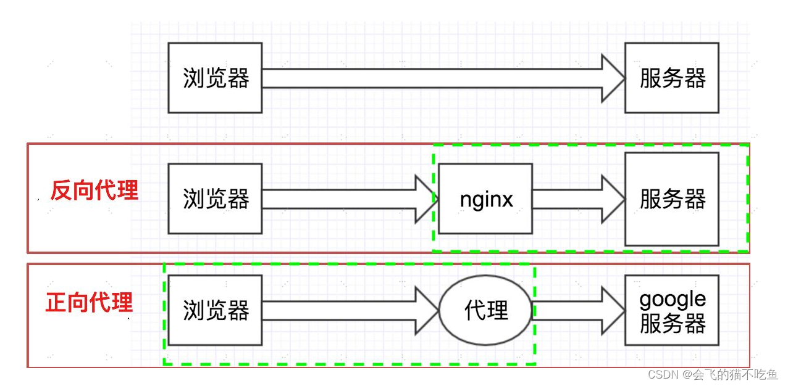
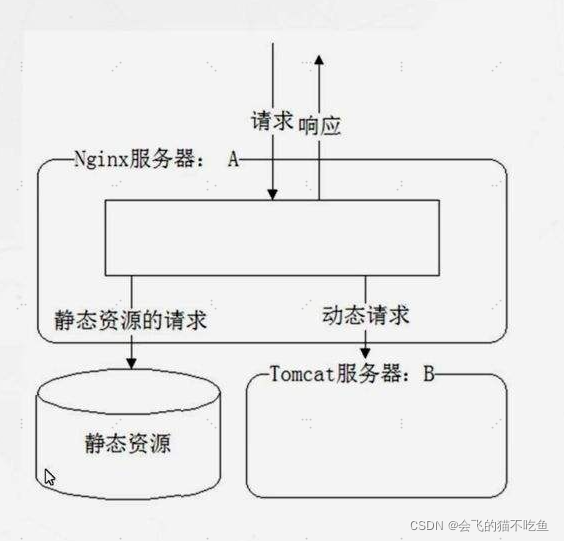

# 部署

## CI/CD：持续集成、持续交付和持续部署

- 持续集成(CI)：代码提交阶段；（技术：GitHub，GitLab）
- 持续集成(CI)：静态代码检查阶段；
- 持续集成(CI)：构建；（技术：Jenkins，Maven）;【跑：建验证测试（BVT）/冒烟测试/单元测试：】
- 持续集成(CI)：测试阶段：【集成测试、性能和压力测试】；
- 持续交付(CD)：Bake：创建不可变的镜像实例；
- 持续交付(CD)：部署：将已 bake 的镜像发送到部署阶段；
- 持续交付(CD)：验证；
- 持续交付(CD)：监控；
- 持续交付(CD)：反馈和协作工具；

## nginx




1. 负载均衡

   ```node：负载均衡name
   upstream node{
       server IP:端口;
       server IP:端口;
       server IP:端口;
   }
   server {
       location / {
           proxy_pass http://node;
       }
   }

   ```

2. 配置 TCP 层 keepalive 探活机制
3. ip_hash：标记登录的服务器，下次继续这台

## jenkins

```流水线-Jenkinsfile
pipeline{
   agent any
   environment{
      cc="ss"
   }
   stages{
      stage("加载){
         steps{
            sh ""
         }
      }
      stage("打包"){
         steps{}
      }
   }
   post{
      always{}
   }
}

```

## docker

## k8s

管理维护容器-YAML
高可用性：容器自动重启、重建；
可扩展性：根据负载来动态改变系统资源；

### 组件概念

1. Node：一个节点是一个虚拟机，可运行一个或多个 pod 的；
2. pod：一个 pod 是一个或多个应用容器的组合；

   - 是 k8s 最小调度单元；
   - 一个 pod 中 共享网络，存储配置；
   - 建议一个 pod 中放一个 应用容器（解耦）；也可以放多个关系密切的应用容器；
   - pod 与 pod 之间用内部 IP 访问，集群外部无法访问；
   - pod 不是稳定实体，容易创建和销毁；比如发生故障时 k8s 会自动销毁重建 IP 会变化；

3. service：将一组 pod 封装成一个服务，通过统一的入口访问；

   - service 地址不会变化，
   - 一个 pod 坏了，转发到剩下健康的 pod 中；
   - 分内部服务和外部服务；
     1. 内部服务：数据库、缓存、消息队列等；
     2. 外部服务：微服务 API 接口、前端界面等；节点上开放一个端口，将端口映射到外部服务；

4. ingress：管理从集群外部访问集群内部服务的入口和方式；

   - 通过 ingress 配置不同转发规则；根据不同规则访问集群内部不同的 service 以及 service 所对应的后端 pod
   - 通过 ingress 配置域名；
   - 其他：负载均衡、SSL 证书等；

5. configMap 组件：配置信息封装起来，在应用中读取使用；（把配置信息和应用程序的镜像内容分开）

   - 修改数据库和应用程序 IP 和端口；只需要更新 configMap，然后重新加载 pod，不需要重新编译和部署程序；应用程序和数据库解耦；
   - 配置中是明文的；

6. secret 组件：封装敏感信息；比如用户名、密码（做了 base64 编码）；
7. volume 组件：持久化存储，挂载到集群中的本地磁盘上或挂载到集群外部的远程存储上；
8. deployment 组件：定义管理应用程序的副本数量，以及应用程序的更新策略；
   - 将一个或多个 pod 组合在一起；
   - 具有副本控制（副本数量）、滚动更新、自动扩容等；
   - 管理 静态、无状态的文件；
9. statefulSet 组件：管理有状态的、动态的；例如数据库；和 deployment 组件一样
   - 将数据库等有状态的，从 k8s 中剥离出来，单独部署
