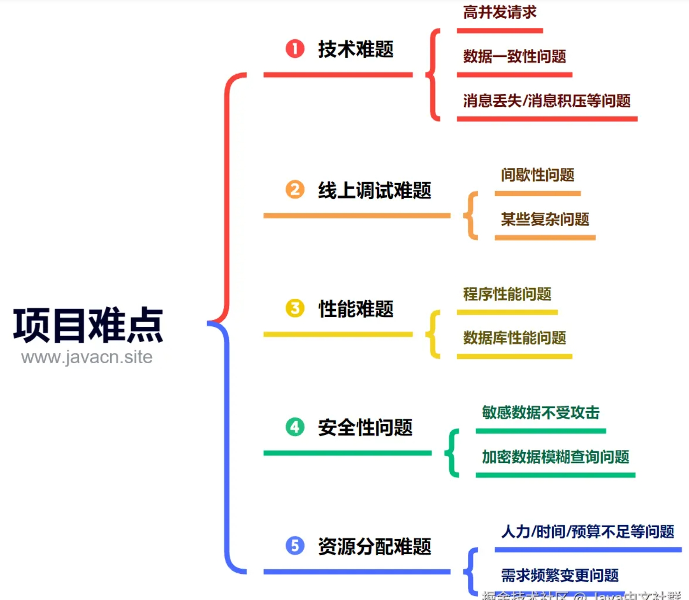

# 问答 10-项目难点

## SaaS 系统 是什么？

SaaS 系统：软件即服务（Software as a Service）：是一种通过互联网提供软件应用的服务平台。
SaaS 系统：让用户“无需关心软件的安装、升级、维护等问题，降低了成本，提高了效率”，是一种非常便捷的商业模式。

其中第三方供应商提供应用程序的托管和提供给客户，通常通过互联网进行访问。这种模式消除了客户需要在“本地安装和维护软件”的需要，而是将这些职责转移到了“第三方提供商”。在 SaaS 平台模式下，用户不再需要购买和维护软件的整个基础架构，而是通过订阅的方式获得对“云端软件的访问权限”。SaaS 平台提供商负责软件的部署、维护和安全性等方面的工作，用户只需要通过网络浏览器或专用应用程序就可以方便地访问和使用软件。
