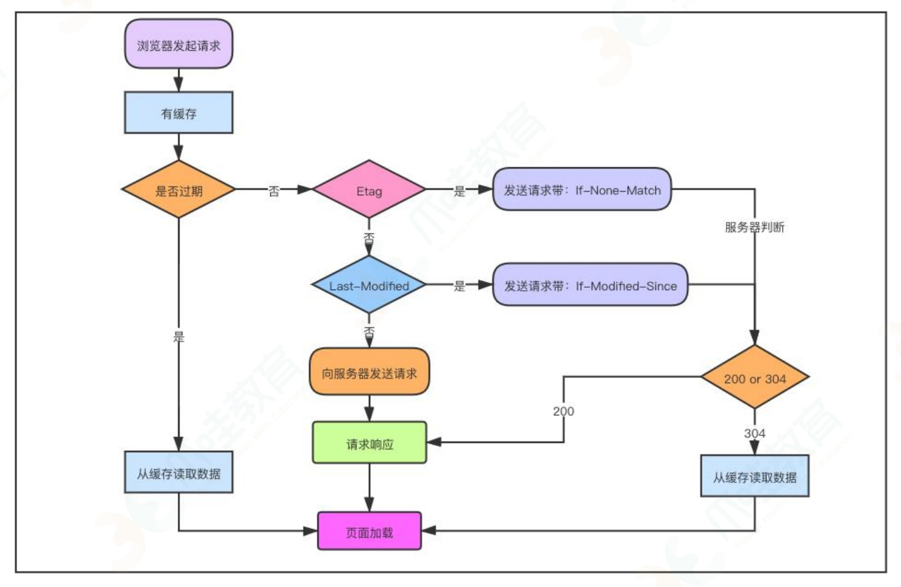

# 浏览器

## 默认浏览器、手机 webview 内核、各家小程序的运行环境

H5 页面：运行环境 1、浏览器；2、APP 的 web-view 组件；3、小程序提供的 web-view 组件；  
微信小程序：运行环境是非完整的浏览器，是基于浏览器内核完全重构的一个内置解析器，针对小程序专门做了优化（功能和流畅性更好）

## 垃圾回收：参考“浏览器系列 / 垃圾回收机制”

栈中数据回收：执行状态指针 ESP 在执行栈中移动，移过某执行上下文，就会被销毁；  
堆中数据回收：V8 引擎采用标记-清除算法；

- 注：在垃圾回收阶段，应用程序的执行会暂停，等待回收执行完毕后，再恢复程序的执行。

## 编译器和解析器：V8 如何执行一段 JavaScript 代码的

计算机语言可以分为两种：编译型和解释型语言。
编译型语言：经过编译器编译后保留机器能读懂的二进制文件，比如 C/C++，go 语言。
解释型语言: 是在程序运行时通过解释器对程序进行动态解释和执行，比如 Python，JavaScript 语言。

- 编译型语言的编译过程：编译器首先将代码进行词法分析、语法分析，生成抽象语法树（AST），然后优化代码，最后生成处理器能够理解的机器码；
- 解释型语言解释过程：解释器会对代码进行词法分析、语法分析，并生产抽象语法树（AST），不过它会再基于抽象语法树生成字节码，最后根据字节码执行程 序；
- AST 的生成：第一阶段是分词（词法分析），将一行行源码拆解成一个个 token（语法上不可再分、最小单个字符）。第二阶段是解析（语法分析），将上一步 生成的 token 数据，根据语法规则转为 AST，这一阶段会检查语法错误；
- 字节码存在的意义：直接将 AST 转化为机器码，执行效率是非常高，但是消耗大量内存，从而先转化为字节码解决内存问题；
- 解释器 在解释执行字节码，同时会收集代码信息，发现某一部分代码是热点代码（HotSpot），编译器把热点的字节码转化为机器码，并保存起来， 下次使用；
- 字节码配合解释器和编译器的计数实现称为即时编译（JIT）。

## 重排（回流）、重绘：参考“问答 6--性能优化”

## 页面性能：如何系统优化页面 “参考 浏览器系列 / 浏览器 4 页面性能”

## 前端缓存



- Service Worker；
- Memory Cache（内存缓存）；
- Disk Cache（硬盘缓存）；
- Push Cache（推送缓存 - http2.0）；

1. Service Worker：运行在浏览器背后的独立线程；【参考下面的 “PWA：解决 web 应用哪些问题”】

2. memory cache（内存缓存）：读取快，存储时间短（关闭  Tab  页，内存中的缓存就被释放）;

   应用：preloader（`<link rel="prefetch">`）显式指定的预加载资源，也会被放入 memory cache 中

3. disk cache（硬盘缓存）：读取慢，存储时间长，容量大

   放硬盘：1.大文件 2.内存占用率高；

   图片，字体，js，css 看大小：小放内存，大放硬盘；

   - 浏览器缓存：通过 HTTP Header  实现：Expires  和  Cache-Control；

     - Expires ：http 1.0 受本地时间限制（绝对时间）；
     - Cache-Control：

       - public：允许所有方缓存 (包括客户端和代理服务器， 如 CDN)；
       - private：只有客户端才可以缓存，代理服务器不能缓存；
       - no-cache：每次必须先询问服务器资源是否已经更新，未更新 304；
       - no-store：不使用缓存；

       - max-age：即最大有效时间（秒-相对时间）
       - must-revalidate：缓存在考虑使用【旧资源】，必须发请求验证；

   - 强制缓存：直接用（不发请求验证）状态码：200；例如：
     1、Expires:<最后期限>
     2、Cache-Control:max-age=600；

   - 对比缓存（协商缓存）：每次需要向服务器请求对比，缓存生效不传回 body 体;
     - Etag / If-None-Match：优先级--高
       - Etag：第一次请求，返回的资源**唯一标示符**；
       - If-None-Match：第二次请求发给服务端，服务端对比，
         1、相同则用缓存，状态码：304；
         2、不同返回新的资源，状态码：200
     - Last-Modified / If-Modified-Since ：
       - Last-Modified：第一次请求，返回的资源**最后修改时间**；
       - If-Modified-Since：第二次请求发给服务端，服务端对比 资源的最后修改时间
         1、服务端时间 <= 请求中的资源时间，则用缓存，状态码：304；
         2、服务端时间 > 请求中的资源时间，则返回新的，状态码：200

4. Push Cache（推送缓存 - http2.0）：以上三种缓存都没有命中时才会被使用，一旦会话结束就被释放；

   http2.0 推送的是静态资源（css,js）；和 WebSocket 以及使用 SSE 等方式向客户端发送即时数据的推送是不同的。

## Cookie 、 localStorage 、 sessionStorage、IndexedDB（NoSQL 数据库）

- 存储大小： Cookie：4K； localStorage / sessionStorage：5M；

- 存储位置：Cookie：每次 http 请求都会带 ；localStorage / sessionStorage：都保存在客户端，不与服务器进行通信；

- 生命周期：

  - localStorage: 除非被清除，否则永久保存
  - sessionStorage:仅在当前会话下有效，关闭页面或浏览器后被清除
  - cookie:

    1. HttpOnly ：可以防止客户端脚本修改
    2. Expires ：设置过期时间
    3. Max-Age ：设置多少秒数后失效
    4. Domain ：指定送达的主机名
    5. Path ：指定送达的 URL 路径
    6. Secure ：只能用于 HTTPS 协议
    7. SameSite ：Strict 仅允许一方；
       Lax 允许部分第三方请求；
       None 无论是否跨站；

**注：**
1、通过点击链接（或者  window.open）打开的新标签页属于同一个 sessionStorage 的；
2、新开一个标签页总是会初始化一个新的 sessionStorage，即使网站是一样的，它们也不属于同一个 sessionStorage；

## 同源策略：协议、域名和端口号相同的 URL 是同源的

## XSS 攻击(跨站脚本攻击)：为什么 cookie 中有 httpOnly 属性

XSS  攻击是指浏览器中执行恶意脚本, 然后拿到用户的信息进行操作。

- 主要分为存储型、反射型和文档型。

  1. 存储型：(持久型)提交了数据，并且存入了数据库，别人访问这个页面的时候就会自动出发;
  2. 反射型：(非持久型)提交了数据，但是这是对你这次访问产生了影响，并非持久性攻击;
     - 1.攻击者构造出特殊的 URL，其中包含恶意代码。
     - 2.⽤户打开带有恶意代码的 URL 时，⽹站服务端将恶意代码从 URL 中取出，拼接在 HTML 中返回给浏览器。
     - 3.⽤户浏览器接收到响应后解析执⾏，混在其中的恶意代码也被执⾏。
     - 4.恶意代码窃取⽤户数据并发送到攻击者的⽹站，或者冒充⽤户的⾏为，调⽤⽬标⽹站接⼝执⾏攻击者指定的操作。的数据发送到浏览器端，浏览器端解析这段带有 XSS 代码的数据后当做脚本执行，最终完成 XSS 攻击。
  3. DOM 的：通过 JS 代码对网页进行修改，变化和执行。当 JS 代码执行后的结果产生了 XSS 漏洞的话，这就是 DOM 型 XSS，再根据该 XSS 能否被存储进数据库中，可再细分为反射型和存储型;

- 防范的措施包括:

  1. 一个信念: 不要相信用户的输入，对输入内容转码或者过滤，让其不可执行。
  2. 两个利用: 利用 CSP（只允许页面向允许的域名发起跨域请求）；利用 Cookie 的 HttpOnly 属性。

## CSRF 攻击（跨站请求伪造）：陌生连接不要随便点

攻击者诱导用户进入一个第三方网站，然后该网站向被攻击网站发送跨站请求。如果用户在被攻击网站中保存了登录状态，那么攻击者就可以利用这个登录状态，绕过后台的用户验证，冒充用户向服务器执行一些操作。

- CSRF 攻击攻击原理及过程如下：

  1. 用户打开浏览器，访问受信任网站 A，输入用户名和密码请求登录网站 A；
  2. 用户信息通过验证后，网站 A 产生 Cookie 信息并返回给浏览器，此时用户登录网站 A 成功，可以正常发送请求到网站 A；
  3. 用户未退出网站 A 之前，在同一浏览器中，打开一个 tab 页访问网站 B；
  4. 网站 B 接收到用户请求后，返回一些攻击性代码，并发出一个请求要求访问第三方站点 A；
  5. 浏览器在接收到这些攻击性代码后，根据网站 B 的请求，在用户不知情的情况下携带 Cookie 信息，向网站 A 发出请求。网站 A 并不知道该请求其实是由 B 发起的，所以会根据用户的 Cookie 信息以用户的权限处理该请求，导致来自网站 B 的恶意代码被执行。

- demo:

  1. git 请求：

     ```code
     
     ```

  2. post 请求：

     ```code
        <body>
           <form action="https://vulnerable-website.com/email/change" method="POST">
              <input type="hidden" name="email" value="pwned@evil-user.net" />
              </form>
           <script>
              document.forms[0].submit();
           </script>
        </body>
     ```

- 防范措施：

  1. 随机化 Token（CSRF Token）：Token 是用于验证网站请求者身份的一种机制，可以防止 CSRF 攻击。该 Token 会在每次访问页面时刷新，以确保每次请求都需要新的 Token。
  2. Cookie SameSite 属性：应用于 Cookie，防止跨站请求伪造攻击，避免恶意网站使用认证（sso）cookie 访问目标网站或者欺骗 cookie 窃取用户数据。
  3. 限制 cookies 操作：不能在 cookie 中加入用户敏感信息，避免 cookie 的信息外泄。
  4. 验证请求的来源站点，请求头中的 Referer 和 Origin 属性

**XSS 与 CSRF 的区别**：XSS 是直接盗取到了用户的权限，然后实施破坏，而 CSRF 是借用户的权限完成攻击，攻击者并没有拿到用户的权限。

## PWA：解决 web 应用哪些问题

- PWA（Progressive Web App），渐进式 Web 应用。一个渐进式过渡方案，让普通站点过渡到 Web 应用，降低站点改造代价，逐渐支持新技术，而不是一步到位；
- PWA 引入 Service Worker 来试着解决离线存储和消息推送问题，引入 mainfest.json 来解决一级入口问题；
- 安装了 Service Worker 模块之后，WebApp 请求资源时，会先通过 Service Worker，让它判断是返回 Serviceworker 缓存的资源还是重新去网络请求资源，一切的控制权交给 Service Worker 来处理；
- 在目前的 Chrome 架构中，Service Worker 是运行在浏览器进程中的，因为浏览器进程生命周期是最长的，所以在浏览器的生命周期内，能够为所有的页面提供服务；

  - 传输协议必须为  HTTPS（因为  Service Worker  中涉及到请求拦截）；
  - 可以自由控制缓存哪些文件、如何匹配缓存、如何读取缓存，并且缓存是持续性的。
  - 缓存分三步：

    1.  先注册  Service Worker；
    2.  监听 install 事件，缓存文件；
    3.  下次访问，拦截请求；
    4.  存在缓存直接读取缓存文件，否则就去请求数据；

  - 浏览器第一次请求拿到结果，会根据【响应头的缓存标识】决定是否缓存；
    是：则将【请求结果和缓存标识】存入缓存中；
    只能缓存 GET 请求；

## WebComponent：像搭积木一样构建 web 应用

- CSS 的全局属性会阻碍组件化，DOM 也是阻碍组件化的一个因素，因为页面中只有一个 DOM，任何地方都可以直接读取和修改 DOM；
- WebComponent 提供了对局部试图封装能力，可以让 DOM、CSSOM 和 JavaScript 运行在局部环境中；
- template 创建模版，查找模版内容，创建影子 DOM，模版添加到影子 DOM 上；
- 影子 DOM 可以隔离全局 CSS 和 DOM，但是 JavaScript 是不会被隔离的；

## 如何实现浏览器内多个标签页之间的通信?

1. 使用 websocket 协议，因为 websocket 协议可以实现服务器推送，所以服务器就可以用来当做这个中介者。标签页通过向服务器发送数据，然后由服务器向其他标签页推送转发。
2. 使用 ShareWorker 的方式，shareWorker 会在页面存在的生命周期内创建一个唯一的线程，并且开启多个页面也只会使用同一个线程。这个时候共享线程就可以充当中介者的角色。
3. 使用 localStorage 的方式，我们可以在一个标签页对 localStorage 的变化事件进行监听，然后当另一个标签页修改数据的时候，我们就可以通过这个监听事件来获取到数据。
4. 使用 postMessage 方法，如果我们能够获得对应标签页的引用，就可以使用 postMessage 方法，进行通信。

## 僵尸进程和孤儿进程是什么？

1. 孤儿进程：父进程退出了，而它的一个或多个进程还在运行，那这些子进程都会成为孤儿进程。孤儿进程将被 init 进程(进程号为 1)所收养，并由 init 进程对它们完成状态收集工作。
2. 僵尸进程：子进程比父进程先结束，而父进程又没有释放子进程占用的资源，那么子进程的进程描述符仍然保存在系统中，这种进程称之为僵死进程。
