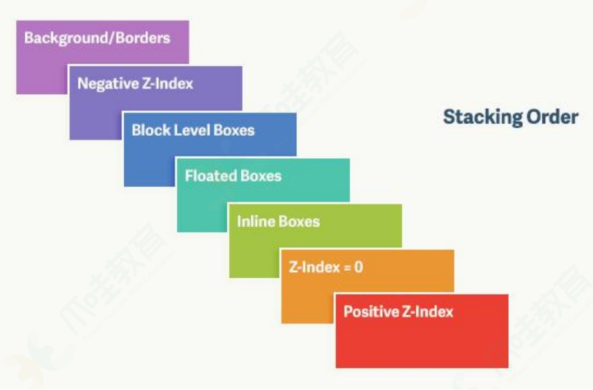

# html/css 问答

# ------html-------------

## 浏览器是如何对 HTML5 的离线储存资源进行管理和加载？

- 在线的情况下，浏览器发现 html 头部有 manifest 属性，它会请求 manifest 文件，
  1. 如果是第一次访问页面，浏览器就会根据 manifest 文件的内容下载相应的资源并进行离线存储。
  2. 如果已经访问过页面并且资源已经进行离线存储了，那么浏览器就会使用离线的资源加载页面，然后浏览器会对比新的 manifest 文件与旧的 manifest 文件，
     - 如果文件没有发生改变，就不做任何操作，
     - 如果文件改变了，就会重新下载文件中的资源并进行离线存储。
- 离线的情况下，浏览器会直接使用离线存储的资源。

## Canvas 和 SVG 的区别

- SVG（矢量图形）： 是基于 XML 的 2D 图形语言，SVG DOM 中的每个元素都可附加 js 事件处理器;

- Canvas（位图）：是画布，通过 js 来绘制 2D 图形；

## 说一下 HTML5 drag API

- dragstart：事件主体是“被拖放元素”，在开始拖放被拖放元素时触发。
- darg：事件主体是“被拖放元素”，在正在拖放被拖放元素时触发。
- dragend：事件主体是“被拖放元素”，在整个拖放操作结束时触发。

- dragenter：事件主体是“目标元素”，在被拖放元素进入某元素时触发。
- dragover：事件主体是“目标元素”，在被拖放在某元素内移动时触发。
- dragleave：事件主体是“目标元素”，在被拖放元素移出目标元素是触发。
- drop：事件主体是“目标元素”，在目标元素完全接受被拖放元素时触发。

# -------css-------------

## transition 动画

```code
div{
    width:100px;
    height:100px;
    background:blue;
    transition:width 2s;
}

div:hover
{
   width:300px;
}

```

## animation 动画

| animation: | myFirst  | 5s       | linear   | 2s       | infinite | alternate        |
| :--------- | :------- | :------- | :------- | :------- | :------- | :--------------- |
|            | 动画名字 | 花费时间 | 速度曲线 | 何时开始 | 播放次数 | 下一周期逆向播放 |

```code
div
{
     animation: myFirst 5s linear 2s infinite alternate；
}

@keyframes myFirst
{
     0%   {background: red; left:0px; }
     50%  {background: blue; left:200px; }
     100% {background: red; left:0px; }
}

```

## 盒子模型:包括  margin、border、padding、content

1. 标准 content:  部分不包含其他部分;
2. IE content:  部分包含 border  和  padding

## visibility:hidden -- 占位，但不可点击（click 事件没用）

## css 权重--优先级规则

!important

1. 内联样式的权重为 1000。
2. ID 选择器（#id）的权重为 100。
3. 类选择器（.class）、属性选择器（[type="radio"]）和 伪类（:hover）的权重为 10。
4. 类型选择器（div） 和 伪元素选择器（::before）的权重为 1。
5. 通配选择器（`*`）、关系选择器（如 +、>）和否定伪类（如 :not()）的权重为 0，但在 :not() 内部声明的选择器会影响优先级。

## 对 BFC 的理解，如何创建 BFC

BFC（Block Formatting Context）:即 区块格式化上下文;  
研究 BFC：就是研究 普通文档流下的“块元素”的排布规则；

- 普通块元素排版问题：-- 浏览器渲染规则导致的

  1.  水平方向：撑满，垂直方向：依次摆放；
  2.  垂直方向相邻元素：margin 会合并；
  3.  父子关系，可能会产生 margin 塌陷（子设置 margin，跑到父外面了）；
  4.  父子关系，子元素浮动，父元素高度塌陷；
  5.  兄弟关系，正常元素可能会被浮动元素覆盖；

- 开启 BFC

  1. 开启 BFC，就是开启一个独立的渲染区域；和浏览器默认渲染规则不一样；
  2. 开启 BFC 后，空间内部和外部是隔开的；内部、外部 互不影响；
  3. 不同 BFC 区域，渲染时互不干扰；

- 创建 BFC 的条件：

  1. 根元素：body；
  2. 元素设置浮动：float （不能是 none）；
  3. 元素设置绝对定位/固定定位：position (absolute、fixed)；
  4. overflow 值为：hidden、auto、scroll（不能是 visible）；
  5. 设置为行内块元素：display:inline-block；
  6. 设置伸缩项目（flex 盒子内的 item -- 特殊需要是“祖元素”）
  7. 多列容器（设置 column-count）；
  8. 表格元素（table、thead、tbody、tfoot、tr、th、td 等）；

```祖-父-子
1. 祖:display:flex;
2. 父：
     float: left;
     position: absolute;
     overflow: auto;
     display: inline-block;
     display: flow-root;
     column-count: 1;
     display: table;
```

## link 和@import 的区别 --用 link 不用@import

1. link 是 XHTML 标签，除了加载 css 外，还可以定义 rss 等其他事务；@import 属于 css 范畴，只能加载 css。
2. link 引用 css 时，在页面载入的同时加载；@import 需要页面网页完全载入之后加载。
3. link 是 XHTML 标签，没有兼容性问题；@import 是在 css2.1 提出的，对低版本浏览器不支持。
4. link 支持 js 控制 dom 去改变样式；@import 不支持。
5. link 方式的样式权重高于@import 的权重。

## CSS3 中有哪些新特性--pdf

1. 新增各种 CSS 选择器 （: not(.input)：所有 class 不是“input”的节点）
2. 圆角 （border-radius:8px）
3. 多列布局 （multi-column layout）
4. 阴影和反射 （Shadoweflect）
5. 文字特效 （text-shadow）
6. 文字渲染 （Text-decoration）
7. 线性渐变 （gradient）
8. 旋转 （transform）
9. 增加了旋转,缩放,定位,倾斜,动画,多背景

## 对 CSSSprites 的理解--不重要 iconfont 代替

CSSSprites（精灵图/雪碧图），将一个页面涉及到的所有图片都包含到一张大图中去，然后利用 CSS 的 background-image，background-repeat，background-position 属性的组合进行背景定位。

## CSS 优化和提高性能的方法有哪些？

- 加载性能：

  1. css 压缩：
  2. css 单一样式：
  3. 减少使用@import，建议使用 link;因为后者在页面加载时一起加载，前者是等待页面加载完成之后再进行加载。

- 选择器性能：

  1. 关键选择器（key selector）:选择器的最后面的部分为关键选择器; CSS 选择符是从右到左进行匹配的;
  2. 有 ID 选择器;
  3. 避免使用通配规则，`*{}`;
  4. 尽量少的去对标签进行选择，而是用 class;
  5. 尽量少的去使用后代选择器，降低选择器的权重值;(尽量将选择器的深度降到最低，最高不要超过三层)
  6. 了解哪些属性是可以通过继承而来的;

- 渲染性能：

  1. 慎重使用高性能属性：浮动、定位。
  2. 尽量减少页面重排、重绘.
  3. 去除空规则：｛｝。
  4. 属性值为 0 时，不加单位。
  5. 属性值为浮动小数 `0.**`，可以省略小数点之前的 0。
  6. 标准化各种浏览器前缀：带浏览器前缀的在前。标准属性在后。
  7. 不滥用 web 字体。

- 可维护性、健壮性：
  1.  将具有相同属性的样式抽离出来，整合并通过 class 在页面中进行使用，提高 css 的可维护性。
  2.  样式与内容分离：将 css 代码定义到外部 css 中。

## 对 CSS 工程化的理解

- 预处理器：Less、 Sass 等; ( 预处理器处理的是类 CSS )

  1. 嵌套代码的能力，通过嵌套来反映不同 css 属性之间的层级关系；
  2. 支持定义 css 变量；
  3. 提供计算函数；
  4. 允许对代码片段进行 extend 和 mixin；支持循环语句的使用；
  5. 支持将 CSS 文件模块化，实现复用。

- 重要的工程化插件： PostCss； ( PostCss 处理的就是 CSS 本身 )

  1.  它可以编译尚未被浏览器广泛支持的先进的 CSS 语法，
  2.  还可以自动为一些需要额外兼容的语法增加前缀。

- Webpack loader 等 。

  1. css-loader：导入 CSS 模块，对 CSS 代码进行编译处理；
  2. style-loader：创建 style 标签，把 CSS 内容写入标签。

## 常见的 CSS 布局单位

常用的布局单位包括像素（px），百分比（%），em，rem，vw/vh。

1. em:相对父元素；
2. rem:相对于根元素（html 元素）

## 元素的层叠顺序



## 如何解决 1px 问题？

1px 问题指的是：在一些 Retina 屏幕 的机型上，移动端页面的 1px 会变得很粗，呈现出不止 1px 的效果。原因很简单——CSS 中的 1px 并不能和移动设备上的 1px 划等号。
它们之间的比例关系有一个专门的属性来描述：
`window.devicePixelRatio（dpr） = 设备的物理像素 / css像素`

打开 Chrome 浏览器，启动移动端调试模式，在控制台去输出这个 devicePixelRatio（dpr） 的值。这里选中 iPhone6/7/8 这系列的机型，输出的结果就是 2；  
这就意味着设置的 1px CSS 像素，在这个设备上实际会用 2 个物理像素单元来进行渲染，所以实际看到的一定会比 1px 粗一些。

在手机上 viewport(视口)一般有：

1. layout viewport（布局视口）：手机一般为了容纳“为桌面浏览器设计的网站”，默认布局视口（viewport） 宽度远大于屏幕的宽度，为了让用户看到网站全貌，缩小网站。例如，apple 一般将 viewport 宽度定为 980px。

2. visual viewport（可视视口）：屏幕的可视区域，即物理像素尺寸
3. ideal viewport（理想视口）：最适合移动设备的 viewport，ideal viewport 的宽度等于移动设备的屏幕宽度

```为了让viewport能够等于ideal viewport，一般我们会添加meta标签
<meta name="viewport" content="width=device-width, initial-scale=1.0, user-scalable=no"/>
width=device-width：宽度为设备宽度
initial-scale：缩放比为1
user-scalable=no：是否允许用户自定义缩放
```

- 解决 1px 问题的三种思路：

  1.  思路一：直接写 0.5px；（废弃）
      （IOS 系统需要 8 及以上的版本，安卓系统则直接不兼容。）

  2.  思路二：伪元素先放大后缩小；  
      这个方法的可行性会更高，兼容性也更好。唯一的缺点是代码会变多。

      思路是先放大、后缩小：在目标元素的后面追加一个 ::after 伪元素，让这个元素布局为 absolute 之后、整个伸展开铺在目标元素上，然后把它的宽和高都设置为目标元素的两倍，border 值设为 1px。接着借助 CSS 动画特效中的放缩能力，把整个伪元素缩小为原来的 50%。此时，伪元素的宽高刚好可以和原有的目标元素对齐，而 border 也缩小为了 1px 的二分之一，间接地实现了 0.5px 的效果。

      ```
      .scale-1px{
        position: relative;
        margin-bottom: 20px;
        border:none;
      }
      .scale-1px:after{
        content: '';
        position: absolute;
        top: 0;
        left: 0;
        border: 1px solid #000;
        -webkit-box-sizing: border-box;
        box-sizing: border-box;
        width: 200%;
        height: 200%;
        -webkit-transform: scale(0.5);
        transform: scale(0.5);
        -webkit-transform-origin: left top;
        transform-origin: left top;
      }
      最好在使用前也判断一下，结合 JS 代码，判断是否 Retina 屏：
      if(window.devicePixelRatio && devicePixelRatio >= 2){
         document.querySelector('ul').className = 'scale-1px';
       }
      ```

  3.  思路三：viewport + rem 实现

      同时通过设置对应 viewport 的 rem 基准值，这种方式就可以像以前一样轻松愉快的写 1px 了。

      在 devicePixelRatio = 2 时，输出 viewport：
      `<meta name="viewport" content="initial-scale=0.5, maximum-scale=0.5, minimum-scale=0.5, user-scalable=no">`

      在 devicePixelRatio = 3 时，输出 viewport：
      `<meta name="viewport" content="initial-scale=0.3333333333333333, maximum-scale=0.3333333333333333, minimum-scale=0.3333333333333333, user-scalable=no">`

      这种兼容方案相对比较完美，适合新的项目，老的项目修改成本过大。

## 水平垂直居中的实现

1. 该方法需要考虑浏览器兼容问题。

   ```
      .parent {
        position: relative;
      }
      .child {
        position: absolute;
        top: 50%;
        left: 50%;
        transform: translate(-50%, -50%);
      }

   ```

2. 该方法适用于盒子有宽高的情况

   ```
      .parent {
        position: relative;
      }
      .child {
        position: absolute;
        top: 0;
        left: 0;
        bottom: 0;
        right: 0;
        margin: auto;
      }
   ```

3. 该方法适用于盒子宽高已知的情况

   ```
      .parent {
        position: relative;
      }
      .child {
        position: absolute;
        top: 50%;
        left: 50%;
        margin-top: -50px; /*自身height的一半 */
        margin-left: -50px; /*自身width的一半 */
      }
   ```

4. flex 布局
   ```
      .parent {
        display: flex;
        align-items: center;
        justify-content: center;
      }
   ```

## 圣杯与双飞翼布局：5 种

1. flex 布局;
2. css grid;
3. css calc;
4. 浮动;

   ```code
   <body>
       <header>header</header>
       <div class="container">
           <div class="middle">middle</div>
           <div class="left">left</div>
           <div class="right">right</div>
       </div>
       <footer>footer</footer>
   </body>
   <style>
       header,
       footer {
           height: 100px;
           width: 100%;
           background-color: antiquewhite;
       }
   .container {
           height: 200px;
           padding-left: 200px;
           padding-right: 300px;
       }
   .container>div {
           float: left;
           height: 100%;
           position: relative;
       }
   .left {
           width: 200px;
           height: 200px;
           background-color: burlywood;
           margin-left: -100%;
           left: -200px;
       }
   .right {
           width: 300px;
           height: 200px;
           background-color: burlywood;
           margin-left: -300px;
           right: -300px;
       }
   .middle {
           width: 100%;
           height: 200px;
           background-color: #b0f9c2;
       }
   </style>
   ```

5.

```code
<body>
    <header>header</header>
    <div class="container">
        <div class="middle">
            <div class="main">middle</div>
        </div>
        <div class="left">left</div>
        <div class="right">right</div>
    </div>
    <footer>footer</footer>
</body>
<style>
    header,
    footer {
        height: 100px;
        width: 100%;
        background-color: antiquewhite;
    }
    .container {
        width: 100%;
        height: 200px;
    }
    .container>div {
        float: left;
        height: 200px;
    }
    .left {
        width: 200px;
        background-color: burlywood;
        margin-left: -100%;
    }
    .right {
        width: 300px;
        background-color: burlywood;
        margin-left: -300px;
    }
    .middle {
        width: 100%;
        background-color: #b0f9c2;
    }
    .main {
        margin: 0 300px 0 200px;
    }
</style>
```
