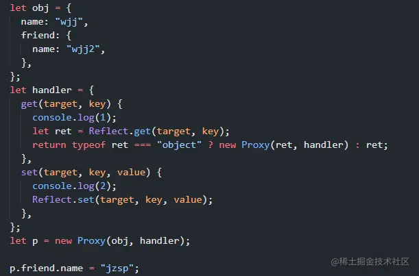
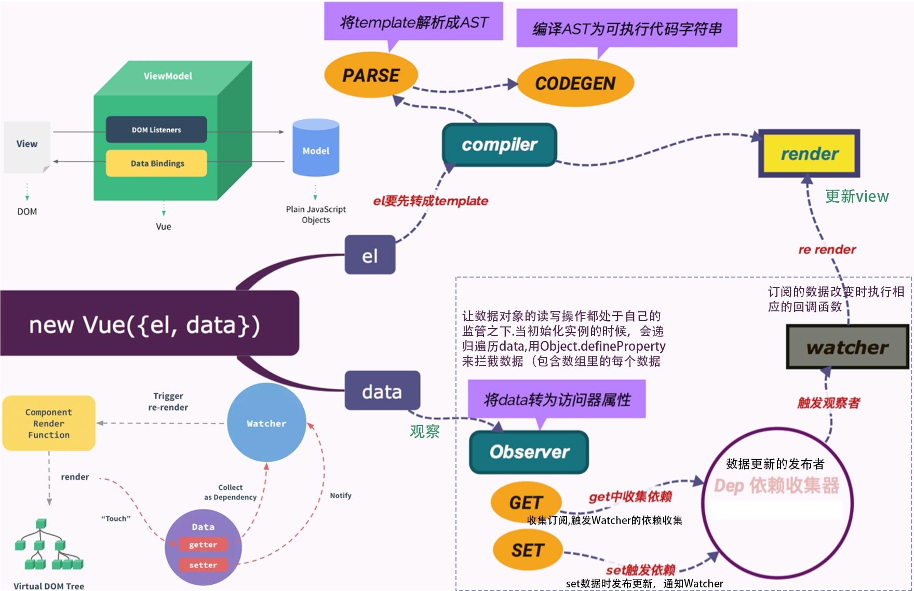
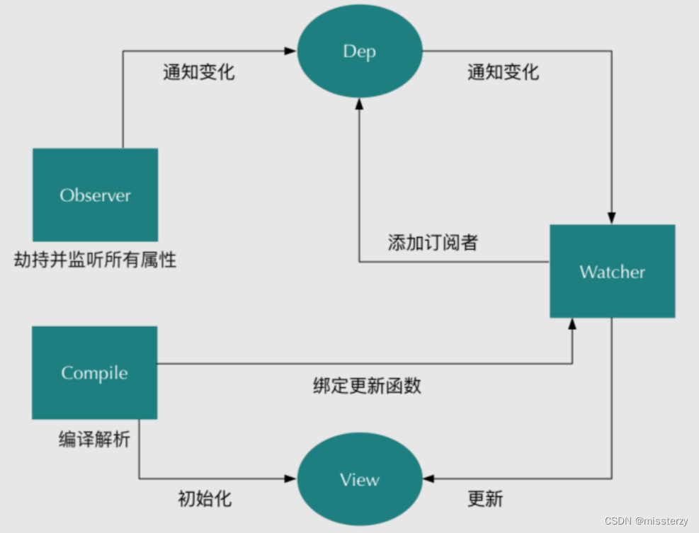

# vue

## vue/react + nginx 配置

1. Nginx + vue 的 history： try_files $uri $uri/ /blog/index.html;
2. Nginx + react 的 history：

```
1、nginx中：
  location /XXX/ {
        try_files $uri $uri/ /XXX/index.html;
        root /html/;
        index index.html;
  }

2、路由添加 basename:
      * "/XXX" ---【<Link to="/" />; // results in <a href="/app" />】
      * "/XXX/"---【<Link to="/" />; // results in <a href="/app/" />】

3、打包后的js/css路径【base】
   * vite.config.ts中 base:"/helper/";
   * package.json 中  "build:staging": "tsc && vite build --base=/helper/ --mode staging",
   注：package.json 中的--base=/helper/ 会覆盖vite.config.ts中的base
```

## vue/react 的 diff 算法比较

- 不同点：  
   vue: 1. 元素相同，key 相同，属性不同 --- 认为节点不同，删除重建； 2. 新旧 virtual DOM：两端到中间比较；  
   react：1. 元素相同，key 相同，属性不同---认为节点相同，修改属性； 2. 新旧 virtual DOM：从左向右比较；  
   vue 双向数据绑定，react 单向的；

- 相同点：都只同级比较；忽略跨级操作；

- 模板语法的流程：  数据->模板->真实 dom；
- 虚拟 DOM 的流程：数据->模版/算法/语法糖->虚拟 dom->一系列 js 操作->真实 dom；
- 虚拟 DOM 是作为数据和真实 DOM 之间的缓冲层诞生的；
- 虚拟 DOM 具有：1.差量更新（diff 算法）2. 批量更新（用户在短时间内对 dom 进行高频操作时，取最后一次的操作结果）

- 在数据量少的情况下，两者性能相差无几。
- 数据量多的情况下，若是数据改变大，接近于全页面更新，模版语法性能更好。
- 在局部更新为主的环境下，虚拟 DOM 的性能更好

## Vue2.0 和 Vue3.0 有什么区别

1. 响应式系统方面：

   - 重构响应式系统，使用 Proxy 替换 Object.defineProperty，使用 Proxy 优势：

     - 可直接监听数组类型的数据变化；
     - 监听的目标为对象本身，不需要像 Object.defineProperty 一样遍历每个属性，有一定的性能提升（深层次也需要递归）；
     - 可拦截 apply、ownKeys、has 等 13 种方法，而 Object.defineProperty 不行；
     - 直接实现对象属性的新增/删除；

2. 功能方面

   - 新增 Composition API：更好的逻辑复用和代码组织；
   - 代码复用新方式；
   - Fragments（片段）；
   - 多个 v-model；
   - Teleport；
   - 新的自定义指令 API；

3. 性能方面

   - diff 算法的优化--静态标记（patchflag）与上次虚拟节点对比时，只对比带有 patch flag 的节点（动态数据所在的节点）；可通过 flag 信息得知当前节点要对比的具体内容。
   - 事件侦听器缓存--模板中内联事件的提取并重用（vue2 原本每次渲染都重新生成内联函数）；
   - 自定义渲染 API（针对跨平台/小程序的）；
   - 按需编译；
   - tree-shaking
   - 更好的 TS 支持；

## vue3.0 proxy

Proxy 默认只代理一层对象的属性;
proxy 代理深层属性:解决办法是，在 Reflect 返回的时候，判断是否是一个对象，如果是对象的话，再次用 Proxy 代理，返回代理对象



## vue2.x 为什么不监听数组

1. Object.defineProperty 劫持的是对象的属性，所以“新增属性时，需要重新遍历对象”；
2. 数组的作用就是不断的增删数据，这就得不断的调用 set 方法，这必然是成本高于回报的事情

由于 Object.defineProperty 只能对属性进行劫持，“需要遍历对象的每个属性，如果属性值也是对象，则需要深度遍历”；而 Proxy 直接代理对象，不需要遍历操作。

## Vue 的基本原理

- 在 new Vue() 后， Vue 会调用 `_init` 函数进行初始化，在 `_init` 过程 data 通过 Observer 转换成了 getter/setter 的形式，来追踪数据变化；当 “被设置的对象” 被读取的时候会执行 getter 函数，被赋值的时候会执行 setter 函数。
- 当 render function 执行的时候，因为会读取所需对象的值，所以会触发 getter 函数从而将 Watcher 添加到依赖中，进行依赖收集。
- 在修改对象的值的时候，会触发对应的 setter， setter 通知之前依赖收集得到的 Dep 中的每一个 Watcher，告诉它们自己的值改变了，需要重新渲染视图。这时候这些 Watcher 就会开始调用 update 来更新视图。

- 模板编译：

1. vue 会把在`<template></template>` 标签中写的类似于 `原生 HTML` 的内容进行编译，把 `原生 HTML` 的内容找出来，再把 `非原生 HTML` 找出来，经过一系列的逻辑处理生成渲染函数（`render 函数`）
2. 而 `render 函数` 会将模板内容生成对应的 `VNode`，而 VNode 再经过前几篇文章介绍的 `patch（补丁、修补） 过程`从而得到将要渲染的视图中的 `VNode`，最后根据 VNode 创建 `真实的 DOM 节点` 并插入到视图中， 最终完成视图的渲染更新。


## 双向数据绑定的原理

首先要对数据进行劫持监听，所以我们需要设置一个监听器 Observer，用来监听所有属性。如果属性发上变化了，就需要告诉订阅者 Watcher 看是否需要更新。因为订阅者是有很多个，所以我们需要有一个消息订阅器 Dep 来专门收集这些订阅者，然后在监听器 Observer 和订阅者 Watcher 之间进行统一管理的。接着，我们还需要有一个指令解析器 Compile，对每个节点元素进行扫描和解析，将相关指令对应初始化成一个订阅者 Watcher，并替换模板数据或者绑定相应的函数，此时当订阅者 Watcher 接收到相应属性的变化，就会执行对应的更新函数，从而更新视图。因此接下去我们执行以下 4 个步骤，实现数据的双向绑定：

1. 实现一个监听器 Observer，用来劫持并监听所有属性，如果有变动的，就通知订阅者；
2. 实现一个订阅器 Dep，用来收集订阅者，对监听器 Observer 和 订阅者 Watcher 进行统一管理；
3. 实现一个订阅者 Watcher，可以收到属性的变化通知并执行相应的函数(update)，从而更新视图；
4. 实现一个解析器 Compile，可以解析每个节点的相关指令，对模板数据和订阅器进行初始化；





发布-订阅模式

- 数据劫持：当 Vue 实例创建时，会递归遍历初始化的数据对象（data 对象），利用 Object.defineProperty()方法将所有属性转换为 getter/setter。这个过程被称为数据劫持或数据代理。通过这种机制，Vue 能够追踪到数据的变化，并在变化发生时触发相应的回调。
- 订阅器 Dep：Dep 类负责维护订阅者列表，并提供一个方法来通知所有的订阅者更新。每当数据发生变化时，都会通过 setter 触发 Dep 实例中的 notify 方法，从而通知所有订阅者更新视图。

观察者模式

- Watcher 类：负责更新视图。当一个属性被访问时，会创建一个 Watcher 实例，这个实例会自动订阅相关联的 Dep。当数据发生变化时，Dep 将通知所有相关的 Watcher 进行更新。
- 视图更新：Vue 使用“模板编译策略”来“解析”模板字符串中的表达式。当模板被编译时，Vue 会识别出绑定表达式并创建 Watcher 实例来监听这些表达式的依赖。当数据发生变化时，Vue 的响应系统会触发视图的更新，这个过程通常是通过重新渲染组件来实现的。

双向数据绑定流程

1. 数据劫持：Vue 在初始化时会对 data 中的数据进行劫持，将其转换为 getter/setter，以便在数据改变时能够捕获到变化。
2. 模板编译：Vue 会对模板进行编译，找到其中动态绑定的数据，并初始化视图；同时，为每个数据绑定创建一个 Watcher 实例，并将其添加到对应的 Dep 中。
3. 数据变化通知：当数据发生变化时，会触发 setter 方法，进而调用 Dep 的 notify 方法通知所有相关的 Watcher 进行更新。
4. 视图更新：Watcher 在收到更新通知后，会调用相应的更新函数来更新视图。

## js 实现简单的双向绑定

```
<body>
    <div id="app">
        <input type="text" id="txt">
        <p id="show"></p>
        <button>click</button>
    </div>
    <script>
        window.onload = function () {
            var obj = {};
            Object.defineProperty(obj, "txt", {
                get: function () {
                    return obj;
                },
                set: function (newValue) {
                    document.getElementById("txt").value = newValue;
                    document.getElementById("show").innerHTML = newValue;
                }
            })
            document.addEventListener("keyup", function (e) {
                obj.txt = e.target.value;
            })
            document.querySelector("button").addEventListener("click", function () {
                obj.txt = "btn"
            })

        }
    </>
</body>
```

## Vue 的生命周期

- 创建期间：

  1. beforeCreate -> setup: 组件实例初始化完成并且 props 被解析后立即调用；

     - 此时还没有初始化 data、methods

  2. created -> setup: 组件实例处理完所有与状态相关的选项后调用；

     - 此时 响应式数据（data）、计算属性、方法（methods）和侦听器 已经创建 OK；
     - 还没有开始编译模板；
     - 还没挂载，$el 属性不可用；

  3. beforeMount: 在组件被挂载之前调用；

     - 组件已经完成了其响应式状态的设置（模板编译完成）；
     - 但还没有创建 DOM 节点，即将首次执行 DOM 渲染过程。
     - 此时页面中，类似 {{msg}} 这样的语法还没有被替换成真正的数据。

  4. mounted：在组件被挂载之后调用；

     - 所有同步子组件都已经被挂载。(不包含异步组件或 <Suspense> 树内的组件)；
     - 其自身的 DOM 树已经创建完成并插入了父容器中
     - 用户已经可以看到渲染好的页面了，可以获取 DOM 节点；

- 运行期间：

  1. beforeUpdate: 组件更新之前执行此函数；

     - 此时 data 中的状态值是最新的；但是界面上显示的 数据还是旧的，因为此时还没有开始重新渲染 DOM 节点

  2. updated: 组件更新完毕之后调用此函数;

     - 此时 data 中的状态值 和 界面上显示的数据 都已经完成了更新，界面已经被重新渲染好了

- 销毁期间：

  1. beforeDestroy -> beforeUnmount： 组件实例被卸载之前调用。（在这一步，实例仍然完全可用）

  2. destroyed -> unmounted: 组件实例被卸载后调用；
     - 其所有子组件都已经被卸载。
     - 所有相关的响应式作用都已经停止。
     - 可以在这个钩子中手动清理一些副作用，例如计时器、DOM 事件监听器或者与服务器的连接。

- errorCaptured -> onErrorCaptured：当捕获一个来自子孙组件的错误时被调用

## Vue 的父组件和子组件生命周期钩子执行顺序是什么

- 加载渲染过程

  1. parent beforeCreate
  2. parent created
  3. parent beforeMounte
     1. child beforeCreate
     2. child created
     3. child beforeMounte
     4. child mounted
  4. parent mounted

- 组件更新过程

  1. parent beforeUpdate
     1. child beforeUpdate
     2. child updated
  2. parent updated

- 销毁过程

  1. parent beforeDestroy
     1. child beforeDestroy
     2. child destroyed
  2. parent destroyed

总结：从外到内，再从内到外

## Vue 中父组件如何监听子组件的生命周期？

在子组件中的各个生命周期$emit 事件

## vue data 为什么是函数不是对象

每个组件都是 vue 的一个实例；组件内的 data 其实是 vue 原型上的属性;
如果是对象的话，在组件上修改 data 会互相影响的

## vue 中 computed

- computed 本质是一个惰性求值的观察者。computed 内部实现了一个惰性的 watcher，也就是 computed watcher；
- computed watcher 不会立刻求值，同时持有一个 dep 实例，其内部通过 this.dirty 属性标记计算属性是否需要重新求值。
  当 computed 的依赖状态发生改变时，就会通知这个惰性的 watcher，computed watcher 通过 this.dep.subs.length 判断有没有订阅者：

  - 有的话会重新计算，然后对比新旧值，如果变化了会重新渲染。
  - 没有的话，仅仅把 this.dirty = true。
  - 当计算属性依赖于其他数据时，属性并不会立即重新计算，只有之后其他地方需要读取属性的时候，它才会真正计算，即具备 lazy（懒计算）特性。

Vue 想确保的不仅仅是计算属性依赖的值发生变化，而是当计算属性最终计算的值发生变化时才会触发渲染 watcher 重新渲染，本质上是一种优化。

## Vue 中 Watch 、WatchEffect （watchPostEffect，watchSyncEffect）

1. watchEffect：

   - 立即执行传入的函数，并在其执行过程中 “自动追踪” 其 “依赖的响应式数据”。当这些依赖的数据发生变化时，watchEffect 会重新执行函数。
   - 不提供新旧值的比较，因为它不追踪具体的数据源，而是追踪执行过程中“访问的所有响应式数据”。
   - 执行时机是在依赖变化时同步执行，除非通过配置项 flush 来指定不同的执行时机。

2. watchPostEffect：
   - watchEffect 的一个变体，它会在 Vue 更新 DOM 之后执行副作用。
3. watchSyncEffect：
   - watchEffect 的另一个变体，它会在响应式数据变化时同步执行副作用，而不是等待下一个事件循环。
4. watch：
   - 允许你明确指定要侦听的响应式引用或 getter 函数，并在数据变化时执行回调函数。
   - 提供了新旧值的比较，允许你在回调函数中访问变化前后的值。
   - 可以根据配置项 flush 来控制副作用的刷新时机，可以是 pre（默认，组件更新前执行）、post（组件更新后执行）或 sync（同步执行）。

watch 提供了更精确的控制，允许你指定“侦听的数据源”并比较“变化前后的值”，而 watchEffect 及其变体则提供了一种更自动化的方式来追踪依赖和执行副作用，适用于不同的场景和需求

- deep watcher：对象做深度观测的时候；
- user watcher：用户自定义的 watcher；
- computed watcher： 几乎就是为计算属性量身定制的；
- sync watcher：在当前 Tick（事件循环） 中同步执行 watcher 的回调函数

  1. 当响应式数据发送变化后，触发了 watcher.update()，只是把这个 watcher 推送到一个队列中，在 nextTick 后才会真正执行 watcher 的回调函数。
  2. 而一旦我们设置了 sync，就可以在当前 Tick 中同步执行 watcher 的回调函数。
  3. 只有当我们需要 watch 的值的变化到执行 watcher 的回调函数是一个同步过程的时候才会去设置该属性为 true。

## vue watch 和 computed 的区别

- computed（计算属性）：依赖其它属性值， 有缓存，只有依赖的属性值变化，下一次获取 computed 的值时才会重新计算；
- watch（侦听器）：侦听属性，无缓存性，类似于某些数据的监听回调 ，每当监听的数据变化时都会执行回调进行后续操作；

## Vue.extend 与 Vue.component（都是创建组件） 区别

1. let mv = new Vue({}) mv 是 vue 实例
2. 没有组件名字

   ```code
   var myVue = Vue.extend(这里可以是一个.vue 单文件组件，也可以是一个包含组件选项的对象)
   var vm = new myVue({
   //其他选项
   })
   new vm().$mount('#mount-point') 或 document.body.appendChild(vm.$mount().$el);
   ```

3. 有组件名字；

   - 注册组件，传入一个扩展过的构造器
     `Vue.component('my-component', Vue.extend({ /* ... */ }))`
   - 注册组件，传入一个选项对象 (自动调用 Vue.extend)
     `Vue.component('my-component', { /* ... */ })`
   - 获取注册的组件 (始终返回构造器)
     `var MyComponent = Vue.component('my-component')`

## filter 过滤器--纯函数

1. filter 中的 this 是什么？

   this 是 undefined，在 filter 中拿不到 vue 实例。

   如果需要用到 this，可以用 computed 或者 method 代替。

## vue v-model

`<input  v-bind:value="mes"  v-on:input="mes= $event.target.value"/>`
指令，管道

## vue v-for 的 key: 与 diff 算法有关，相同的 key 直接复用

避免将 v-if 和 v-for 放在同一个元素上，因为 v-for 优先级比 v-if 更高。

## keep-alive ：include（组件 name，包括），exclude（排除）

`<keep-alive>` 包裹动态组件时，会缓存不活动的组件实例，而不是销毁它们。

## vue nextTick -- DOM 更新后调用 / vm.$forceUpdate---强制本组件和卡槽子组件更新

- nextTick：分宏任务 和 微任务 （默认）
- 微任务：Promise --》宏任务
- 宏任务：setImmediate --》MessageChannel --》setTimeout (DOM 交互事件走宏任务，v-on@)

* Vue 在内部对异步队列尝试使用原生的 Promise.then、MutationObserver(监测 DOM 树，在 DOM 发生变化时异步执行回调函数) 和 setImmediate(DOM 交互事件走宏任务，v-on@)，如果执行环境不支持，则会采用 setTimeout(fn, 0) 代替。
* 在数据变化之后立即使用 Vue.nextTick(callback)

## vue3.0 ref() 与 reactive() 主要有三个区别

1. ref() 可以存储“原始类型”，而 reactive 不能。
2. ref() 有一个 .value 属性，你必须使用 .value 属性获取内容，但是使用 reactive() 的话可以直接访问；
3. 使用 ref() 函数可以替换整个对象实例，但是在使用 reactive() 函数时就不行；【ref 类型为 Ref<T>，而 reactive 返回的反应类型为原始类型本身】

   ```
   // 无效 - x 的更改不会被 Vue 记录
   let x = reactive({name: 'John'})
   x = reactive({todo: true})

   // 有效
   const x = ref({name: 'John'})
   x.value = {todo: true}

   ```

   **注**：应该盲目地选择 ref() 而不是 reactive()（保持风格一致）；

## vue3.0 hook 编写

```demo
import { ref, watch } from 'vue';
const useAdd= ({ num1, num2 }) =>{
    const addNum = ref(0)
    watch([num1, num2], ([num1, num2]) => {
       addFn(num1, num2)
    })
    const addFn = (num1, num2) => {
       addNum.value = num1 + num2
    }
    return {
       addNum,
       addFn
    }
}
export default useAdd;

<span>加法等于:{{ addNum }}</span>

<script setup>
 import { ref } from 'vue'
 import useAdd from './useAdd.js'     //引入自动hook
 const num1 = ref(2)
 const num2 = ref(1)
 //加法功能-自定义Hook（将响应式变量或者方法形式暴露出来）
 const { addNum, addFn } = useAdd({ num1, num2 })
 addFn(num1.value, num2.value)
</script>

```

## vue 组件通信

1. 父子通信：Props/$emit，provide/inject，$refs，Vuex，$emit/$on，$attrs/$listeners，$parent/$children，

2. 兄弟通信：$emit/$on，Vuex

3. 隔代（跨级）通信：$emit/$on，Vuex，provide/inject，$attrs/$listeners

## vue 组件--插件

- 组件（component）： 用来构成 App 的业务模块；

- 插件(plugin) ：用来增强技术栈的功能模块（是对 Vue 的功能的增强和补充）；
  1. 建立 toast.vue；
  2. 创建 toast.js （install ）
  3. main.js 中使用 Vue.use(ToastPlugin)
  4. this.$showToast ('标题', '提示内容')

## vue 路由 ========

## vue hash 和 history 原理

1. Hash 模式：地址栏 URL 中有 #。vue-router 优先判断浏览器是否支持 pushState：

   - 若支持，则通过 pushState 改变 hash 值，进行目标路由匹配，渲染组件；通过 popstate 事件监听浏览器操作，完成导航功能；
   - 若不支持，使用 location.hash 设置 hash 值，onhashchange 事件 监听 URL 变化完成路由导航（如 IE9 及以下）。

   Hash 模式不需要在服务器层面上进行任何特殊处理。

1. History 模式：利用了 html5 History Interface 中新增的 pushState() 和 replaceState() 方法。

   - 在当前已有的 back、forward、go 的基础之上，pushState() 和 replaceState()方法 提供了对历史记录进行修改的功能。
   - pushState() 和 replaceState()方法不会触发页面刷新，只是导致了 history 对象发生变化，地址栏会有反应。

   * popState 事件：
     - 仅仅调用 pushState 方法或 replaceState 方法，并不会触发 popState 事件；只有用户点击浏览器后退和前进按钮时，或者使用 js 调用 back、forward、go 方法时才会触发。

## vue link 传值

1. query--hash 模式：路径 + 参数会显示在 url 中；刷新参数还在；类似于我们 ajax 中 get 传参
   `<router-link :to="{ path: 'register', query: { plan: 'private' }}">Register</router-link>`
2. params--history  模式  ：路径显示，参数不显示；刷新参数没有了；则类似于 post
   `<router-link :to="{ name: 'user', params: { userId: 123 }}">User</router-link>`

## VueRouter-路由守卫

1. 全局：前置 beforeEach ；后置 afterEach（没有 next）；beforeResolve
2. 路由内 ：独享 beforeEnter；
3. 组件内：beforeRouteEnter（唯一 next 有回调），beforeRouteUpdate，beforeRouteLeave

## 完整的 Vue 路由生命周期

1. 导航被触发。
2. 在失活的组件里调用 beforeRouteLeave 守卫。
3. 调用全局的 beforeEach 守卫。
4. 在重用的组件里调用 beforeRouteUpdate 守卫 (2.2+)。
5. 在路由配置里调用 beforeEnter 。
6. 解析异步路由组件。
7. 在被激活的组件里调用 beforeRouteEnter 。
8. 调用全局的 beforeResolve 守卫 (2.5+)。
9. 导航被确认。
10. 调用全局的 afterEach 钩子。
11. 触发 DOM 更新。
12. 调用 beforeRouteEnter 守卫中“传给 next” 的回调函数，创建好的组件实例会作为回调函数的参数传入。

## Vuex ==========

## 为什么要用 vuex

Vuex 主要解决 “深层嵌套” 和 “非直接关联组件之间” 的通信。

## Vuex 是通过什么方式提供响应式数据的？

在 Store 构造函数中通过 new Vue({}) 实现的。利用 Vue 来监听 state 下的数据变化，给状态添加 getter、setter。

vuex 中的 store 本质就是没有 template 的隐藏着的 vue 组件。

## Vuex 如何区分 state 是外部直接修改，还是通过 mutation 方法修改的？

在 Vuex 中通过 执行 commit('xx', payload) 方法来修改 state;

- commit，其底层通过执行 this.withCommit(fn) 设置 committing 标志变量为 true，然后才能修改 state，修改完毕还需要还原 committing 变量。
- 外部修改虽然能够直接修改 state，但是并没有修改 committing 标志位;
- 以只要 watch 一下 state，state change 时判断是否\_committing 值为 true，即可判断修改的合法性。

## 当执行 import vue from "vue" 时发生了什么？

- 其实在 nodejs 中，执行 import 就相当于执行了 require ；
  1.  `import Vue from 'vue'` 解析为 `const Vue = require('vue')`
- node 中维护了一组路径查找顺序；

  1. 是否 node 核心包
  2. 是否为 '/' 开头；
  3. 是否为 './'、'/' 或者 '../' 开头；
  4. 以上条件都不符合，读取项目目录下 node_modules 包里的包（找到）。

- 那么问题来了，node_modules 下的 vue 是一个文件夹，而引入的 Vue 是一个 javascript 对象，那它是怎么取到这个对象呢？

  其实对于一个 npm 包，内部还有一个文件输出的规则，先看下 node_modules/vue 下的文件结构是怎么样的：

  ```
   ├── LICENSE
   ├── README.md
   ├── dist
   ├── package.json
   ├── src
   └── types
  ```

  其实对于 npm 包，require 的规则是这样的：

  1. 查找 package.json 下是否定义了 main 字段，是则读取 main 字段下定义的入口。
  2. 如果没有 package.json 文件，则读取文件夹下的 index.js 或者 index.node。
  3. 如果都 package.json、index.js、index.node 都找不到，抛出错误 module 'some-library' 。

  那么看一下 vue 的 package.json 文件有这么一句：

  ```
  {
     ...
     "main": "dist/vue.runtime.common.js",
     ...
   }
  ```

  到这里就很清晰了：

  ```
    import vue from 'vue';
    // 最后转换为
    const vue = require('./node_modules/vue/dist/vue.runtime.common.js');
  ```

  而 vue.runtime.common.js 文件的最后一行是：module.exports = Vue;，就正好跟我们平时使用时的 new Vue({}) 是一致的，这就是 import vue from 'vue' 的过程了。

## SSR 有了解吗？原理是什么？

在客户端请求服务器的时候，服务器到数据库中获取到相关的数据，并且在服务器内部将 Vue 组件渲染成 HTML，并且将数据、HTML 一并返回给客户端，这个在服务器将数据和组件转化为 HTML 的过程，叫做服务端渲染 SSR。

而当客户端拿到服务器渲染的 HTML 和数据之后，由于数据已经有了，客户端不需要再一次请求数据，而只需要将数据同步到组件或者 Vuex 内部即可。除了数据以外，HTML 也结构已经有了，客户端在渲染组件的时候，也只需要将 HTML 的 DOM 节点映射到 Virtual DOM 即可，不需要重新创建 DOM 节点，这个将数据和 HTML 同步的过程，又叫做客户端激活。

使用 SSR 的好处：

1. 有利于 SEO：
2. 白屏时间更短：
   服务端渲染在浏览器请求 URL 之后已经得到了一个带有数据的 HTML 文本，浏览器只需要解析 HTML，直接构建 DOM 树就可以。

## 从 DOM 到虚拟 DOM：切图仔 --> JQuery --> 模板语法 -->虚拟 DOM

## Nuxt.js -- 服务端渲染
