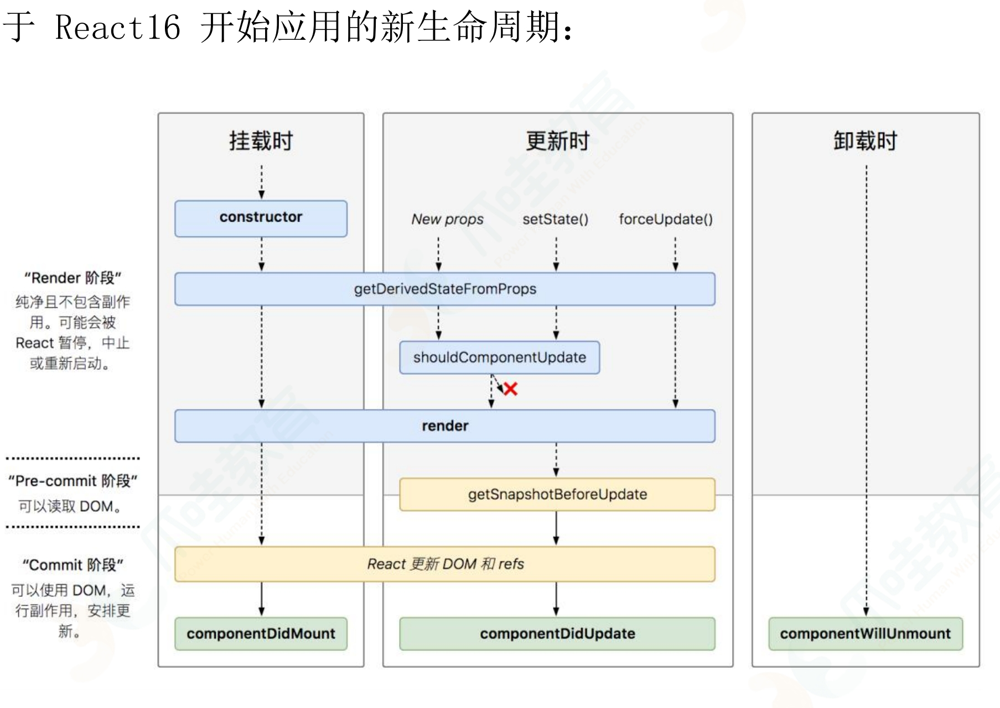
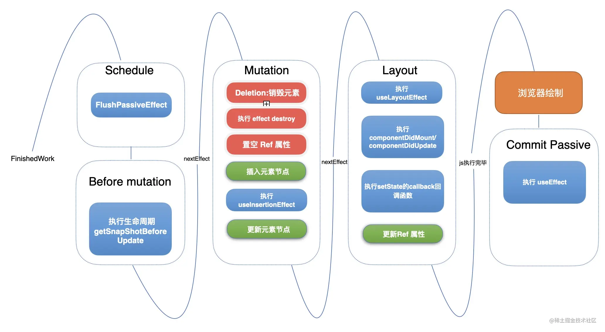
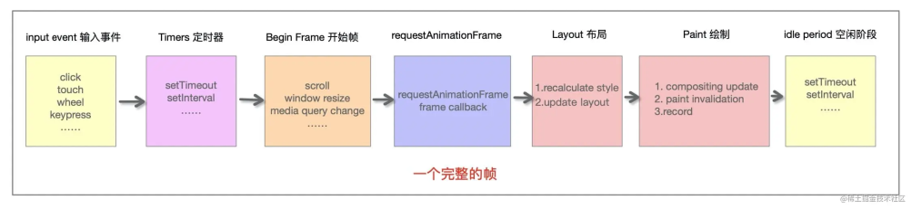
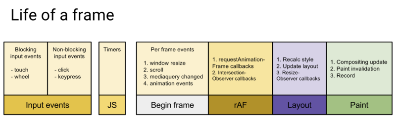

# react

https://www.zhihu.com/question/394945080/answer/3248392880

## React 的事件和普通的 HTML 事件有什么不同？

1. 对于事件名称命名方式，原生事件为全小写，react 事件采用小驼峰
2. 对于事件函数处理语法，原生事件为字符串，react 事件为函数
3. react 事件不能采用 return false 的方式来阻止浏览器的默认行为，而必须要地明确地调用 preventDefault()来阻止默认行为

- 合成事件是 react 模拟原生 DOM 事件所有能力的一个事件对象，其优点如下

1. 兼容所有浏览器，更好的跨平台
2. 将事件统一存放在一个数组，避免频繁的新增与删除（垃圾回收）。方便 react 统一管理和事务机制。
3. 事件的执行顺序为原生事件先执行，合成事件后执行，合成事件会冒泡绑定到 document 上，所以尽量避免原生事件与合成事件混用，如果原生事件阻止冒泡，可能会导致合成事件不执行，因为需要冒泡到 document 上合成事件才会执行。

## React 组件中怎么做事件代理？它的原理是什么？

在 React 底层，主要对合成事件做了两件事：

1. 事件委派：React 会把所有的事件绑定到结构的最外层，使用统一的事件监听器，这个事件监听器上维持了一个映射来保存所有组件内部事件监听和处理函数。
2. 自动绑定：React 组件中，每个方法的上下文都会指向该组件的实例，即自动绑定 this 为当前组件。

## React 高阶组件、Render props、hooks 有什么区别，为什么要不断迭代

Hoc、render props 和 hook 都是为了解决代码复用的问题，

但是 hoc 和 render props 都有特定的使用场景和明显的缺点。

hook 是 react16.8 更新的新的 API，让组件逻辑复用更简洁明了，同时也解决了 hoc 和 render props 的一些缺点。

## React 如何判断什么时候重新渲染组件

组件状态的改变可以因为 props 的改变，或者直接通过 setState 方法改变;
因为 React 中的 shouldComponentUpdate 方法默认返回 true，这就是导致每次更新都重新渲染的原因。

## React 中可以在 render 访问 refs 吗？为什么？

不可以，render 阶段 DOM 还没有生成，无法获取 DOM。DOM 的获取需要在 pre-commit 阶段和 commit 阶段：

## React setState 调用之后发生了什么？是同步还是异步？

1. 在代码中调用 setState 函数之后，合并 传入的参数对象与组件;
2. React 会以相对高效的方式根据新的状态构建 React 元素树;
3. 在 React 得到元素树之后，React 会自动计算出新的树与老树的节点差异，然后根据差异对界面进行最小化重渲染。

在源码中，通过 isBatchingUpdates 来判断 setState 是先存进 state 队列还是直接更新，如果值为 true 存到 state 队列中，为 false 则直接更新。

在 React `钩子函数及合成事件`中，它表现为异步（批量）；
而在 `setTimeout、setInterval、promise.then`等函数中，包括在 `DOM 原生事件中`，它都表现为同步（单独）。这种差异，本质上是由 `React 事务机制`和`批量更新机制`的工作方式来决定的。

## 为什么使用 jsx 的组件中没有看到使用 react 却需要引入 react？

JSX 是 React.createElement(component,props, ...children)方法的语法糖。
在 React 17 之后，就不再需要引入，因为 babel 已经可以帮我们自动引入 react。

## React Hooks 解决了哪些问题？

1. 在组件之间复用状态逻辑很难
2. 复杂组件变得难以理解
3. 难以理解的 class

## React Hook 的使用限制有哪些？

- 在 React 的函数组件中调用 Hook;
- 不要在循环、条件或嵌套函数中调用 Hook;
  1. 加载编译时会组成 3 部分；所有的 value 一个数组，所有 use 一个数组，还有一个光标指针；
  2. 初次加载，把遇到的所有的 value 推进 state 数组中，遇到的所有 use 推进 set 数组中，光标指针从 0 开始每次加一；
  3. 状态变化，二次加载，光标指针从 0 开始，遇到 use 光标指针加一，对应从 2 数组拿 value 和 use；假如遇到 if （少/多）了一个 use,后续拿到的 value 和 use 就不对应；

## react 16.x 最新版本解决了什么问题，增加了哪些东西

React 16.x 的三大新特性 Time Slicing、Suspense、hooks
Time Slicing: 解决 CPU 速度问题;
Suspense:（解决网络 IO 问题）和 lazy 配合，实现异步加载组件;
提供了一个内置函数 componentDidCatch，当有错误发生时,捕获；

- useRef：
- useState：
- useEffect：在渲染结束之后执行；
- useLayoutEffect：在 DOM 更新之后执行；永远比 useEffect 先执行，这是因为 DOM 更新之后，渲染才结束；

- useCallback：缓存的是函数，有些函数没必要跟这 state 变化；
- useMemo：缓存的结果是回调函数中 return 回来的“值”，主要用于缓存计算结果的；
- useImperativeMethods：用于自定义暴露给父组件的实例值；
- createContext/useContext：是让“后代组件”之间共享“祖代组件”的状态；

## React 16 中新生命周期有哪些

- render 阶段（调和阶段 - 计算）：纯函数，不要有副作用；可能会被暂停、中止、重新启动；避免昂贵的计算（可以使用 useMemo 优化）

  1. render 阶段的核心：是如何创建 Fiber Node（节点） 以及 构建 Fiber Tree。
  2. 当组件更新，本质上是从 fiberRoot 开始深度调和 fiber 树。
  3. Fiber Reconciler（协调器）通过“遍历的方式”实现“可中断的”递归；

     - “递”阶段：

       1. 首先从 rootFiber 开始向下深度优先遍历。为遍历到的每个 Fiber 节点调用 beginWork 方法。该方法会根据传入的 Fiber 节点创建子 Fiber 节点，并将这两个 Fiber 节点连接起来。
       2. 当遍历到叶子节点（即没有子组件的组件）时就会进入“归”阶段。

     - “归”阶段

       1. 在“归”阶段会调用 completeWork 方法 处理 Fiber 节点。当某个 Fiber 节点执行完 completeWork：

          - 如果存在兄弟 Fiber 节点（即 fiber.sibling !== null），会进入其兄弟 Fiber 的“递”阶段；
          - 如果不存在兄弟 Fiber，会进入父级 Fiber 的“归”阶段；

       2. “递”和“归”阶段会交错执行，直到“归”到 rootFiber。至此，render 阶段的工作就结束了。

- Commit 阶段（即 Renderer-渲染器 的工作流程）：主要分为三部分：

  1. before mutation（Pre-commit） 阶段（执行 DOM 操作前）
  2. mutation 阶段（执行 DOM 操作）
  3. layout 阶段（执行 DOM 操作后）

  Commit 阶段：不可中断的（同步执行）；直接操作真实 DOM；执行副作用（如生命周期方法调用）

  

## 为什么要用 fiber

在浏览器中，页面是一帧一帧绘制出来的，渲染的帧率与设备的刷新率保持一致。一般情况下，设备的屏幕刷新率为 1s 60 次，当每秒内绘制的帧数（FPS）超过 60 时，页面渲染是流畅的；而当 FPS 小于 60 时，会出现一定程度的卡顿现象。下面来看完整的一帧中，具体做了哪些事情：

- 一帧 内可完成如下六个步骤的任务： d

1. 用户交互输入事件（Input events），能够让用户得到最早的反馈。

   - Blocking input events（阻塞输入事件）：例如 touch 或 wheel
   - Non-blocking input events（非阻塞输入事件）：例如 click 或 keypress

2. JavaScript 引擎解析执行：执行定时器（Timers）事件等回调，需要检查定时器是否到时间，并执行对应的回调。
3. 帧开始（Begin frame）：每一帧事件（Per frame events），例如 window resize、scroll 或 media query change
4. 执行请求动画帧 rAF（requestAnimationFrame），即在每次绘制之前，会执行 rAF 回调。
5. 页面布局（Layout）：计算样式（Recalculate style）和更新布局（Update Layout）。即这个元素的样式是怎样的，它应该在页面如何展示。
6. 绘制渲染（Paint）：合成更新（Compositing update）、重绘部分节点（Paint invalidation）和 Record。得到树中每个节点的尺寸与位置等信息，浏览器针对每个元素进行内容填充。
7. 上述 6 个阶段完成，就处于 空闲阶段（Idle Peroid）会执行 RIC (RequestIdelCallback)注册的任务。

JS 引擎和页面渲染引擎是在同一个渲染线程(主线程)之内，两者是互斥关系。如果在某个阶段执行任务特别长，例如在定时器阶段或 Begin Frame 阶段执行时间非常长，时间已经明显超过了 16ms，那么就会阻塞页面的渲染，从而出现卡顿现象。

在 Reactv15 以及之前的版本，React 对于虚拟 DOM 是采用自顶向下递归（深度优先遍历）对比虚拟 DOM 树，找出需要变动的节点，然后同步更新它们，这个过程 react 会一直占用浏览器资源，会导致用户触发的事件得不到响应。给前端交互上的体验就是卡顿

为什么它能解决卡顿，React 将 2 层架构（协调器、渲染器）改为 3 层架构（调度器、协调器、渲染器），修改协调器流程引入 Fiber 架构；把更新、渲染过程拆分为一个个小块的任务（fiber），通过合理的调度机制来调控时间，指定任务执行的时机，实现异步可中断执行，从而降低页面卡顿的概率，提升页面交互体验。通过 Fiber 架构，让 reconcilation 过程变得可被中断，适时地让出 CPU 执行权，可以让浏览器及时地响应用户的交互。（就是使 JS 的执行变成可控，不希望 JS 不受控制地长时间执行）。

更新 fiber 的过程叫做 Reconciler（调和器），每一个 fiber 都可以作为一个执行单元来处理，所以每一个 fiber 可以根据自身的过期时间 expirationTime（ v17 版本叫做优先级 lane ）来判断是否还有空间时间执行更新，如果没有时间更新，就要把主动权交给浏览器去渲染，做一些动画，重排（ reflow ），重绘 repaints 之类的事情，这样就能给用户感觉不是很卡。然后等浏览器空余时间，在通过 scheduler （调度器），再次恢复执行单元上来，这样就能本质上中断了渲染，提高了用户体验。

Fiber 架构的核心思想就是“任务拆分”和“协同”，主动把执行权交给主线程，使主线程有时间空档处理其他高优先级任务。

https://juejin.cn/post/6844903975112671239
https://juejin.cn/post/7092419515748712456

- 并发与并行
  并发：单核处理器；（一个真身，其余都是虚影）
  并行：多核处理器；（真身和分身，都是物理存在的）

- 在 react v16 之后，架构可以分为三层：

  Scheduler（调度器）—— 调度任务的优先级，高优任务优先进入 Reconciler（协调器）；
  Reconciler（协调器）—— 负责找出变化的组件：更新工作从递归变成了可以中断的过程。Reconciler 内部采用了 Fiber 的架构；
  Renderer（渲染器）—— 负责将变化的组件渲染到页面上。

  1. 一帧理想时间是 16ms(1000ms/60)，如果浏览器处理完上述的任务(布局和绘制之后)，还有盈余时间，浏览器就会调用 requestIdleCallback 的回调，如果浏览器一直繁忙，requestIdleCallback 的第二个参数指定一个超时时间，超时则执行；

  2. Scheduler（调度器）： react 实现了一个类 requestIdleCallback 的函数；通过“时间切片”和“超时检查机制”来让出控制权；
  3. react 的 Fiber 也称虚拟栈帧（Virtual Stack Frame）模拟调用栈帧，保存节点处理的上下文信息，手动实现的，可控（可暂停/恢复）；

  4. Fiber 也称协程或纤程；是一种流程控制； React 通过 Fiber 架构，让自己的 Reconciliation 过程变成可被中断。
  5. Fiber 也是一种数据结构或者说执行单元；每次执行完一个'执行单元', React 就会检查现在还剩多少时间，如果没有时间就将控制权交回浏览器，让位给高优先级的任务，浏览器空闲后再恢复渲染；
  6. 因为使用了链表结构，即使处理流程被中断了，我们随时可以从上次未处理完的 Fiber 继续遍历下去。
  7. 双缓冲：为了使整个更新过程可随时暂停恢复，节点与树分别采用了 FiberNode 与 FiberTree 进行重构。

     - fiberNode 使用了双链表的结构，可以直接找到兄弟节点与子节点。
     - “current” 指向的是当前被实际渲染为 DOM 的树，当进入 “Reconcile”阶段的时候，会拷贝一颗新的 Fiber 树，我们称之为 “workInProgress” 。
     - 如果整个过程顺利完成，会将 “current” 指向新生成的这颗 Fiber 树 。
     - 如果出现 渲染 要被 “中断” 的时候，它会直接放弃 “workInProgress” 的处理。
     - 下一次更新依然依靠 “current” 即可，因为刚才的更新并没有更改任何 “current” 上的信息。（类似 git， 基于主分支，新建分支）

  8. 保证状态的一致性和视图的一致性：所有更新任务“按照顺序”插入一个队列, “状态（变量）”必须按照插入顺序进行计算，但“任务”可以按优先级顺序执行；

* react 16 后， 5 个优先级：
  1. Immediate(-1) - 这个优先级的任务会同步执行, 或者说要马上执行且不能中断
  2. UserBlocking(250ms) 这些任务一般是用户交互的结果, 需要即时得到反馈
  3. Normal (5s) 应对哪些不需要立即感受到的任务，例如网络请求
  4. Low (10s) 这些任务可以放后，但是最终应该得到执行. 例如分析通知
  5. Idle (没有超时时间) 一些没有必要做的任务 (e.g. 比如隐藏的内容), 可能会被饿死

## fiber 为什么是链表不是数组？

https://juejin.cn/post/7184747220036485177

Fiber 采用链表数据结构的原因：是因为链表可以方便的在列表的中间插入和删除元素。

与数组相比，链表具有更好的插入和删除性能，因为在数组中执行这些操作通常需要移动大量元素，而在链表中只需要修改一些指针即可。

链表缺点：然而，链表的查找性能通常比数组差，因为需要遍历整个列表才能找到所需的元素。

尽管如此，Fiber 还是选择使用链表作为其数据结构，因为在构建和更新用户界面时插入和删除元素的需求要远远大于查找元素的需求。

## React diff 算法的原理是什么

diff 算法探讨的就是虚拟 DOM 树发生变化后，生成 DOM 树更新补丁的方式。它通过对比新旧两株虚拟 DOM 树的变更差异，将更新补丁作用于真实 DOM，以最小成本完成视图更新;

- 具体的流程如下：

1. 真实的 DOM 首先会映射为虚拟 DOM；
2. 当虚拟 DOM 发生变化后，就会根据差距计算生成 patch，这个 patch 是一个结构化的数据，内容包含了增加、更新、移除等；
3. 根据 patch 去更新真实的 DOM，反馈到用户的界面上。

- diff 算法可以总结为三个策略，分别从树、组件及元素三个层面进行复杂度的优化：

1. 忽略节点跨层级操作场景，提升比对效率。（基于树进行对比）;

   需要进行树比对，即对树进行分层比较。两棵树只对同一层次的节点进行比较，如果发现节点已经不存在了，则该节点及其子节点会被完全删除掉，不会用于进一步的比较，这就提升了比对效率

2. 如果组件的 class 一致，则默认为相似的树结构，否则默认为不同的树结构。（基于组件进行对比）
   - 如果组件是同一类型则进行树比对；
   - 如果不是则直接放入补丁中。
   - 只 要 父 组 件 类 型 不 同 ， 就 会 被 重 新渲染。这也就是为什么 shouldComponentUpdate、PureComponent 及 React.memo 可以提高性能的原因。
3. 同一层级的子节点，可以通过标记 key 的方式进行列表对比。（基于节点进行对比）

   - 元素比对主要发生在同层级中，通过标记节点操作生成补丁。节点操作包含了插入、移动、删除等。
   - 其中节点重新排序同时涉及插入、移动、删除三个操作，所以效率消耗最大，此时策略三起到了至关重要的作用。通过标记 key 的方式，React 可以直接移动 DOM 节点，降低内耗。

## React key 是干嘛用的 为什么要加？key 主要是解决哪一类问题的

Keys 是 React 用于追踪哪些列表中元素被修改、被添加或者被移除的辅助标识。要保证 key 在其同级元素中具有唯一性

vue3 没有乏时间切片能力（收益不高）；除了高频动画，都可以用用防抖和节流去提高

## react 为什么是深度优先，不是广度优先

1. 更符合组件化的思想：

   React 的组件化设计使得组件树的结构通常是深度大于宽度的。深度优先遍历能够更快地到达叶子节点，处理完一个组件后再回溯到父组件，这种顺序更符合组件的嵌套和更新逻辑。

2. 减少中间状态的维护：

   深度优先遍历在处理一个分支时，可以一次性完成该分支的所有更新，减少了中间状态的维护和上下文切换的开销。而广度优先遍历需要频繁地在不同层级之间切换，增加了额外的状态管理成本。

3. 优化性能：

   - 同层比较：React 的 Diff 算法遵循“同层比较”的原则，即只比较同一层级的节点。深度优先遍历天然符合这一原则，因为它在遍历过程中会逐层深入，逐层比较。
   - Key 优化：React 使用 key 属性来标识和快速定位列表节点，深度优先遍历可以更高效地利用 key 进行节点比较和重用，减少不必要的 DOM 操作。

4. 复杂度控制：

   深度优先遍历的时间复杂度为 O(n)，其中 n 是节点的数量。由于 React 的虚拟 DOM 树通常深度较大，深度优先遍历能够在遍历过程中尽早发现差异并进行更新，避免了广度优先遍历可能带来的额外复杂度。

5. 更好的递归实现：

   深度优先遍历的递归实现更简洁，代码可读性和维护性更好。React 的调和算法大量使用了递归调用，深度优先遍历天然适合这种实现方式。

## React-Router 的实现原理是什么？

- 基于 hash 的路由：
  通过监听 hashChange 事件，感知 hash 的变化改变 hash 可以直接通过 location.hash=xxx

- 基于 H5 history 路由：
  改变 url 可以通过 history.pushState 和 replaceState 等，会将 URL 压入堆栈，同时能够应用 history.go() 等 API 监听 url 的变化可以通过自定义事件触发实现

## react-router 里的 Link 标签和 a 标签的区别

`<Link>`是 react-router 里实现路由跳转的链接，一般配合`<Route>`使用，react-router 接管了其默认的链接跳转行为;  
`<Link>` 的“跳转”行为只会触发相匹配的`<Route>`对应的页面内容更新，而不会刷新整个页面。

`<Link>`做了 3 件事情:

1. 有 onclick 那就执行 onclick
2. click 的时候阻止 a 标签默认事件
3. 根据跳转 href(即是 to)，用 history (web 前端路由两种方式之一，history & hash)跳转，此时只是链接变了，并没有刷新页面

## 对 Redux 的理解，主要解决什么问题

Redux 提供了一个叫 store 的统一仓储库，组件通过 dispatch 将 state 直接传入 store，不用通过其他的组件。并且组件通过 subscribe（订阅） 从 store 获取到 state 的改变。

## Redux 和 Vuex 有什么区别，它们的共同思想

vuex 弱化 dispatch，通过 commit 进行 store 状态的一次更变；取消了 action 概念，不必传入特定的 action 形式进行指定变更；弱化 reducer，基于 commit 参数直接对数据进行转变，使得框架更加简易;

共同思想：单—的数据源、变化可以预测

## Redux 中间件是怎么拿到 store 和 action? 然后怎么处理?

函数柯里化（Currying）‌ 是一种将接受多个参数的函数变换成接受一个单一参数的函数的技术。  
最初，函数接收第一个参数，然后返回一个新的函数，这个新函数再接收下一个参数，依此类推，直到所有参数都被接收，函数才会执行并返回最终结果

redux 中间件本质就是一个函数柯里化。redux applyMiddlewareApi 源码中每个 middleware 接受 2 个参数（Store 的 getState 函数和 dispatch 函数，分别获得 store 和 action）最终返回一个函数。
该函数会被传入 next 的下一个 middleware 的 dispatch 方法，并返回一个接收 action 的新函数，
这个函数可以直接调用 next（action），或者在其他需要的时刻调用，甚至根本不去调用它。
调用链中最后一个 middleware 会接受真实的 store 的 dispatch 方法作为 next 参数，并借此结束调用链。
所以，middleware 的函数签名是（{ getState，dispatch }）=> next => action。

## Redux 中间件是什么？接受几个参数？柯里化函数两端的参数具体是什么

Redux 的中间件提供的是位于 action 被发起之后，到达 reducer 之前的扩展点；换而言之，原本 view -→> action -> reducer->store 的数据流加上中间件后变成了 view -> action -> middleware-> reducer -> store ，在这一环节可以做一些"副作用"的操作，如异步请求、打印日志等

柯里化函数两端一个是 middewares，一个是 store.dispatch

## Next.js -- 服务端渲染
