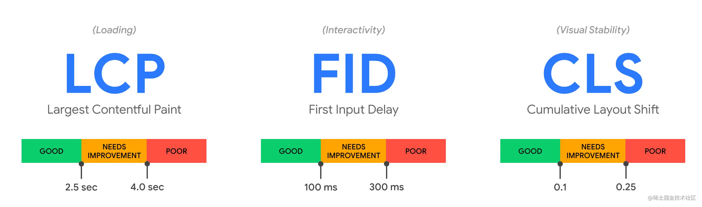
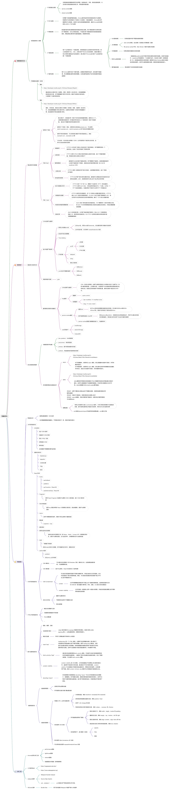
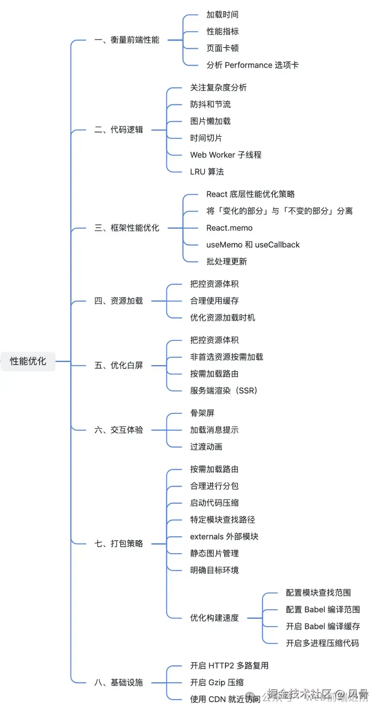

# 性能优化

打包方面优化、网络方面优化、白屏渲染优化、代码方面优化

## 性能指标与采集 “参考 浏览器系列 / 浏览器 4 页面性能”

## 打包方面优化

- 减少产物体积：1.代码压缩、2.代码分割、3.摇树优化、4.优化 SourceMap、5.按需引入、6.路由懒加载、7.动态垫片（CDN 动态加载 polyfil）、8.依赖外置（公共依赖 CDN 加载）、9.作用提升等
- 减少打包时间：1.缩减范围、2.定向搜索、3.持久化缓存、4.提前构建、5.按需构建、6.并行构建、7.可视结构等

## 网络方面优化

1. 减小请求资源体积；

   - 开启 gzip/br 压缩。

2. 减少网络请求：利用网络缓存、DNS 预解析、预建连（preconnect）、预请求（preload & prefetch）、路由懒加载、使用高性能网络协议、最小化 HTTP 请求大小、最小化 HTTP 响应大小；

   - 利用浏览器缓存；
   - DNS 预解析（`<link rel="dns-prefetch" href="//example.com">`）;
   - preconnect 提前建立网络连接。常用于 Server API 等域名，兼容性更好（`<link rel="preconnect" href="example.com">`）；
   - 使用 http/2 协议，同时做好域名收敛；
   - 使用 CDN 部署和加载静态资源；
   - 提升 HTTPS 性能；
   - 媒体查询（`<link rel="preload" href="bg-image-wide.png" as="image" media="(min-width: 601px)">`）；
   - 资源加载优化，减少网络请求次数;
     1. 压缩静态资源文件
     2. 合理进行 js、css 分包，并利用 HTTP/2
     3. 减少外部脚本数量
     4. 懒加载 或 按需加载
     5. 行内图片(Base64 编码)、图片懒加载、使用 webp 等高性能图片格式
     6. 使用字体图标，iconfont 代替图片图标
     7. 浏览器缓存(强缓存与协商缓存)

3. 减少不必要的重定向；

- preload 和 prefetch 的区别

1. preload 优先加载。只提高下载优先级，但不执行；因为它标明这个资源是本页肯定会用到 —— “本页优先”；
2. prefetch 预加载。会降低这个资源的优先级，因为它标明这个资源是下一页可能用到的 —— “为下一页提前加载”；

- defer / async / type="module" 参考 **“参考 浏览器系列 / 浏览器 2 渲染进程”**

## 渲染方面优化

结合 渲染进程(浏览器内核) 即 关键渲染路径 优化首屏渲染，减少白屏

CRP（关键渲染路径）: 指浏览器通过把 HTML、CSS 和 JavaScript 转化成屏幕上的像素的步骤顺序。

- 减少重排（回流）与重绘 **“参考 浏览器系列 / 浏览器 4 页面性能”**；
- 减少长任务执行时间，例如利用 web worker、时间片分割、setTimeout 等；
- 避免频繁的垃圾回收；
- 利用 防抖与节流 优化用户输入事件；
- 使用服务端渲染 SSR；
- 预渲染；
- 骨架屏；

## 白屏渲染优化

1. 服务端渲染 SSR；
2. 预渲染；
3. 骨架屏；

## 代码方面优化

1. 使用函数式组件
2. 子组件拆分与计算属性
3. 使用 v-show 复用 DOM
4. 使用 KeepAlive 缓存 DOM
5. 延迟功能：使用 Deferred 组件延时分批渲染组件，渐进式渲染，降低 JS 执行时间过长导致渲染卡住的现象。
6. 时间片切割
7. 使用非响应式数据
8. 虚拟滚动组件
9. 路由懒加载
10. 动态异步加载
11. 数据分屏加载
12. 图片资源懒加载
13. 无限下拉加载
14. 第三方插件的按需引入
15. 事件及时销毁
16. 事件委托

## 如何衡量 Web 体验？

- 站点体验
  Web Vitals (opens new window)定义了 LCP、FID、CLS 指标，成为了业界主流的标准。基于长期以来的体验指标优化积累，最新的核心体验指标主要专注于“加载、交互、视觉稳定”；

1. 加载的速度：决定用户是否可以尽早访问到视觉上的图像；
2. 可交互的速度：则决定用户心理上是否可以尽快感觉页面上的元素可以操作，
3. 视觉稳定性：则负责衡量页面的视觉抖动对用户造成的负面影响。



- 错误监控

对 “JS 错误、静态资源错误以及请求错误” 都提供了宏观的 “错误数、错误率、影响用户数、影响用户比例” 等指标，一目了然的关注到当前还存留的错误以及对用户的影响，以协助开发人员尽快修复问题。

## 如何⽤ webpack 来优化前端性能？ “参考 问答 7--模块化-工程化 / 如何⽤ webpack 来优化前端性能？”

## 如何提⾼ webpack 的构建速度？“参考 问答 7--模块化-工程化 / 如何提⾼ webpack 的构建速度”

## 节流函数和防抖函数：参考“问答 1--js / 节流与防抖”

## 取消图片加载

1. 使用 abort()方法：实现简单、直接，能够在任何阶段取消图片的加载。

```demo
   let img = new Image();
   img.src = 'https://example.com/image.jpg';
   img.abort() // 取消图片加载

```

1. 将 src 属性设为空字符串：实现简单，能够在图片加载的任何阶段使用。
2. 使用 Intersection Observer API：能够根据图片是否在视口内，动态地加载或取消加载图片，从而优化页面性能。
3. 使用 Fetch API 和 AbortController：能够与其他 Fetch API 请求一致地处理图片加载，并且灵活地控制加载过程。
4. 使用第三方库：使用简单，能够优化页面性能，但需要引入额外的第三方库。

## 性能优化总结





https://mp.weixin.qq.com/s/EFf6RD0hZZbA-vInAZN3-Q
