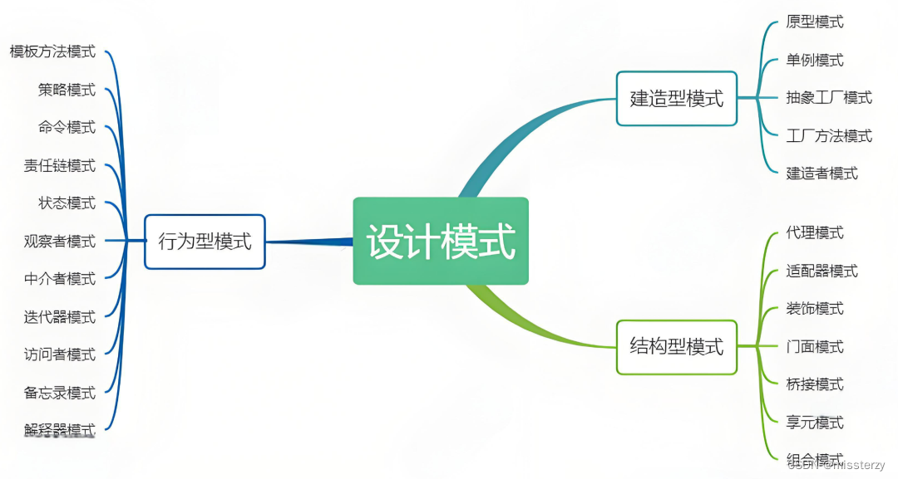

# 设计模式

1. 创建型模式（Creational Patterns）

   - 创建型模式关注对象的创建过程，隐藏创建逻辑，并且通过使用对象的接口来控制对象的创建。
   - 典型的有: 单例模式、工厂模式、原型模式

2. 结构型模式（Structural Patterns）

   - 结构型模式关注对象的组合，通过组合简单对象形成复杂的结构。
   - 典型的有: 代理模式、装饰器模式、适配器模式、组合模式

3. 行为型模式（Behavioral Patterns）

   - 行为型模式专注于对象间的通信，即对象如何相互协作以完成复杂的任务。
   - 典型的有: 策略模式、观察者模式、迭代器模式

## 发布订阅者 和 观察者模式区别

1. 观察者模式是由具体目标调度，比如当事件触发，就会去调用观察者的方法，所以观察者模式的订阅者与发布者之间是存在依赖的。

2. 发布/订阅模式由统一调度中心调用，因此发布者和订阅者不需要知道对方的存在。
